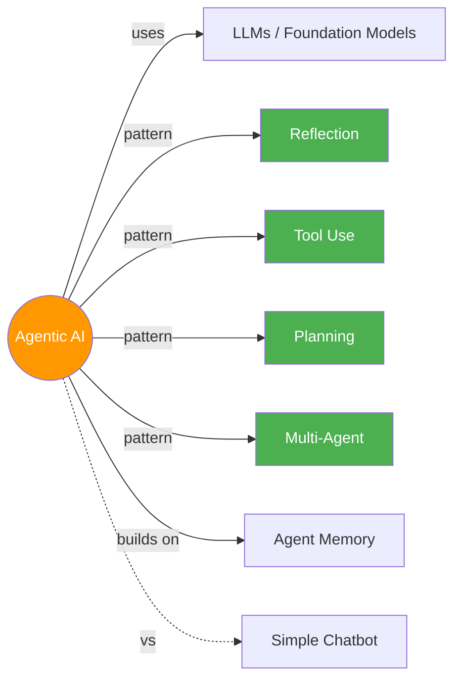

# 🤖 Agentic AI

> LLMs jo sirf jawab nahi dete, kaam bhi karte hain — plan, execute, reflect, repeat! 🔄

---

## 🧠 Brain — How This Connects

## 📊 Progress

| # | Lesson | Topics | Confidence | Revised |
|---|--------|--------|-----------|---------|
| 01 | [Intro to Agentic Workflows](01-intro-to-agentic-workflows.md) | What is Agentic AI, Autonomy, Applications, Task Decomposition, Evals, Design Patterns | 🔴 | — |
| 02 | [Reflection Design Pattern](02-reflection-design-pattern.md) | Self-critique, Direct vs Iterative, Chart/SQL generation, External Feedback | 🔴 | — |
| 03 | [Tool Use](03-tool-use.md) | What are Tools, Creating Tools, Tool Syntax, Code Execution, MCP | 🔴 | — |
| 04 | [Practical Tips for Building](04-practical-tips.md) | Evals, Error Analysis, Component-level Evals, Addressing Problems, Cost/Latency | 🔴 | — |
| 05 | [Autonomous Agents](05-autonomous-agents.md) | Planning, LLM Plans, Code Execution, Multi-Agent, Communication Patterns | 🔴 | — |
| — | [Flashcards](flashcards.md) | 🃏 Self-test across all modules | — | — |
| — | [Cheatsheet](cheatsheet.md) | 📋 One-pager quick reference | — | — |

## 🧩 Memory Fragments

> Things picked up over time. Random "aha!" moments, project learnings.
> 
> - _Add fragments as you learn..._

---

## 🎬 Teach Mode — Lesson Flow

> Open these in order = you can teach anyone Agentic AI

| # | Lesson | One-liner | Time |
|---|--------|-----------|------|
| 01 | [Intro to Agentic Workflows](01-intro-to-agentic-workflows.md) | What, why, and the 4 design patterns | ~45 min |
| 02 | [Reflection Design Pattern](02-reflection-design-pattern.md) | AI that critiques its own work and iterates | ~40 min |
| 03 | [Tool Use](03-tool-use.md) | Connecting LLMs to DBs, APIs, code execution, MCP | ~45 min |
| 04 | [Practical Tips for Building](04-practical-tips.md) | Evals, error analysis, debugging, cost optimization | ~50 min |
| 05 | [Autonomous Agents](05-autonomous-agents.md) | Planning + Multi-agent = full autonomy | ~45 min |

**Supporting:**
- [Flashcards](flashcards.md) — self-test across all modules
- [Cheatsheet](cheatsheet.md) — one-page everything

---

## 📚 Sources

> - 🎓 Course: [Agentic AI](https://learn.deeplearning.ai/courses/agentic-ai) — DeepLearning.AI
> - 👨‍🏫 Instructor: Andrew Ng
> - 📦 5 Modules · Intermediate · Self-paced · Python

## 🔗 Connected Topics

> → [Agent Memory](../agent-memory/) · _LLMs (planned)_ · _Prompt Engineering (planned)_

## 30-Second Recall 🧠

> Agentic AI = LLMs that don't just respond, they **act**. Four design patterns: **Reflection** (self-critique loop), **Tool Use** (connect to external world), **Planning** (break tasks into steps), **Multi-Agent** (specialized agents collaborating). Key difference from chatbots: iterative, multi-step workflows with autonomy — not one-shot generation.
