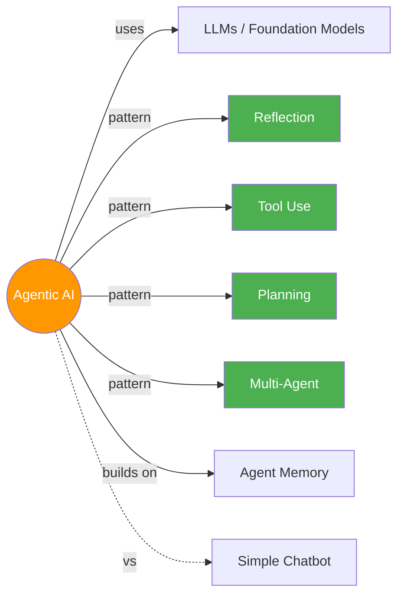

# 🤖 Agentic AI

> LLMs jo sirf jawab nahi dete, kaam bhi karte hain — plan, execute, reflect, repeat! 🔄

---

## 🧠 Brain — How This Connects

## 📊 Progress

| # | Module | Lessons | Confidence | Revised |
|---|--------|---------|-----------|---------|
| 01 | [Intro to Agentic Workflows](module-1-intro/) | 8/8 ✅ | 🟡 | — |
| 02 | [Reflection Design Pattern](module-2-reflection/) | 5/5 ✅ | 🟡 | — |
| 03 | [Tool Use](module-3-tool-use/) | 5/5 ✅ | 🟡 | — |
| 04 | [Practical Tips](module-4-practical-tips/) | 7/7 ✅ | 🟡 | — |
| 05 | [Autonomous Agents](module-5-autonomous-agents/) | 5/5 ✅ | 🟡 | — |

## 🧩 Memory Fragments

> Things picked up over time. Random "aha!" moments, project learnings.
> 
> - Andrew Ng coined "agentic" → marketers hijacked it → hype skyrocketed
> - #1 skill differentiator: disciplined dev process (evals + error analysis)
> - Without agentic workflows, many of Andrew's projects would be *impossible*
> - Reflection is surprisingly easy to implement — 2 prompts, 1 loop
> - Different LLMs for generation vs critique = powerful combo
> - External feedback (code errors, web search, regex) breaks the performance plateau
> - LLM pair comparison is unreliable (position bias!) — use binary rubric instead
> - 3 tiers: Direct generation < Reflection < Reflection + External Feedback
> - Tools = functions LLM CHOOSES to call at runtime (not hard-coded)
> - aisuite auto-generates JSON schema from docstring — docstring is the tool's resume
> - Code execution = THE meta-tool. One tool to rule them all
> - MCP turns M×N integrations into M+N — USB port for LLMs
> - Andrew Ng's team had an agent run `rm *.py` — always sandbox!
> - 2×2 eval framework: code/LLM-judge × per-example/no ground truth — the mental model
> - Error analysis spreadsheet: count errors per component, don't trust your gut!
> - Invoice example: teams would fix PDF parser (15%), but real problem was LLM extraction (87%)
> - Customer email: 75% query errors, 30% email errors, only 4% database — data always surprises
> - Error percentages are NOT mutually exclusive — one example can have multiple failing components
> - Priority = Error Rate × Fixability — high errors but no fix ideas? Skip for now
> - Component evals = faster feedback loop. Gold standard + F1 score. Confirm with E2E eval
> - LLM fix order: prompt → model swap → split step → fine-tune (last resort, expensive)
> - Larger models >> smaller at instruction following (PII example: Llama 8B failed, GPT-5 nailed it)
> - Read other people's prompts — Andrew downloads open-source packages to read their prompts!
> - Quality > Latency > Cost — "having high costs from high usage is a good problem to have"
> - Build ↔ Analyze cycle — less experienced teams over-index on building, skip analysis
> - Planning agent = don't hard-code tool sequences, let LLM write its own plan
> - JSON plan format: step number + description + tool + args = parseable by code
> - Code as plan > JSON plan > text plan (Wang et al. 2024) — code is most unambiguous
> - Tool-based data analysis = brittle treadmill of new tools. Code execution = just write pandas
> - Multi-agent = same LLM, different prompts + tools. Value is in decomposition, not multiple AIs
> - Agent = LLM prompted with role + given tools (researcher = LLM + web_search)
> - Manager agent = 4th agent that plans + delegates + reflects. Planning with agents instead of tools
> - Two most common patterns: Linear (relay) + Hierarchical (manager + team)
> - All-to-all communication = experimental, chaotic, hard to predict — re-run if output isn't good

---

## 🎬 Teach Mode — Module Flow

> Open these in order = you can teach anyone Agentic AI

| # | Module | What You'll Learn | Est. Time |
|---|--------|-------------------|-----------|
| 01 | [Intro to Agentic Workflows](module-1-intro/) | What, why, applications, task decomposition, evals, 4 design patterns | ~45 min |
| 02 | [Reflection Design Pattern](module-2-reflection/) | Self-critique loops, chart/SQL generation, external feedback | ~40 min |
| 03 | [Tool Use](module-3-tool-use/) | Creating tools, tool syntax, code execution, MCP | ~45 min |
| 04 | [Practical Tips](module-4-practical-tips/) | Evals, error analysis, component evals, cost/latency optimization | ~50 min |
| 05 | [Autonomous Agents](module-5-autonomous-agents/) | Planning, LLM plans, multi-agent, communication patterns | ~45 min |

**Supporting:**
- [Flashcards](flashcards.md) — cross-module self-test
- [Cheatsheet](cheatsheet.md) — one-page everything
- [Evals & Error Analysis Comparison](vs.md) — every eval technique compared

---

## 📚 Sources

> - 🎓 Course: [Agentic AI](https://learn.deeplearning.ai/courses/agentic-ai) — DeepLearning.AI
> - 👨‍🏫 Instructor: Andrew Ng
> - 📦 5 Modules · Intermediate · Self-paced · Python

## 🔗 Connected Topics

> → [Agent Memory](../agent-memory/) · _LLMs (planned)_ · _Prompt Engineering (planned)_

## 30-Second Recall 🧠

> Agentic AI = LLMs that don't just respond, they **act**. Four design patterns: **Reflection** (self-critique loop → external feedback breaks the plateau), **Tool Use** (LLM chooses functions at runtime — aisuite auto-schemas from docstrings, code execution is the meta-tool, MCP standardizes M×N→M+N), **Planning** (LLM writes its own step-by-step plan in JSON/code → executes one step at a time; code > JSON > text for plan format; code execution = thousands of built-in functions vs handful of custom tools), **Multi-Agent** (specialized agents collaborating — each agent = prompted LLM + role-specific tools; two main patterns: Linear relay + Hierarchical manager; deeper hierarchies and all-to-all exist but are harder to control). Build quick → look at outputs → build evals (2×2: code/LLM-judge × ground truth) → error analysis spreadsheet (traces + spans, count per component, prioritize by error rate × fixability) → component-level evals (gold standard + F1) → fix (non-LLM: tune/replace; LLM: prompt→model→split→fine-tune) → optimize latency then cost. The secret sauce? **Build ↔ Analyze cycle** — that's what separates good builders from great ones.
