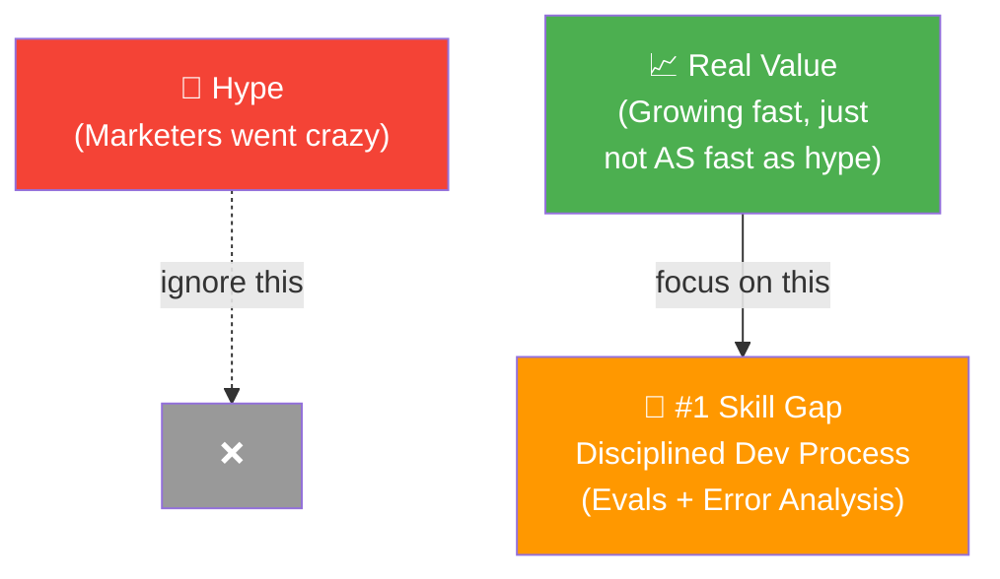

# 01 · Welcome! 👋

---

## 🎯 One Line
> Andrew Ng built this course because agentic workflows are the #1 skill in AI — and the gap between good and great builders is **evals + error analysis**.

---

## 🖼️ The Big Picture

> 💡 **Hype toh aayegi jaayegi — asli skill hai: eval karna aur errors fix karna. Woh builder jeeta jo debug karna jaanta hai, jo demo banana jaanta hai nahi.** 🔧

---

## 🧱 Key Takeaways

| Point | Detail |
|-------|--------|
| **Who coined "agentic"** | Andrew Ng — then marketers slapped it on everything |
| **Hype vs Reality** | Hype is sky-high, but real valuable applications ARE growing fast |
| **Real-world apps** | Customer support agents, deep research reports, legal docs, medical diagnosis |
| **Impossible without agentic** | Many of Andrew's teams build projects that simply can't exist without agentic workflows |
| **#1 differentiator** | Disciplined dev process → **evals + error analysis** separates great builders from mediocre ones |
| **Course promise** | Best practices for building agentic AI applications |

---

## ⚡ Why This Matters

- Agentic workflows = **one of the most important skills in AI today**
- Opens up: job opportunities + ability to build amazing software yourself
- Not just about coding agents — it's about the **development process around them**

---

> **Next →** [What is Agentic AI?](02-what-is-agentic-ai.md)
