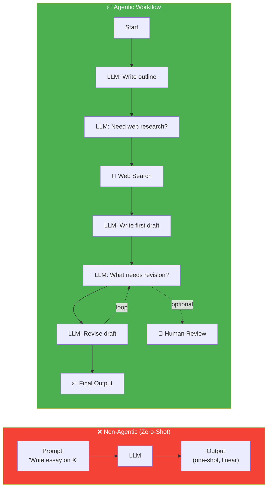
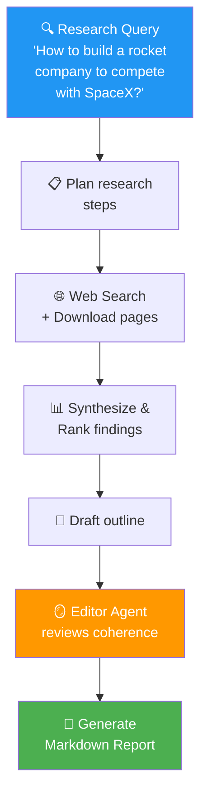

# 02 · What is Agentic AI? 🤖

---

## 🎯 One Line
> Agentic AI = LLM apps that work in **multiple iterative steps** (outline → research → draft → reflect → revise) instead of generating everything in one shot.

---

## 🖼️ Non-Agentic vs Agentic



> 💡 **Non-agentic = Exam hall mein first word se last word tak bina backspace ke likhna. Agentic = Ghar pe outline banao, research karo, draft likho, revise karo — jaise asli insaan karta hai!** ✍️

---

## 🧱 The Core Definition

| | Non-Agentic | Agentic |
|--|-------------|---------|
| **How it works** | One prompt → one output | Multiple steps, each using LLM/tools |
| **Analogy** | Writing an essay in one go, no backspace | Outline → research → draft → revise |
| **Quality** | Surprisingly decent, but surface-level | Much better — deeper, more thoughtful |
| **Speed** | Fast (single call) | Slower (multiple iterations) |
| **Human-in-the-loop** | ❌ No | ✅ Optional at any step |

> **Formal definition:** An agentic AI workflow is a process where an **LLM-based app executes multiple steps** to complete a task.

---

## ⚡ Essay Writing — Step Breakdown

```
┌─────────────────────────────────────────────────┐
│  DIRECT (Non-Agentic)                           │
│  ┌──────────────────────────────────────┐       │
│  │ "Write essay on X" → 📄 Done         │       │
│  └──────────────────────────────────────┘       │
│  Result: Surface level, covers obvious facts    │
├─────────────────────────────────────────────────┤
│  AGENTIC (Multi-Step)                           │
│                                                 │
│  Step 1  LLM → Write essay outline              │
│     ↓                                           │
│  Step 2  LLM → Decide web search terms          │
│     ↓                                           │
│  Step 3  🔧 Web Search API → fetch pages        │
│     ↓                                           │
│  Step 4  LLM → Write first draft (with sources) │
│     ↓                                           │
│  Step 5  LLM → Reflect: what needs revision?    │
│     ↓                                           │
│  Step 6  👤 Optional: human review key facts     │
│     ↓                                           │
│  Step 7  LLM → Revise draft                     │
│     ↓  ↩️ (loop back to Step 5 if needed)        │
│  ✅ Final: Much better output                    │
└─────────────────────────────────────────────────┘
```

---

## 🔬 Running Example: Research Agent

The course builds a **research agent** end-to-end. Here's what it does:



**Why is this better than one-shot?**
- Multiple sources found + downloaded (not just LLM's training data)
- Deep thinking through synthesis + ranking
- Editor reviews for coherence
- Result: thoughtful report, not generic essay

---

## 💼 Real-World Agentic Use Cases (Andrew's teams)

| Domain | What the agent does |
|--------|-------------------|
| **Legal compliance** | Research legal documents for conflicts |
| **Healthcare** | Analyze sector-specific research |
| **Business product research** | Deep-dive competitor analysis |
| **Custom research agents** | Specialized agents for any domain |

---

## 🔑 The Key Skill

```
┌──────────────────────────────────────────┐
│  TASK DECOMPOSITION                      │
│                                          │
│  Complex Task                            │
│      ↓                                   │
│  Break into smaller steps                │
│      ↓                                   │
│  Build components for each step          │
│      ↓                                   │
│  Execute steps one at a time             │
│      ↓                                   │
│  Get quality output                      │
│                                          │
│  ⚠️  This is TRICKY but CRITICAL —       │
│  it determines your ability to build     │
│  agentic workflows for ANY application   │
└──────────────────────────────────────────┘
```

> 💡 **Task decomposition = Recipe banana. Ek dish ko steps mein todo — prep, cook, plate. Wahi concept hai, bas kitchen LLM hai! 🍳**

---

## 🧪 Quick Check

<details>
<summary>❓ What's the formal definition of an agentic AI workflow?</summary>

A process where an **LLM-based app executes multiple steps** to complete a task. Not one prompt → one output, but a series of LLM calls, tool uses, and iterations.
</details>

<details>
<summary>❓ Why does agentic workflow produce better output despite being slower?</summary>

Because it mirrors how humans actually work — outline first, research, draft, reflect, revise. Each step builds on the previous one. Multiple iterations catch and fix errors that a single pass misses.
</details>

<details>
<summary>❓ What is the #1 skill for building agentic workflows?</summary>

**Task decomposition** — breaking a complex task into smaller executable steps, and building components to execute each step well.
</details>

---

> **← Prev** [Welcome](01-welcome.md) · **Next →** [Degrees of Autonomy](03-degrees-of-autonomy.md)
