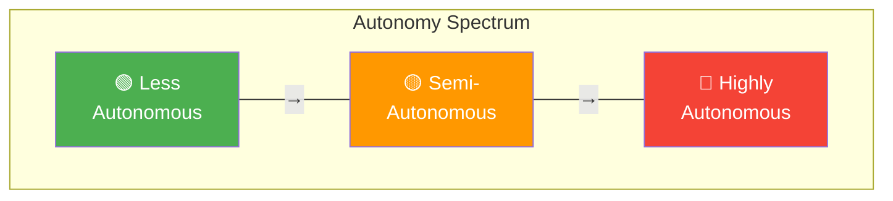
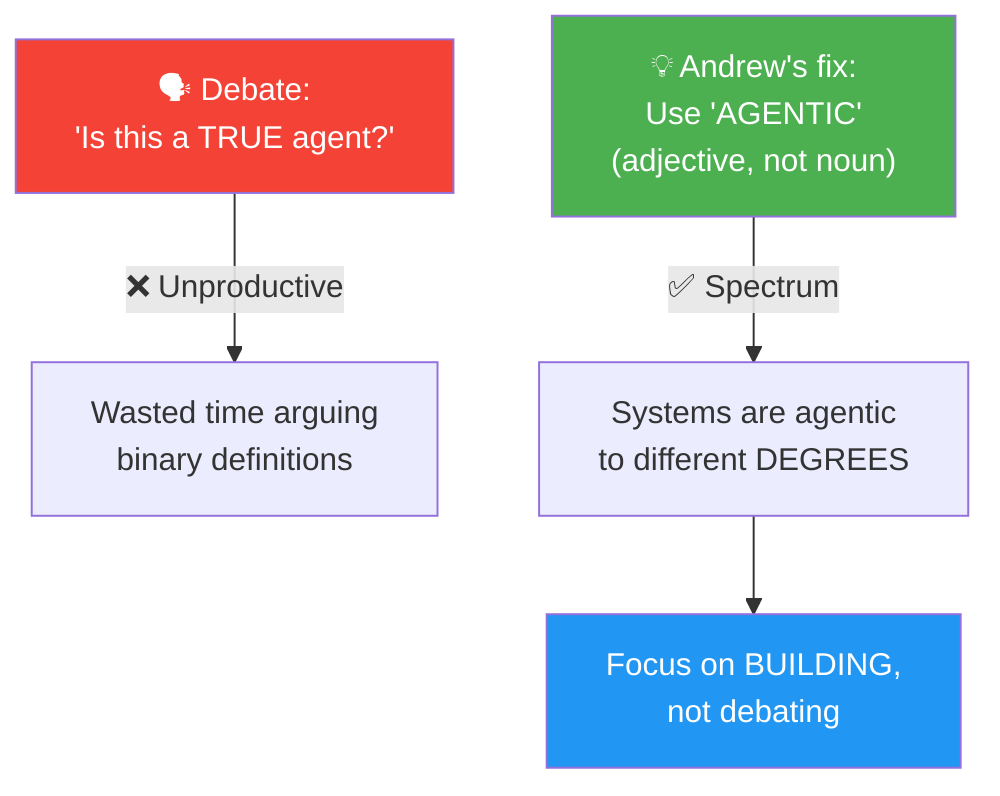

# 03 · Degrees of Autonomy 📊

---

## 🎯 One Line
> "Agentic" is an adjective, not a binary — systems can be agentic to **different degrees**, from fully predetermined steps to LLMs deciding everything on the fly.

---

## 🖼️ The Autonomy Spectrum



| | 🟢 Less Autonomous | 🟡 Semi-Autonomous | 🔴 Highly Autonomous |
|--|-------------------|-------------------|---------------------|
| **Steps** | All predetermined by programmer | Some decided by LLM | LLM decides the full plan |
| **Tools** | Hard-coded (web search, fetch) | Predefined set, LLM chooses which | Can **create new tools** on the fly |
| **LLM's role** | Only generates text | Makes some decisions + chooses tools | Makes ALL decisions autonomously |
| **Predictability** | ✅ Very predictable | 🔶 Moderate | ⚠️ Less controllable, unpredictable |
| **Real-world today** | Tons of valuable apps being built NOW | Growing adoption | Active research, frontier work |

> 💡 **Less autonomous = train track pe chalna (fixed route). Highly autonomous = GPS de do, khud rasta dhundh lega — lekin kabhi galat gali mein bhi ghus sakta hai! 🚂→🚗**

---

## ⚡ Same Task, Different Autonomy Levels

### Example: "Write an essay about black holes"

```
┌─────────────────────────────────────────────────────────┐
│  🟢 LESS AUTONOMOUS (Linear, Deterministic)             │
│                                                         │
│  🔴 User: "Write essay about black holes"               │
│     ↓                                                   │
│  ⬜ LLM → Generate search queries                       │
│     ↓                                                   │
│  🟩 Web Search (hard-coded)                             │
│     ↓                                                   │
│  🟩 Web Fetch (hard-coded)                              │
│     ↓                                                   │
│  ⬜ LLM → Write essay                                   │
│     ↓                                                   │
│  ✅ Done                                                 │
│                                                         │
│  Programmer decided every step. LLM just fills text.    │
├─────────────────────────────────────────────────────────┤
│  🔴 HIGHLY AUTONOMOUS (Dynamic, LLM-Driven)             │
│                                                         │
│  🔴 User: "Write essay about black holes"               │
│     ↓                                                   │
│  ⬜ LLM → Decides: web search? news? arXiv papers?      │
│     ↓  (LLM chose web search + arXiv)                   │
│  🟩 Web Search  🟩 arXiv Search                         │
│     ↓                                                   │
│  ⬜ LLM → How many pages to fetch? Need PDF→text tool?  │
│     ↓                                                   │
│  🟩 Web Fetch (3 pages)  🟩 PDF-to-Text                 │
│     ↓                                                   │
│  ⬜ LLM → Write essay draft                              │
│     ↓                                                   │
│  ⬜ LLM → Reflect: need more sources? Revise?           │
│     ↓  ↩️ (loops back if needed)                         │
│  ✅ Done                                                 │
│                                                         │
│  LLM decided the steps, tools, and when to stop.        │
└─────────────────────────────────────────────────────────┘

Legend:  🔴 = User input   ⬜ = LLM call   🟩 = Tool/Software
```

---

## 🎨 Course Visual Convention

| Color | Meaning | Example |
|-------|---------|---------|
| 🔴 **Red** | User input / input document | User query, uploaded doc |
| ⬜ **Gray** | LLM call | Generate text, decide next step |
| 🟩 **Green** | Tool / software action | Web search API, code execution, PDF-to-text |

---

## 🔑 Why "Agentic" Not "Agent"



> **Key insight:** "Agent" = binary (is it or isn't it?). "Agentic" = spectrum (how much?). This lets us stop debating and start building.

---

## ⚠️ Trade-offs at Each End

| End of Spectrum | Pros | Cons |
|----------------|------|------|
| 🟢 **Less autonomous** | Predictable, controllable, easy to debug | Limited flexibility, can't adapt |
| 🔴 **Highly autonomous** | Flexible, can handle unexpected scenarios | Less controllable, unpredictable, harder to debug |

> 💡 **Less autonomous = bahut valuable hai already! Duniya mein zyaadatar agentic apps isi end pe baith ke paisa kama rahi hain. Highly autonomous = cool hai, but still research area.** 💰

---

## 🧪 Quick Check

<details>
<summary>❓ Why did Andrew Ng use "agentic" instead of "agent"?</summary>

To end the binary debate of "is this a true agent or not?" — **"agentic" is an adjective** that acknowledges systems can be autonomous to different degrees. This lets us focus on building rather than arguing definitions.
</details>

<details>
<summary>❓ What's the main difference between less autonomous and highly autonomous agents?</summary>

**Less autonomous:** All steps predetermined by programmer, tools hard-coded, LLM only generates text.
**Highly autonomous:** LLM decides the sequence of steps, chooses (or even creates) tools, controls the entire workflow.
</details>

<details>
<summary>❓ Which end of the spectrum has more real-world production apps today?</summary>

**Less autonomous** — tons of valuable apps are being built and deployed for businesses right now. Highly autonomous agents are exciting but still in active research, less controllable, and more unpredictable.
</details>

---

> **← Prev** [What is Agentic AI?](02-what-is-agentic-ai.md) · **Next →** [Benefits of Agentic AI](04-benefits.md)
