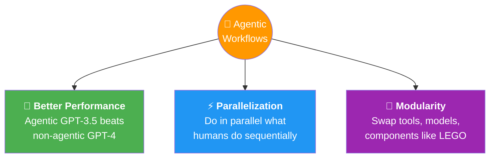
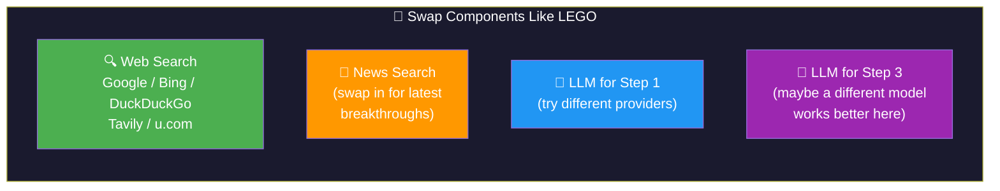

# 04 · Benefits of Agentic AI 💪

---

## 🎯 One Line
> Three superpowers: **much better performance** (GPT-3.5 agentic > GPT-4 non-agentic!), **parallelization** (faster than humans), and **modularity** (swap components like LEGO).

---

## 🖼️ The Three Benefits



---

## 📊 Benefit 1: Much Better Performance

### HumanEval Coding Benchmark 🔥

```
Performance (% correct)
│
│                                              ┌─────────┐
│                                              │ Agentic  │
│                                         ┌────│ GPT-4    │
│                                         │    │ ~95%+    │
│                               ┌─────────┤    └─────────┘
│                               │ Agentic  │
│                               │ GPT-3.5  │
│                    ┌──────────│ ~80%+    │
│                    │ Non-     │          │
│                    │ Agentic  └──────────┘
│        ┌───────────│ GPT-4    │
│        │ Non-      │ 67%      │
│        │ Agentic   └──────────┘
│ ───────│ GPT-3.5  │
│        │ 48%      │
│        └──────────┘
│
└────────────────────────────────────────────────────
         Non-Agentic              Agentic
```

| Model | Non-Agentic | Agentic | Takeaway |
|-------|------------|---------|----------|
| **GPT-3.5** | 48% | 80%+ | Agentic workflow = **massive jump** |
| **GPT-4** | 67% | 95%+ | Even the best models benefit hugely |

> 💡 **Sabse bada takeaway: GPT-3.5 + agentic workflow > GPT-4 alone! Matlab purana model bhi agar sahi workflow mein daalo toh naye model ko peet deta hai. Workflow > Raw Model Power!** 🥊

**Named agentic systems on the chart** (from the course slides):

| System | Pattern(s) Used |
|--------|----------------|
| **Reflexion** | Reflection |
| **LATS** (Language Agent Tree Search) | Planning + Reflection |
| **LDB + Reflexion** | Reflection + Debugging |
| **CodeT** | Tool Use (code testing) |
| **ANPL** | Planning |
| **MetaGPT** | Multi-Agent |
| **AgentCoder** | Multi-Agent + Tool Use |
| **Intervenor** | Reflection |

All of these sit **above** the non-agentic baselines — proof that the design patterns (Reflection, Tool Use, Planning, Multi-Agent) genuinely move the needle.

**Why?** Agentic techniques like reflection (write code → check it → fix bugs → retry) let even older models iterate to better solutions.

---

## ⚡ Benefit 2: Parallelization

```
┌────────────────────────────────────────────────────────┐
│  👤 HUMAN (Sequential)                                  │
│                                                         │
│  Search 1 → Read page 1 → Read page 2 → Read page 3   │
│          → Search 2 → Read page 4 → Read page 5 → ...  │
│                                                         │
│  ⏱️ Reads 9 pages ONE AT A TIME                         │
├────────────────────────────────────────────────────────┤
│  🤖 AGENTIC (Parallel)                                  │
│                                                         │
│  ┌─ LLM 1 → Search terms ──┐                           │
│  ├─ LLM 2 → Search terms ──┼─→ 3 searches in parallel  │
│  └─ LLM 3 → Search terms ──┘                           │
│              ↓                                          │
│  ┌─ Fetch page 1 ─┐                                    │
│  ├─ Fetch page 2 ─┤                                    │
│  ├─ Fetch page 3 ─┤                                    │
│  ├─ Fetch page 4 ─┼─→ 9 downloads in parallel! ⚡      │
│  ├─ Fetch page 5 ─┤                                    │
│  ├─ Fetch page 6 ─┤                                    │
│  ├─ Fetch page 7 ─┤                                    │
│  ├─ Fetch page 8 ─┤                                    │
│  └─ Fetch page 9 ─┘                                    │
│              ↓                                          │
│  LLM → Write essay                                     │
│                                                         │
│  ⏱️ WAY faster than human sequential processing         │
└────────────────────────────────────────────────────────┘
```

> Agentic workflows take longer than single-prompt generation, but **compared to how a human would do the same research** → much faster because of parallel execution.

---

## 🧩 Benefit 3: Modularity



| What You Can Swap | Examples |
|-------------------|----------|
| **Web search engine** | Google, Bing, DuckDuckGo, Tavily, u.com |
| **Add new tool types** | News search engine for latest breakthroughs |
| **LLM per step** | Different model/provider for different steps — pick the best for each job |

> 💡 **Modularity = buffet system 🍽️. Har step ke liye best dish (model/tool) choose karo. Ek hi restaurant (model) se sab kuch lena zaroori nahi!**

---

## 📋 Summary

| Benefit | Why It Matters |
|---------|---------------|
| 🚀 **Performance** | Agentic workflow on older model > newer model without workflow |
| ⚡ **Parallelization** | Do research in parallel = faster than human sequential work |
| 🧩 **Modularity** | Add/swap tools + use different LLMs per step = best of everything |

---

## 🧪 Quick Check

<details>
<summary>❓ On HumanEval, which performs better: non-agentic GPT-4 or agentic GPT-3.5?</summary>

**Agentic GPT-3.5** beats non-agentic GPT-4! GPT-3.5 with agentic workflows (reflection, iteration) scores 80%+, while GPT-4 without agentic workflow only gets 67%. The agentic workflow improvement is **bigger** than the model generation improvement.
</details>

<details>
<summary>❓ How can agentic workflows be faster than humans if they take more steps?</summary>

**Parallelization.** A human reads 9 web pages one at a time. An agentic workflow downloads all 9 in parallel and feeds them to the LLM simultaneously. More steps, but many run concurrently.
</details>

<details>
<summary>❓ What does modularity mean in agentic workflows?</summary>

You can **swap out individual components** — use different web search engines, add new tool types (like a news API), or use different LLM providers for different steps. It's like LEGO blocks.
</details>

---

> **← Prev** [Degrees of Autonomy](03-degrees-of-autonomy.md) · **Next →** [Agentic AI Applications](05-applications.md)
