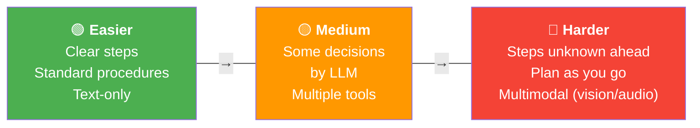
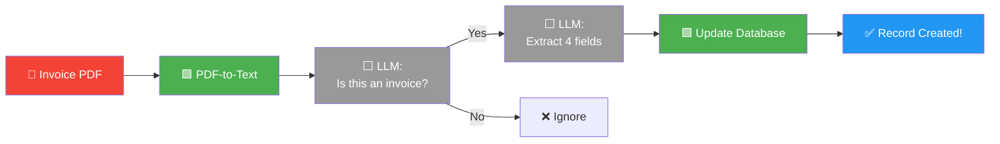
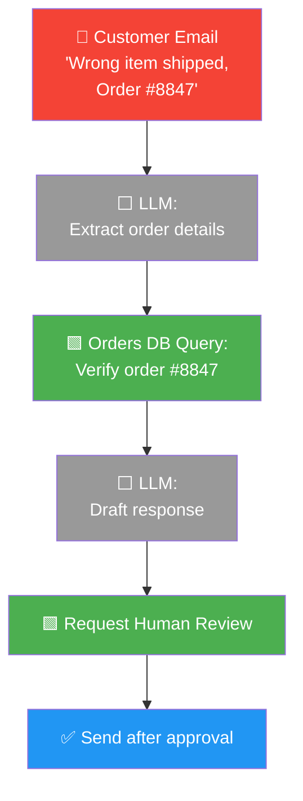
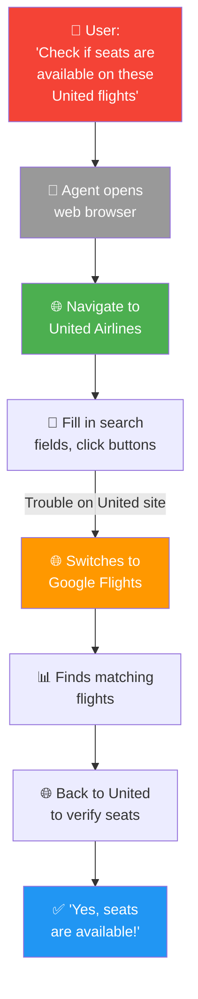

# 05 · Agentic AI Applications 🌍

---

## 🎯 One Line
> From invoice processing to customer service to computer use — agentic apps range from **easy (clear steps, text-only)** to **hard (dynamic planning, multimodal)**.

---

## 🖼️ Difficulty Spectrum



| Factor | 🟢 Easier | 🔴 Harder |
|--------|----------|----------|
| **Steps** | Clear, step-by-step process | Steps not known ahead of time |
| **Procedures** | Standard procedures to follow | Plan/solve as you go |
| **Input type** | Text-only assets | Multimodal (sound, vision, audio) |

---

## 🟢 Example 1: Invoice Processing (Easy)



**4 required fields extracted:**

| Field | Example Value |
|-------|--------------|
| Biller | Tech Flow Solutions |
| Biller Address | (from invoice) |
| Amount Due | $3,000 |
| Due Date | August 20, 2025 |

> **Why easy?** Clear 2-step process: identify fields → save to database. No ambiguity.

---

## 🟡 Example 2: Customer Order Inquiry (Medium)



**Steps:** Extract info → DB lookup → Draft response → Human review → Send

> **Why medium?** Clear process, but involves tool calls (DB query) and human-in-the-loop.

---

## 🔴 Example 3: General Customer Service Agent (Hard)

```
┌─────────────────────────────────────────────────────────┐
│  ❓ "Do you have black jeans or blue jeans?"            │
│                                                         │
│  Agent must PLAN:                                       │
│    1. Check inventory for black jeans → 🟩 DB query     │
│    2. Check inventory for blue jeans  → 🟩 DB query     │
│    3. Respond to customer                               │
├─────────────────────────────────────────────────────────┤
│  ❓ "I'd like to return the beach towel I bought"       │
│                                                         │
│  Agent must PLAN:                                       │
│    1. Verify customer actually bought towel → 🟩 DB     │
│    2. Check return policy (30 days? unused?) → 🟩 DB    │
│    3. If allowed:                                       │
│       a. Issue return packing slip  → 🟩 Tool           │
│       b. Set DB record to "return pending" → 🟩 DB      │
├─────────────────────────────────────────────────────────┤
│  ⚠️  Required steps NOT known ahead of time!            │
│  LLM must decide the plan based on each query.          │
└─────────────────────────────────────────────────────────┘
```

> 💡 **Invoice = exam with fixed syllabus (steps pata hain). Customer service = open book exam (pata nahi kya aayega, agent ko khud soochna padega)! 📝**

---

## 🔴 Example 4: Visual Computer Use (Cutting-Edge)



| Aspect | Status |
|--------|--------|
| **What it does** | Agent uses web browser — reads pages, clicks, fills forms |
| **Slide example** | **ChatGPT Agent Mode** (OpenAI) — shown as a real demo of visual computer use |
| **Reliability** | ⚠️ Not reliable enough for mission-critical apps yet |
| **Common failures** | Slow-loading pages confuse agent, complex pages can't be parsed |
| **Future** | Exciting research area — many companies working on this |

> **Cutting-edge but not production-ready.** Agent can figure it out eventually, but stumbles often on real websites.

---

## 📋 All Four Examples Mapped to Difficulty

| Example | Difficulty | Steps Known? | Modality | Key Challenge |
|---------|-----------|-------------|----------|---------------|
| 📄 Invoice Processing | 🟢 Easy | ✅ Yes, clear 2 steps | Text | Almost none — deterministic |
| 📧 Customer Order Inquiry | 🟡 Medium | ✅ Yes, 3 steps | Text | DB lookups + human review |
| 💬 General Customer Service | 🔴 Hard | ❌ No, plan as you go | Text | LLM must decide steps dynamically |
| 🖥️ Visual Computer Use | 🔴🔴 Very Hard | ❌ No, navigate live web | Vision + Text | Multimodal, unpredictable pages |

---

## 🧪 Quick Check

<details>
<summary>❓ What makes an agentic task "easy" vs "hard"?</summary>

**Easy:** Clear step-by-step process, standard procedures, text-only input.
**Hard:** Steps not known ahead of time (LLM must plan), multimodal input (vision, audio), unpredictable environments.
</details>

<details>
<summary>❓ Why is general customer service harder than order inquiry?</summary>

Order inquiry has a **fixed 3-step process** (extract → lookup → respond). General customer service could be ANYTHING — the agent must **dynamically plan** what DB queries to make, what policies to check, and what actions to take. Steps are not known ahead of time.
</details>

<details>
<summary>❓ Are computer-use agents ready for production?</summary>

**Not yet.** They can eventually figure out tasks, but often struggle with slow-loading pages, complex web UIs, and accurately parsing page content. It's an exciting research area but not reliable enough for mission-critical use today.
</details>

---

> **← Prev** [Benefits](04-benefits.md) · **Next →** [Task Decomposition](06-task-decomposition.md)
