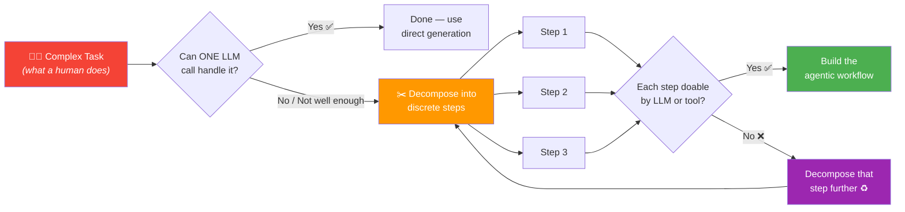
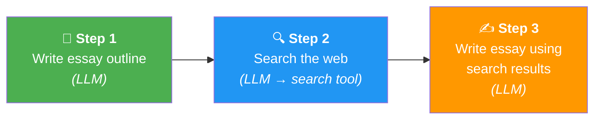
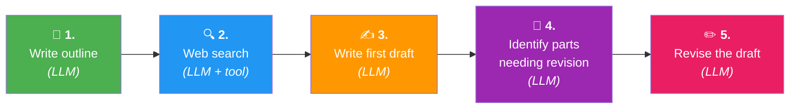
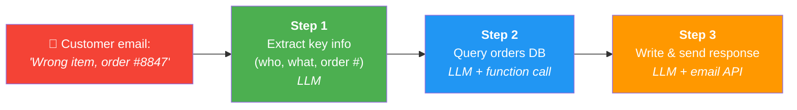
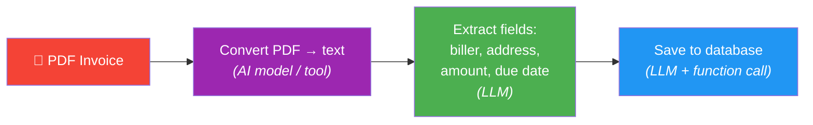
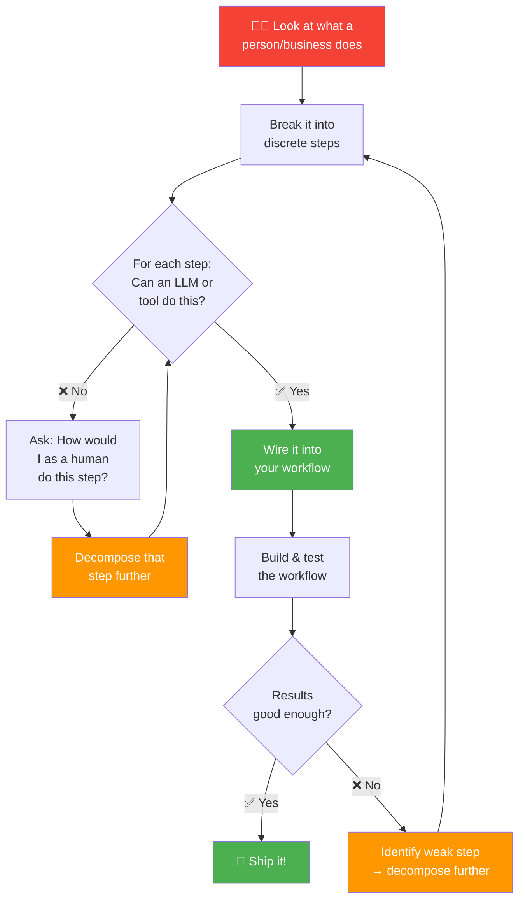

# 06 · Task Decomposition ✂️

---

## 🎯 One Line
> Task decomposition = looking at stuff people do and breaking it into **discrete steps** where each step can be done by an LLM, a tool, or a function call.

---

## 🖼️ The Core Idea



> 💡 **Task decomposition = recipe banana. Complex dish ko steps mein todna taaki har step ek tool ya LLM kar sake. Agar koi step bada lage? Usse aur tod do! 🍳**

---

## 🔑 The One Question That Drives Everything

Every time you look at a step, ask yourself:

> **"Can this step be done by either an LLM, a short piece of code, a function call, or a tool?"**

| Answer | What To Do |
|--------|-----------|
| ✅ **Yes** | Great — wire it into your workflow |
| ❌ **No** | Ask: *"How would I as a human do this step?"* → Decompose it further into smaller sub-steps |

This question is the **heartbeat** of building agentic workflows. You keep asking it at every level until every piece is implementable.

---

## 🔬 Example 1: Research Agent (The Iterative Journey)

This is the best example of how decomposition **evolves through iteration** — you don't nail it on the first try.

### Attempt 1 — Direct Generation (One Shot)

```
┌───────────────────────────────────┐
│  "Write an essay on topic X"  →  LLM  →  📄 Output
└───────────────────────────────────┘
```

**Problem:** Output is surface-level — covers obvious facts, lacks depth. Like asking someone to write an essay without doing any research first.

### Attempt 2 — Three-Step Workflow



**Checklist:** Can each step be done?
- Step 1: LLM can write a decent outline ✅
- Step 2: LLM can generate search terms → web search tool ✅  
- Step 3: LLM can input search results and write essay ✅

**Problem:** Better, but the essay felt **disjointed** — the beginning didn't feel consistent with the middle and end. (Andrew Ng literally built this and ran into this exact problem.)

### Attempt 3 — Further Decomposition of Step 3

The fix? Don't write the final essay in one go. Break **"write essay"** into sub-steps:



> 💡 **Non-agentic = essay ek baar mein likh diya, no backspace. Agentic = pehle draft, phir proofread, phir revise — jaise hum humans karte hain! ✏️**

### The Evolution At A Glance

| Version | Steps | What Changed | Result |
|---------|-------|-------------|--------|
| **V1** | 1 (direct generation) | Nothing — just prompt | Surface-level, shallow |
| **V2** | 3 (outline → search → write) | Added research phase | Better depth, but disjointed |
| **V3** | 5 (outline → search → draft → critique → revise) | Decomposed "write" into draft-critique-revise | Deeper, more coherent |

**Key insight:** You can keep refining — if V3 still isn't good enough, you can decompose further or modify the workflow. It's an iterative process.

---

## 🔬 Example 2: Customer Order Inquiry



| Step | What Happens | Implementable? |
|------|-------------|---------------|
| 1. Extract info | LLM reads email, pulls out name, order #, complaint | ✅ LLM is great at this |
| 2. Find records | LLM generates DB query → function call to orders database | ✅ LLM + function call |
| 3. Respond | LLM drafts response using DB info → API call to send email | ✅ LLM + API |

---

## 🔬 Example 3: Invoice Processing



Simplest decomposition — just two core steps after PDF conversion. Clear, deterministic, easy to validate.

---

## 🧱 Building Blocks (Your Toolkit)

When decomposing tasks, you're picking from this palette of building blocks:

| Building Block | What It Does | Examples |
|---------------|-------------|---------|
| **🧠 LLMs** | Generate text, decide what to call, extract info | GPT-4, Claude, Gemini |
| **🧠 Multimodal Models** | Process images, audio, video — not just text | Vision models, speech-to-text |
| **🤖 Specialized AI Models** | Narrow tasks that general LLMs aren't best at | PDF-to-text, text-to-speech, image analysis |
| **🔧 APIs / Software Tools** | Connect to external services | Web search, weather data, send email, check calendar |
| **🗄️ Retrieval Tools** | Pull up data from storage | Database queries, RAG (search large text collections) |
| **💻 Code Execution** | LLM writes code, then runs it on your machine | Python scripts, data processing, calculations |

> Think of it as a **LEGO set** — task decomposition is figuring out which pieces to snap together and in what order.

```
┌─────────────────────────── YOUR TOOLKIT ───────────────────────────┐
│                                                                     │
│   🧠 LLMs          🤖 Specialized Models     🔧 APIs/Tools        │
│   ├─ Text gen       ├─ PDF → Text             ├─ Web Search         │
│   ├─ Extraction     ├─ Text → Speech          ├─ Email              │
│   ├─ Decisions      └─ Image Analysis         ├─ Calendar           │
│   └─ Planning                                 └─ Weather            │
│                                                                     │
│   🗄️ Retrieval      💻 Code Execution                              │
│   ├─ Database        └─ LLM writes & runs                          │
│   └─ RAG                code on your machine                       │
│                                                                     │
└─────────────────────────────────────────────────────────────────────┘
```

---

## 🧠 The Decomposition Mindset



The whole thing is a **loop** — build → evaluate → refine → repeat. You rarely get it right the first time.

> 💡 **Pehli baar mein perfect workflow banane ka sochna band karo. Pehle basic bana, test karo, phir improve karo — jaise code likhte ho waise hi! 🔄**

---

## 📋 Summary: The 3-Step Recipe

| Step | Do This |
|------|---------|
| **1. Observe** | Look at the task a human does. How would YOU do it step by step? |
| **2. Validate** | For EACH step → ask: "Can this be done by an LLM or a tool?" |
| **3. Iterate** | Build → test → if quality isn't good enough → decompose further or modify the workflow |

---

## ⚠️ Gotchas

- ❌ **Don't try to get the perfect decomposition on Day 1** — you'll almost always iterate multiple times
- ❌ **Don't make steps too big** — if a step requires "judgment" that's hard to formalize, decompose it further  
- ❌ **Don't forget to test each step individually** — a chain is only as strong as its weakest link
- ❌ **Don't panic if you don't fully get it yet** — the course walks through many more examples in later modules

---

## 🧪 Quick Check

<details>
<summary>❓ What's the ONE question you should ask for every step in your decomposition?</summary>

**"Can this step be done by an LLM, a short piece of code, a function call, or a tool?"**

If yes → great, wire it in. If no → ask how a human would do it, and break that step down further.
</details>

<details>
<summary>❓ In the research agent example, why was V2 (3 steps) still not good enough?</summary>

The essay came out **disjointed** — the beginning, middle, and end didn't feel consistent. Because "write the essay" was one big step. The fix: decompose it into **write first draft → identify revision needs → revise** — just like a human would iterate on their own writing.
</details>

<details>
<summary>❓ What's the difference between an LLM building block and a "tool" building block?</summary>

**LLM** = generates text, makes decisions, extracts info (the "brain").  
**Tools** = external capabilities the LLM can call: APIs (email, search), databases, code execution, retrieval (RAG). Tools are the LLM's **hands** — they let it interact with the outside world.
</details>

<details>
<summary>❓ Is task decomposition a one-time activity?</summary>

**No!** It's iterative. You build → test → find weak spots → decompose further → test again. Andrew Ng himself says he often iterates multiple times before getting the quality he wants. Yeh ek loop hai, one-shot nahi! 🔄
</details>

---

> **← Prev** [Applications](05-applications.md) · **Next →** [Evaluating Agentic AI](07-evals.md)
