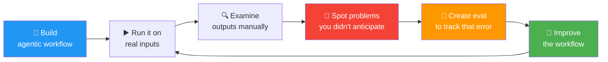
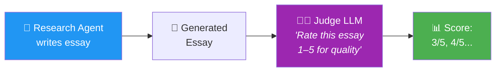
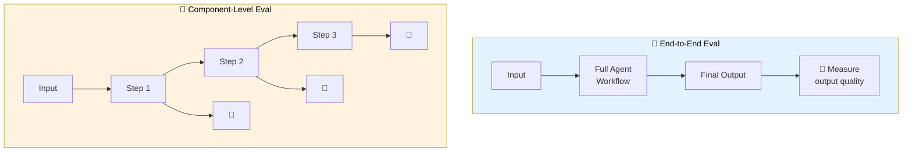

# 07 · Evaluating Agentic AI (Evals) 📏

---

## 🎯 One Line
> Evals = systematically measuring how well your agentic workflow performs, so you can find what's broken and fix it — the **#1 predictor** of building agents effectively.

---

## 🖼️ Why Evals Matter



> 💡 **Evals = health checkup for your agent. Pehle bana, phir problems dhundh, phir thermometer bana jo track kare ki bimari theek ho rahi hai ya nahi! 🩺**

**The key insight:** Don't try to predict all failure modes upfront. Build first → examine outputs → discover issues → then create evals to measure and track them. Problems are very hard to anticipate in advance.

---

## 🧱 Two Types of Eval Metrics

| Type | When to Use | How It Works | Example |
|------|------------|-------------|---------|
| **📐 Objective (Code-based)** | Clear right/wrong criteria | Write code to check for specific conditions | Did the output mention a competitor? (yes/no) |
| **🧑‍⚖️ Subjective (LLM-as-Judge)** | Quality is fuzzy, no black/white answer | Prompt another LLM to score the output | "Rate this essay's quality 1–5" |

### 📐 Objective Eval — Competitor Mention Example

Your customer service agent sometimes drops competitor names unprompted:

```
❌ "We're much better than our competitor, ComproCo."
❌ "Unlike RivalCo, we make returns easy."
```

This is a problem most businesses wouldn't anticipate before building the agent. But once spotted, you can measure it:

```
┌──────────────────────────────────────────────────────┐
│  EVAL: Competitor Mention Rate                       │
│                                                      │
│  competitors = ["ComproCo", "RivalCo", "TheOtherCo"]│
│                                                      │
│  For each response:                                  │
│    → Search output text for competitor names          │
│    → Flag if found                                   │
│                                                      │
│  Score = mentions / total_responses                   │
│                                                      │
│  Week 1: 12%  →  Week 2: 5%  →  Week 3: 0.5% ✅    │
└──────────────────────────────────────────────────────┘
```

**Why this works:** It's binary — either the name appears or it doesn't. No ambiguity. Just code.

### 🧑‍⚖️ Subjective Eval — LLM-as-Judge Example

For a research agent writing essays, quality is harder to measure with code:



| Essay Topic | Judge Score |
|------------|------------|
| Black hole science | ⭐⭐⭐ (3/5) |
| Robots harvesting fruit | ⭐⭐⭐⭐ (4/5) |

As you improve the agent → scores should go up over time.

> ⚠️ **Caveat from Andrew Ng:** LLMs are actually **not great** at 1-to-5 scale ratings. It's a quick-and-dirty first cut, but Module 4 teaches better techniques for more accurate LLM-based scoring.

---

## 🔬 Two Levels of Evals



| Level | What It Measures | Use Case |
|-------|-----------------|----------|
| **🎯 End-to-End** | Quality of the **final output** of the entire agent | "Is the overall result good?" |
| **🔧 Component-Level** | Quality of **each individual step's** output | "Which specific step is failing?" |

Both are useful for different parts of your dev process. End-to-end tells you if there's a problem; component-level tells you **where** the problem is.

---

## 🔍 Error Analysis — The Detective Work

Beyond automated evals, there's **error analysis** — manually reading through the intermediate outputs (traces) of every step to spot where things go wrong.

```
┌──────────────────────────────────────────────────┐
│  ERROR ANALYSIS = Reading the agent's diary 📖   │
│                                                  │
│  Step 1 output: ✅ Looks good                    │
│  Step 2 output: ✅ DB query correct              │
│  Step 3 output: ❌ Mentions competitor here!      │
│                    ↑                             │
│                    Found the bug! 🐛             │
└──────────────────────────────────────────────────┘
```

> 💡 **Error analysis = doctor ka stethoscope. Eval bataata hai "patient beemar hai." Error analysis bataata hai "problem yahan hai — Step 3 mein." 🩺**

---

## 📋 The Eval Workflow (Summary)

| Step | Action | Key Point |
|------|--------|-----------|
| **1. Build first** | Don't try to predict every failure upfront | Problems are hard to anticipate |
| **2. Examine outputs** | Manually read agent responses | Look for things you wish it did better |
| **3. Create eval** | Write code (objective) or use LLM judge (subjective) | Track the specific error rate |
| **4. Fix & improve** | Modify workflow, prompts, or tools | Use eval to verify the fix works |
| **5. Repeat** | Keep examining → finding → eval-ing → fixing | Continuous improvement loop |

---

## ⚠️ Gotchas

- ❌ **Don't try to write all evals before building** — you can't predict what will go wrong. Build first, evaluate second.
- ❌ **Don't trust 1-5 scale LLM ratings blindly** — they're a rough starting point but not very accurate. Better techniques exist (Module 4).
- ❌ **Don't only do end-to-end evals** — if the final output is bad, you need component-level evals to pinpoint WHERE it broke.
- ❌ **Don't skip manual examination** — error analysis (reading traces) catches things automated evals miss.

---

## 🧪 Quick Check

<details>
<summary>❓ Why shouldn't you build evals before building the workflow?</summary>

Because it's **very hard to predict** what will go wrong in advance. You'll discover issues only after running the agent on real inputs and examining outputs. Build first → discover problems → then create targeted evals.
</details>

<details>
<summary>❓ When do you use code-based evals vs LLM-as-judge?</summary>

**Code-based** = when the criterion is **objective** (black/white). Example: did it mention a competitor name? Yes or no.  
**LLM-as-judge** = when the criterion is **subjective** (quality, tone, coherence). Example: how good is this essay? No simple code can answer that.
</details>

<details>
<summary>❓ What's the difference between end-to-end and component-level evals?</summary>

**End-to-end** measures the **final output** quality of the entire agent → tells you IF something is wrong.  
**Component-level** measures **each step's** output quality → tells you WHERE it's wrong.  
Dono chahiye — end-to-end for overall health, component for debugging! 🔍
</details>

<details>
<summary>❓ What is error analysis?</summary>

Manually reading through the **intermediate outputs (traces)** of each step in the workflow to spot where the agent falls short. It's the detective work that automated evals can't fully replace. You literally read Step 1's output, Step 2's output, etc. to find the weak link.
</details>

---

> **← Prev** [Task Decomposition](06-task-decomposition.md) · **Next →** [Design Patterns](08-design-patterns.md)
