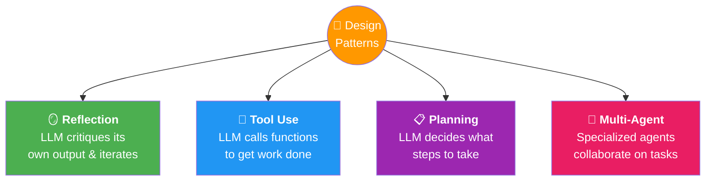
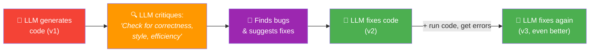
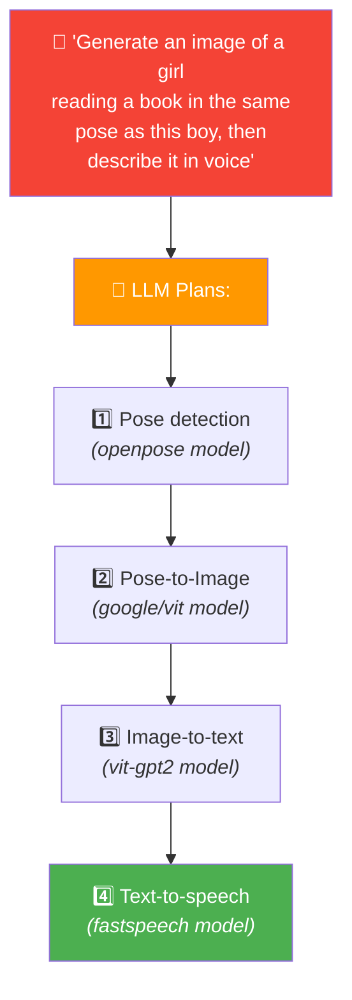
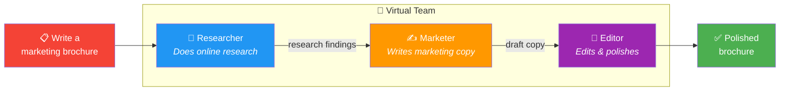

# 08 · Agentic Design Patterns 🎨

---

## 🎯 One Line
> Four patterns for combining building blocks into powerful workflows: **Reflection** (self-critique loop), **Tool Use** (external capabilities), **Planning** (LLM decides the steps), **Multi-Agent** (team of specialists).

---

## 🖼️ The Four Patterns At A Glance



| Pattern | Core Idea | Control Level | Difficulty |
|---------|-----------|--------------|------------|
| 🪞 **Reflection** | LLM examines its own output, finds flaws, iterates | High — developer controls the loop | ⭐ Easiest to start |
| 🔧 **Tool Use** | LLM calls external functions (search, code, APIs) | High — developer defines available tools | ⭐⭐ Moderate |
| 📋 **Planning** | LLM itself decides the sequence of actions | Lower — LLM picks the plan | ⭐⭐⭐ Experimental |
| 👥 **Multi-Agent** | Multiple specialized LLM personas collaborate | Lowest — agents interact freely | ⭐⭐⭐ Experimental |

> 💡 **Top to bottom = zyada control se kam control. Reflection mein tum boss ho. Multi-Agent mein tum manager ho — team ko kaam de diya, ab hope karo sab theek kare! 😅**

---

## 🪞 Pattern 1: Reflection

LLM generates output → critiques it → improves based on critique → repeat.



**How it works in practice:**

| Step | What Happens |
|------|-------------|
| 1. Generate | Ask LLM to write code for a task → outputs v1 |
| 2. Critique | Prompt the **same LLM**: "Here's code for X. Check for correctness, style, efficiency. Give constructive criticism." |
| 3. Fix | Feed critique back: "This bug was found, fix it" → v2 |
| 4. External feedback (optional) | Actually **run the code**, capture errors → feed errors back → v3 |

**Two flavors:**
- **Self-reflection** — same LLM critiques its own output
- **Critique agent** — a separate LLM prompted as "your role is to critique code" (foreshadowing multi-agent!)

> ⚠️ Not magic — doesn't make everything 100% correct. But gives a **nice performance bump** for relatively low effort.

---

## 🔧 Pattern 2: Tool Use

LLM can call **functions** (tools) to interact with the outside world.

```
┌─────────────────────────────────────────────────────────────┐
│  🤖 LLM                                                     │
│                                                              │
│  "What's the best coffee maker?"                             │
│       ↓                                                      │
│  🔧 Calls: web_search("best coffee maker reviews 2026")     │
│       ↓                                                      │
│  📊 Gets results → synthesizes answer                        │
│                                                              │
│  "If I invest $100 at 5% for 10 years?"                     │
│       ↓                                                      │
│  💻 Calls: execute_code("100 * 1.05**10")                   │
│       ↓                                                      │
│  📊 Computes: $162.89                                        │
└─────────────────────────────────────────────────────────────┘
```

**What tools are available?**

| Tool Category | Examples (from course slides) |
|--------------|---------|
| 🔍 Information Gathering | Web search, Wikipedia, database access |
| 📊 Analysis & Math | Code execution, Wolfram Alpha, Bearly Code Interpreter |
| 📧 Productivity | Email, calendar, messaging |
| 🖼️ Images | Image generation, image captioning, OCR |

The key: LLM **decides** which tool to call based on the task. Developer defines the menu of available tools.

---

## 📋 Pattern 3: Planning

Instead of the developer hardcoding the steps, the **LLM itself decides** what sequence of actions to take.



*Example from the [HuggingGPT paper](https://arxiv.org/abs/2303.17580) (Shen et al., 2023) — the LLM orchestrates multiple specialized Hugging Face models.*

**Key difference from Task Decomposition:**
- In Task Decomposition (Lesson 06): **you** (the developer) decide the steps
- In Planning pattern: the **LLM** decides the steps at runtime

> ⚠️ Planning agents are **harder to control** and more experimental. The LLM might pick a bad plan. But when they work, the results can be delightful.

---

## 👥 Pattern 4: Multi-Agent Collaboration

Multiple LLM "agents" — each prompted with a different role/persona — work together on a task.



**Real-world example: ChatDev** (by Chen Qian et al.)
- A virtual software company with agents playing different roles:

| Agent Role | What It Does |
|-----------|-------------|
| 👔 CEO | High-level decisions |
| 💻 Programmer | Writes code |
| 🧪 Tester | Tests the code |
| 🎨 Designer | UI/UX design |

These agents collaborate to **complete entire software development tasks** — like a virtual dev team.

**Hard proof from research** — *"Improving Factuality and Reasoning through Multiagent Debate"* (Du et al., 2023):

| Task | Single Agent | Multi-Agent | Improvement |
|------|-------------|------------|-------------|
| Biographies | 66.0% | **73.8%** | +7.8% |
| MMLU | 63.9% | **71.1%** | +7.2% |
| Chess moves | 29.3% | **45.2%** | +15.9% |

> 💡 **Multi-Agent = hiring ek team. Tum manager ho — har agent ko role do, kaam karne do, aur hope karo sab milke kuch accha bana dein. Jaise real office mein hota hai! 🏢**

> ⚠️ More difficult to control — you don't always know what agents will do. But research shows better outcomes for complex tasks (biographies, chess moves, software dev).

---

## 📊 Pattern Comparison

| | 🪞 Reflection | 🔧 Tool Use | 📋 Planning | 👥 Multi-Agent |
|---|---|---|---|---|
| **Who decides steps?** | Developer | Developer (tools menu) | LLM | LLMs (collaborating) |
| **Control** | 🟢 High | 🟢 High | 🟡 Medium | 🔴 Lower |
| **Predictability** | 🟢 High | 🟢 High | 🟡 Varies | 🔴 Varies |
| **Implementation** | Easy | Moderate | Harder | Hardest |
| **When to use** | Improve quality via iteration | Need external data/actions | Steps not known upfront | Complex tasks needing specialization |

---

## ⚠️ Gotchas

- ❌ **Reflection isn't magic** — it gives a nice performance bump, not 100% correctness
- ❌ **Planning agents can pick bad plans** — they're experimental and harder to control
- ❌ **Multi-agent ≠ always better** — the complexity overhead is only worth it for genuinely complex tasks
- ❌ **These patterns combine** — real workflows often mix 2-3 patterns together (e.g., reflection + tool use in the code example)

---

## 🧪 Quick Check

<details>
<summary>❓ What are the 4 agentic design patterns?</summary>

1. **Reflection** — LLM critiques its own output and iterates
2. **Tool Use** — LLM calls external functions (search, code, APIs)
3. **Planning** — LLM decides the sequence of steps at runtime
4. **Multi-Agent** — Multiple specialized LLM agents collaborate

Control decreases as you go down the list. Reflection is easiest; Multi-Agent is most experimental.
</details>

<details>
<summary>❓ In Reflection, what's the difference between self-reflection and a critique agent?</summary>

**Self-reflection** = the same LLM critiques its own output (one model, two prompts).  
**Critique agent** = a separate LLM prompted specifically as "your role is to critique code" — a preview of multi-agent pattern! Both work; critique agent can sometimes give more focused feedback.
</details>

<details>
<summary>❓ How is the Planning pattern different from Task Decomposition (Lesson 06)?</summary>

In **Task Decomposition**, the **developer** breaks the task into steps and hardcodes the workflow.  
In **Planning**, the **LLM itself** decides what steps to take at runtime. More flexible but harder to control — the LLM might pick a bad plan.
</details>

<details>
<summary>❓ What is ChatDev?</summary>

A software framework (by Chen Qian et al.) where **multiple AI agents** — each with a role like CEO, Programmer, Tester, Designer — collaborate as a virtual software company to complete development tasks. It's a real example of the multi-agent pattern in action.
</details>

<details>
<summary>❓ Do these patterns work in isolation?</summary>

**No!** Real workflows often **combine** patterns. Example: the code generation demo uses **Reflection** (critique loop) + **Tool Use** (running code to get error messages). The patterns are building blocks you mix and match.
</details>

---

> **← Prev** [Evaluating Agentic AI](07-evals.md)
>
> 🎉 **Module 1 Complete!** → **Next Module:** [Reflection Design Pattern](../module-2-reflection/)
