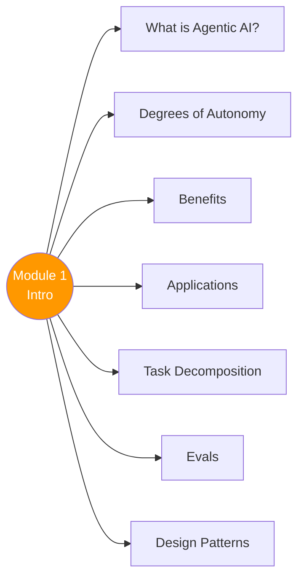

# 🚀 Module 1 — Introduction to Agentic Workflows

> Agentic AI kya hai, kyu chahiye, kahan use hota hai, aur kaise banate hain — sab yahan! 

---

## 🧠 Brain — Module Overview

## 📊 Progress

| # | Lesson | Confidence | Revised |
|---|--------|-----------|---------|
| 01 | [Welcome](01-welcome.md) | 🔴 | — |
| 02 | [What is Agentic AI?](02-what-is-agentic-ai.md) | 🟡 | — |
| 03 | [Degrees of Autonomy](03-degrees-of-autonomy.md) | 🟡 | — |
| 04 | [Benefits of Agentic AI](04-benefits.md) | 🟡 | — |
| 05 | [Agentic AI Applications](05-applications.md) | 🔴 | — |
| 06 | [Task Decomposition](06-task-decomposition.md) | 🔴 | — |
| 07 | [Evaluating Agentic AI](07-evals.md) | 🔴 | — |
| 08 | [Agentic Design Patterns](08-design-patterns.md) | 🔴 | — |

## 🧩 Memory Fragments

> - Andrew Ng coined "agentic" → marketers hijacked it → hype >> reality, but real value IS growing fast
> - #1 skill differentiator: disciplined dev process (evals + error analysis)
> - Without agentic workflows, many projects would be *impossible*
> - Non-agentic = writing essay with no backspace. Agentic = outline → research → draft → revise
> - Course running example: **Research Agent** (plan → search → synthesize → draft → edit → report)
> - Task decomposition = THE key skill that determines your ability to build agents

---

## 🎬 Teach Mode

| # | Lesson | One-liner | Time |
|---|--------|-----------|------|
| 01 | [Welcome](01-welcome.md) | Why this matters + course overview | 2 min |
| 02 | [What is Agentic AI?](02-what-is-agentic-ai.md) | Core definition + agentic vs traditional | 5 min |
| 03 | [Degrees of Autonomy](03-degrees-of-autonomy.md) | Spectrum from assistive → fully autonomous | 5 min |
| 04 | [Benefits](04-benefits.md) | Why go agentic? The superpowers | 4 min |
| 05 | [Applications](05-applications.md) | Real-world use cases | 7 min |
| 06 | [Task Decomposition](06-task-decomposition.md) | Breaking workflows into steps | 8 min |
| 07 | [Evals](07-evals.md) | How to measure if it works | 5 min |
| 08 | [Design Patterns](08-design-patterns.md) | The 4 patterns overview | 7 min |

---

## 📚 Sources
> - 🎓 Course: [Agentic AI](https://learn.deeplearning.ai/courses/agentic-ai) — DeepLearning.AI, Andrew Ng

## 30-Second Recall 🧠
> _Will be written after all lessons are filled._
