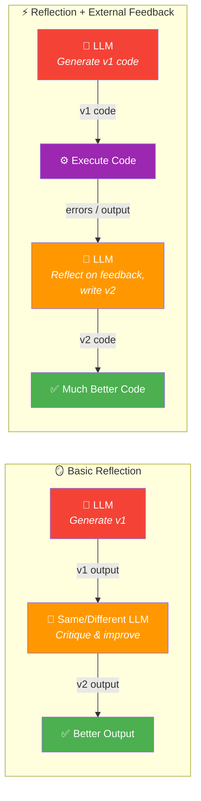
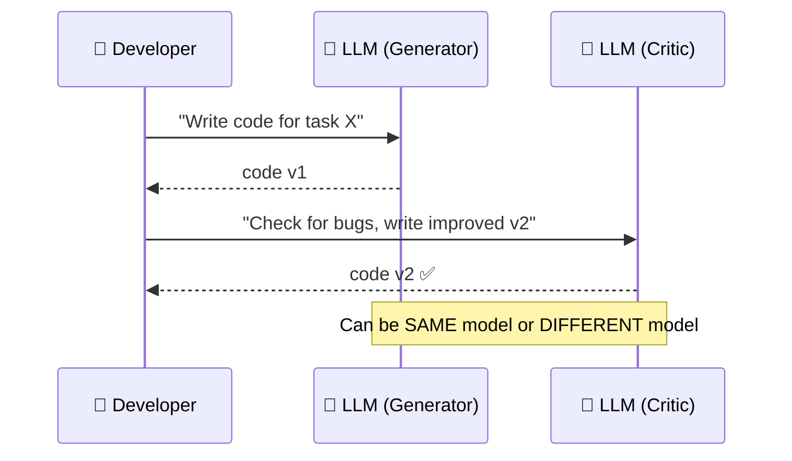
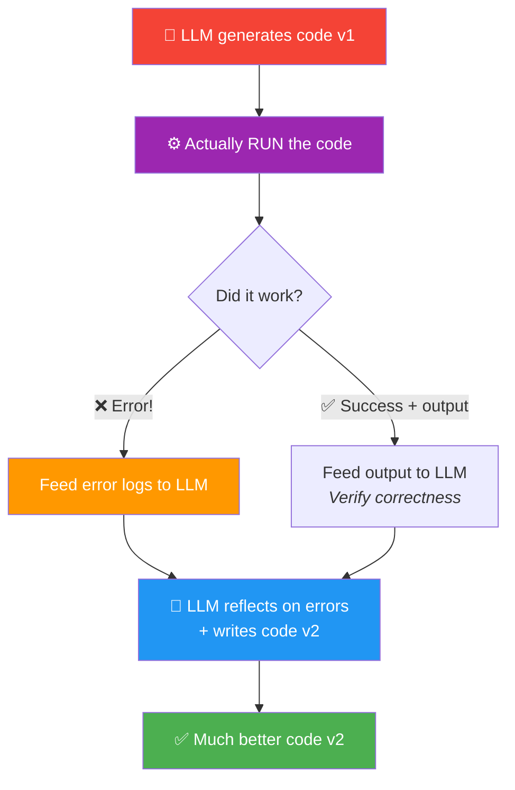

# 01 · Reflection to Improve Outputs 🪞

---

## 🎯 One Line
> Generate first draft → critique it → fix it → get a better output. Add **external feedback** (like running code and getting errors) and the improvement skyrockets.

---

## 🖼️ The Big Picture



> 💡 **Reflection = apna kaam khud check karna, jaise exam mein paper submit karne se pehle ek baar re-read karte ho. Fark sirf itna hai — LLM ko tum bata sakte ho KYA check karna hai! 📝**

---

## 🧱 Core Concept: How Humans Reflect

Andrew Ng's email example makes this crystal clear:

```
┌──────────────────────────────────────┐  ┌──────────────────────────────────────┐
│  📧 Email v1 (First Draft)           │  │  📧 Email v2 (After Reflection)      │
│                                      │  │                                      │
│  Hey Tommy,                          │  │  Hey Tommy,                          │
│  I'll be in New York next month,     │  │  I'll be in New York next month      │
│  let me know if you'll be            │  │  from the 5th-7th. Let me know if    │
│  fre for dinner one night.           │  │  you'll be free for dinner one       │
│                                      │  │  night.                              │
│                                      │  │  Andrew                              │
└──────────────────────────────────────┘  └──────────────────────────────────────┘
```

| Problem Found | Fix Applied |
|--------------|-------------|
| ❌ "Next month" — vague, kaunsa date? | ✅ Specific: "5th–7th" |
| ❌ "fre" — typo | ✅ Fixed: "free" |
| ❌ No signature | ✅ Added "Andrew" |

**The takeaway:** You read your draft → spot problems → fix them. LLMs can do the exact same thing with a second prompt.

---

## ⚡ How It Works for LLMs

### Step 1: Basic Reflection (Self-Critique)



| Component | What It Does | Key Detail |
|-----------|-------------|------------|
| **Generator LLM** | Writes the first draft (v1) | Any capable model works |
| **Critic LLM** | Reviews v1, finds flaws, writes v2 | Can be the same model with a different prompt, OR a completely different model |
| **Why different models?** | Different LLMs have different strengths | **Reasoning models** (thinking models) are particularly good at finding bugs 🐛 |

> 💡 **Generator = writer jo essay likhta hai. Critic = teacher jo red pen se mistakes nikalta hai. Same person ho sakta hai (self-review), ya alag bhi (peer review)! 🖊️**

### Step 2: Add External Feedback (The Power Move)

This is where reflection goes from *"nice to have"* to *"game changer"*:



**Concrete example from the course:**

```
┌─────────────────────────────────────────────────────────────────┐
│  🤖 LLM writes code v1                                         │
│  ↓                                                              │
│  ⚙️ Execute code → 💥 SyntaxError: unterminated string literal  │
│     (detected at line 1)                                        │
│  ↓                                                              │
│  🤖 LLM receives: v1 code + error message                      │
│     "Reflect on the error and write improved v2"                │
│  ↓                                                              │
│  ✅ Code v2 — syntax fixed, runs correctly                      │
└─────────────────────────────────────────────────────────────────┘
```

---

## 🔑 The Key Insight

| Reflection Type | What the LLM Has | Power Level |
|----------------|-------------------|-------------|
| **Without external feedback** | Only its own output to stare at | 📊 Modest improvement — LLM is guessing what *might* be wrong |
| **With external feedback** | Output + **new information** (errors, execution results, search results) | 🚀 Much bigger improvement — LLM knows exactly what went wrong |

> 💡 **Bina external feedback = andhera mein teer chalana 🏹. With external feedback = spotlight ON karke target dikhana 🔦. Zyada accurate hoga, obviously!**

**Design consideration (Andrew Ng's exact words):**
> *"Whenever reflection has an opportunity to get additional information, that makes it much more powerful."*

---

## 📌 What Reflection Works On

Not just code — reflection improves **any** LLM output:

| Use Case | Generate v1 | Reflect & Fix → v2 |
|----------|-------------|---------------------|
| ✉️ **Emails** | Write first draft | Check tone, typos, missing details |
| 💻 **Code** | Write initial code | Check bugs, style, efficiency |
| 📊 **Charts** | Generate visualization | Critique readability, labels, data accuracy |
| 📝 **Essays** | Write first draft | Check coherence, facts, completeness |

---

## ⚠️ Gotchas

- ❌ **Reflection is NOT magic** — it doesn't make LLMs always right. It gives a **modest performance bump**, not perfection
- ❌ **Without external feedback, improvement is limited** — the LLM is just re-reading its own work (like proofreading without a spell-checker)
- ❌ **Don't skip external feedback when it's available** — if you *can* run the code, search the web, or check facts, always feed that back. It's the biggest lever

---

## 🧪 Quick Check

<details>
<summary>❓ What's the simplest way to implement reflection?</summary>

Prompt the LLM to generate a first draft (v1), then pass v1 back to the **same LLM** with a different prompt asking it to critique and improve → get v2. That's it — two prompts, one loop. **Surprisingly easy to implement.**
</details>

<details>
<summary>❓ Why might you use a DIFFERENT LLM for the critique step?</summary>

Different LLMs have different strengths. **Reasoning models** (thinking models) are particularly good at finding bugs. So you might use a general model for fast v1 generation, but a reasoning model for careful critique. Jaise ek banda fast draft likhta hai, doosra banda carefully proofread karta hai — dono alag skills! 🧐
</details>

<details>
<summary>❓ Why is external feedback so important for reflection?</summary>

Without it, the LLM is only looking at its own output — it's guessing what *might* be wrong. With external feedback (error logs, code execution results, search results), the LLM gets **new information** it didn't have before, letting it pinpoint exactly what's wrong. It's the difference between guessing and *knowing*.
</details>

<details>
<summary>❓ Is reflection only useful for code?</summary>

No! Reflection works for **any** LLM output — emails, essays, charts, SQL queries, domain names, anything. The pattern is universal: generate → critique → improve.
</details>

---

> **Next →** [Why Not Just Direct Generation?](02-why-not-direct-generation.md)
