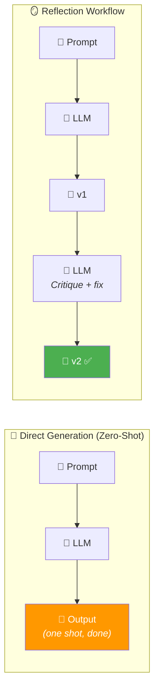
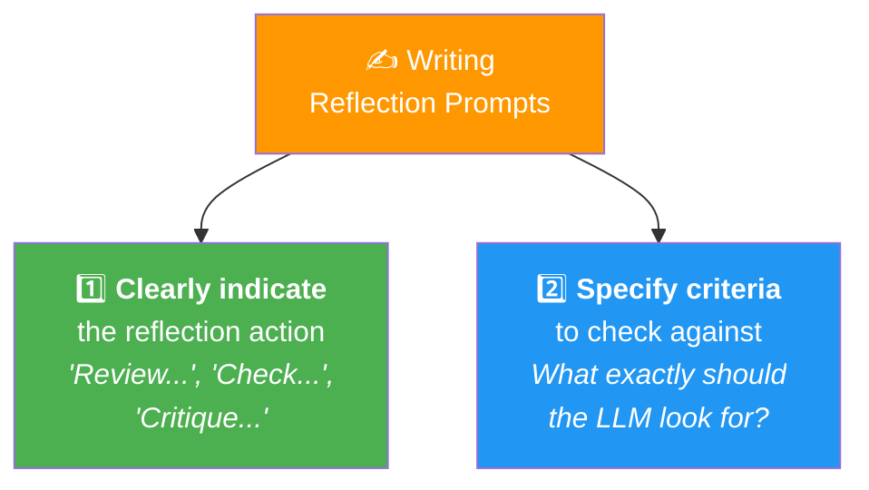

# 02 · Why Not Just Direct Generation? 🎯

---

## 🎯 One Line
> Direct generation (zero-shot) works fine for simple tasks, but **reflection consistently outperforms it** across many tasks — research proves it, and writing good reflection prompts is the key skill.

---

## 🖼️ The Big Picture



> 💡 **Direct generation = ek hi attempt mein exam likhna, bina re-check kiye. Reflection = likhne ke baad ek baar padh ke mistakes fix karna. Kaun better karega? Obviously second wala! 📝**

---

## 🧱 Key Concept: Zero / One / Few-Shot Prompting

Before comparing, let's nail down what "zero-shot" means:

```
┌─────────────────────────────────────────────────────────────────────┐
│  ZERO-SHOT (0 examples)                                            │
│  "Convert to MM/DD/YYYY format. Input: {input_date}"               │
│                                                                     │
│  ONE-SHOT (1 example)                                               │
│  "Convert to MM/DD/YYYY format.                                     │
│   Input: Jan 1st, 2025 → Output: 01/01/2025                        │
│   Input: {input_date}"                                              │
│                                                                     │
│  TWO-SHOT / FEW-SHOT (2+ examples)                                  │
│  "Convert to MM/DD/YYYY format.                                     │
│   Input: Jan 1st, 2025 → Output: 01/01/2025                        │
│   Input: 21st June, 2025 → Output: 06/21/2025                      │
│   Input: {input_date}"                                              │
└─────────────────────────────────────────────────────────────────────┘
```

| Type | Examples in Prompt | When to Use |
|------|-------------------|-------------|
| **Zero-shot** | 0 — just the instruction | Simple, well-understood tasks |
| **One-shot** | 1 input→output pair | Show the format you want |
| **Few-shot** | 2+ input→output pairs | Complex formats, edge cases |

**Direct generation = zero-shot prompting.** You give the LLM a task with no examples and expect it to produce the final answer in one go.

---

## 📊 Research Proof: Reflection Beats Direct Generation

This is from the **Self-Refine paper** (Madaan et al., 2023) — one of the key research papers backing reflection:

```
Performance (%)    0    20    40    60    80    100
                   ├─────┼─────┼─────┼─────┼─────┤

Sentiment Reversal ██████████░░░░  → ██████████████████ ✅
Dialogue Response  ██████████████░  → ████████████████████ ✅
Code Optimization  ████████████░░░  → ██████████████████ ✅
Code Readability   ██████████░░░░░  → ████████████████████ ✅
Math Reasoning     ██████████████░  → ████████████████████ ✅
Acronym Generation ██████░░░░░░░░░  → ██████████████ ✅
Constrained Gen    ████████░░░░░░░  → ██████████████████ ✅

                   ░ = Zero-shot    █ = With Reflection
```

**Across ALL tasks and multiple models (GPT-3.5, GPT-4), reflection consistently outperforms direct generation.**

> 💡 **Research ka verdict clear hai — reflection wins. Har baar, har task mein. "But results may vary depending on your specific application" — Andrew Ng ki disclaimer bhi sun lo! 😄**

---

## 🛠️ Where Reflection Helps Most

Not every task benefits equally. Here's where reflection really shines:

| Task | Problem Without Reflection | Reflection Prompt Strategy |
|------|---------------------------|--------------------------|
| 🏗️ **Complex structured output** (HTML tables, deeply nested JSON) | Missing tags, broken nesting | *"Validate the HTML code"* / *"Check JSON structure"* |
| 📋 **Step-by-step instructions** (how to brew tea, setup guides) | Missing steps, wrong order | *"Check instructions for coherence and completeness"* |
| 🌐 **Domain name brainstorming** | Unintended meanings, hard to pronounce | *"Does this have negative connotations? Is it hard to pronounce?"* |
| ✉️ **Professional emails** | Wrong tone, factual errors, missing details | *"Check tone, verify facts and dates, then rewrite"* |

> **Andrew Ng's real-world use:** His team at AI Fund actually used reflection prompts to brainstorm domain names for startups — checking pronunciation, negative connotations in other languages, and filtering down to a shortlist. Not just theory — production usage! ✅

> ⚠️ For **basic** tasks (simple HTML, short code), LLMs are already quite good — reflection may not help much. It shines most on **complex outputs** where there are more things that can go wrong.

---

## ✍️ How to Write Good Reflection Prompts

Two golden rules from the course:



### Example Prompts (from Andrew Ng's slides)

| Use Case | Reflection Prompt |
|----------|------------------|
| 🌐 **Domain names** | *"Review the domain names you suggested. Check if each name is easy to pronounce and easy to spread via word of mouth. Consider whether each name might mean something negative in other languages. Then output a shortlist of only the names that meet these criteria."* |
| ✉️ **Email improvement** | *"Review the email first draft. Check that the tone is professional and look for phrases that could be considered rude or insensitive. Verify all facts, dates, and promises are accurate. Then write the next draft of the email."* |

**Pattern in both:**
1. ✅ **Tell it to review/reflect** — "Review the domain names", "Review the email"
2. ✅ **List specific criteria** — pronunciation, negative meanings, tone, facts
3. ✅ **Tell it what to output** — "output a shortlist", "write the next draft"

> 💡 **Reflection prompt = exam rubric dena teacher ko. Agar tum bolo "check karo" toh generic feedback milega. Agar bolo "spelling check karo, grammar check karo, facts verify karo" — toh FOCUSED feedback milega! Specificity = quality. 🎯**

---

## 🏆 Pro Tip: Learn from Others' Prompts

Andrew Ng's personal tip for getting better at prompt engineering:

> *"One of the ways I've learned to write better prompts is to read a lot of other prompts that other people have written. Sometimes I'll download open source software and find the prompts in a piece of software that I think is especially well done."*

**Translation:** Go read the prompts in well-built open source AI tools. It's like reading good code to become a better programmer — same principle, applied to prompts.

---

## ⚠️ Gotchas

- ❌ **Don't use reflection for trivially simple tasks** — basic HTML, simple math, short code. LLMs already nail these. Reflection adds latency for zero benefit
- ❌ **Vague reflection prompts = vague improvements** — "make it better" is useless. Specify WHAT to check
- ❌ **Results may vary** — reflection *consistently* outperforms zero-shot in research, but YOUR specific task might be the exception. Always test with evals

---

## 🧪 Quick Check

<details>
<summary>❓ What is "direct generation" also called?</summary>

**Zero-shot prompting** — you give the LLM an instruction with zero examples and let it produce the answer in one go. No reflection, no iteration.
</details>

<details>
<summary>❓ What's the difference between zero-shot, one-shot, and few-shot?</summary>

The number of **examples** (input→output pairs) included in the prompt:
- **Zero-shot** = 0 examples (just the instruction)
- **One-shot** = 1 example
- **Few-shot** = 2+ examples

More examples = the LLM better understands your expected format.
</details>

<details>
<summary>❓ What research paper proved reflection outperforms direct generation?</summary>

**"Self-Refine: Iterative Refinement with Self-Feedback"** by Madaan et al. (2023). Tested across 7 tasks (sentiment reversal, code optimization, math reasoning, etc.) — reflection won on all of them, across multiple models.
</details>

<details>
<summary>❓ What are the two golden rules for writing reflection prompts?</summary>

1. **Clearly indicate the reflection action** — "Review...", "Check...", "Critique..."
2. **Specify the criteria to check** — don't just say "improve it". Say WHAT to look for: tone, facts, pronunciation, structure, etc.

Jitna specific criteria, utna focused feedback! 🎯
</details>

<details>
<summary>❓ When does reflection NOT help much?</summary>

For **trivially simple tasks** that LLMs already handle well — basic HTML, short code snippets, simple formatting. Reflection shines on **complex outputs** where more things can go wrong (nested JSON, multi-step instructions, professional emails with facts to verify).
</details>

---

> **← Prev** [Reflection to Improve Outputs](01-reflection-to-improve-outputs.md) · **Next →** [Chart Generation Workflow](03-chart-generation-workflow.md)
