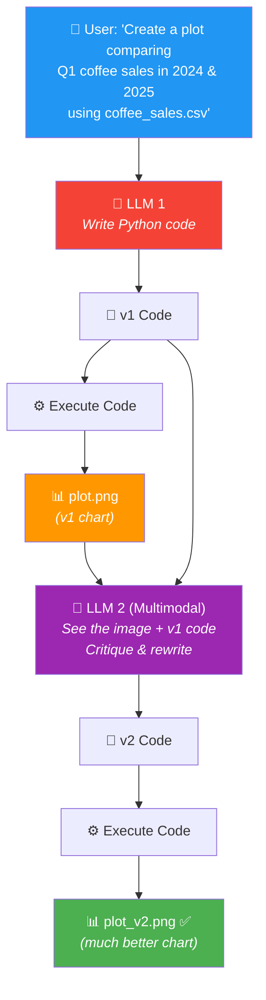
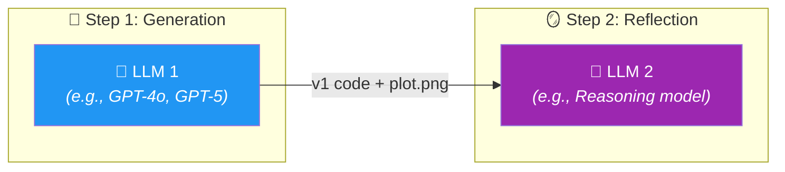

# 03 · Chart Generation Workflow 📊

---

## 🎯 One Line
> Use a **multimodal LLM** to generate chart code, then feed the generated image back into the LLM to critique it visually and produce a better version — reflection on images, not just text.

---

## 🖼️ The Full Workflow



> 💡 **Yeh reflection ka multimodal version hai — LLM sirf code nahi padhta, chart ki IMAGE bhi dekhta hai! Jaise art teacher painting dekh ke feedback deta hai, not just paintbrush strokes ka description padh ke 🎨**

---

## 🧱 The Coffee Sales Example

### The Data

| date | price | coffee_name |
|------|-------|-------------|
| 2024-01-12 | 3.87 | Latte |
| 2024-01-28 | 3.87 | Hot Chocolate |
| 2024-02-09 | 3.87 | Hot Chocolate |
| 2024-03-01 | 2.89 | Cappuccino |
| ... | ... | ... |
| 2025-03-23 | 3.57 | Latte |

**Task:** *"Create a plot comparing Q1 coffee sales in 2024 and 2025"*

### What Happened

```
┌──────────────────────────────────┐   ┌──────────────────────────────────┐
│  📊 v1: Stacked Bar Chart        │   │  📊 v2: Grouped Bar Chart ✅      │
│                                  │   │                                  │
│  ██████████████                  │   │  ██  ░░    ██  ░░    ██  ░░     │
│  ██████████                      │   │  ██  ░░    ██  ░░    ██  ░░     │
│  ██████                          │   │  ██  ░░    ██  ░░    ██  ░░     │
│  ████                            │   │                                  │
│                                  │   │  Latte  Choco  Cappuccino       │
│  ❌ Hard to compare               │   │  ██ = 2024    ░░ = 2025          │
│  ❌ Stacked = visually confusing   │   │  ✅ Clear comparison              │
│  ❌ Not intuitive                  │   │  ✅ Side-by-side = easy to read   │
└──────────────────────────────────┘   └──────────────────────────────────┘
```

**v1 was a stacked bar chart** — technically correct but visually confusing. After the multimodal LLM *looked at the image* and critiqued it, it switched to a **grouped bar chart** — much clearer for comparison.

---

## ⚡ The Two-LLM Strategy

A key insight from this lesson: you can (and often should) use **different models** for generation vs reflection.



| Role | What Model | Why |
|------|-----------|-----|
| **Generator** | Fast general model (GPT-4o, GPT-5, etc.) | Quick first draft, good at code generation |
| **Critic** | Reasoning model / multimodal model | Better at visual analysis, spotting issues, structured critique |

> Different models have different strengths — **toggle and experiment** with combinations to find what works best for your use case.

---

## ✍️ The Prompts (from course slides)

### Generation Prompt (LLM 1)
```
Write Python code to generate a visualization 
that answers the user's question:
{user prompt}
```

### Reflection Prompt (LLM 2)
```
You are an expert data analyst who provides 
constructive feedback on visualizations.

{v1 code} {plot.png} {conversation history}

Step 1: Critique the attached chart for readability, 
        clarity, and completeness.
Step 2: Write new code to implement your improvements.
```

**Notice the pattern** (same as Lesson 02):
1. ✅ **Role assignment** — "expert data analyst"
2. ✅ **Specific criteria** — "readability, clarity, and completeness"
3. ✅ **Clear action** — critique THEN write new code

---

## 🔑 What Makes This Special: Multimodal Reflection

This example introduces something new — the critic LLM doesn't just read the code, it **looks at the generated image**:

| Traditional Reflection | Multimodal Reflection |
|----------------------|----------------------|
| LLM reads code/text and guesses what output looks like | LLM **sees the actual image** and reasons about it visually |
| Might miss visual issues (colors, layout, readability) | Can spot: bad chart type, cramped labels, poor color choices |
| Text-only input | Text + image input |

> 💡 **Code padh ke sirf bugs milte hain. Chart DEKH ke UX problems milte hain — jaise stacked bar confusing hai, labels overlap ho rahe hain, colors similar hain. Visual feedback = visual problems caught! 👁️**

---

## ⚠️ Gotchas

- ❌ **Reflection impact varies by application** — some tasks get a BIG boost, some barely any. Andrew Ng is explicit: *"From various studies, reflection improves performance by a little bit on some, by a lot on some others, and maybe barely any at all on some other applications."*
- ❌ **Don't assume v2 is always better** — you need evals (next lesson!) to measure whether reflection actually helped
- ❌ **Model combinations matter** — a reasoning model for reflection often outperforms a non-reasoning model. Experiment with different pairings

---

## 🧪 Quick Check

<details>
<summary>❓ What's special about chart generation reflection compared to code reflection?</summary>

It's **multimodal** — the critic LLM doesn't just read the code, it actually **looks at the generated chart image**. This lets it spot visual issues (bad chart type, cramped labels, poor color choices) that code review alone would miss.
</details>

<details>
<summary>❓ In the coffee sales example, what was wrong with v1 and how was v2 better?</summary>

**v1** was a stacked bar chart — technically correct but hard to compare 2024 vs 2025 visually (bars stacked on top of each other).  
**v2** was a grouped bar chart — side-by-side bars for each coffee type, making comparison much clearer and more intuitive.
</details>

<details>
<summary>❓ Why use different LLMs for generation vs reflection?</summary>

Different models have different strengths. A fast general model (GPT-4o) is great for quick code drafts. A **reasoning model** is often better for critique — it's more thorough at spotting issues. Toggle and experiment to find the best combo for your task.
</details>

<details>
<summary>❓ Does reflection always improve chart quality?</summary>

**Not guaranteed.** Andrew Ng says impact varies: big boost on some tasks, barely any on others. You need to **measure with evals** (next lesson) to know if reflection helps for YOUR specific use case.
</details>

---

> **← Prev** [Why Not Just Direct Generation?](02-why-not-direct-generation.md) · **Next →** [Evaluating Impact of Reflection](04-evaluating-reflection.md)
