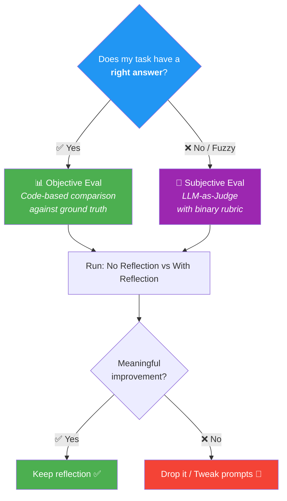
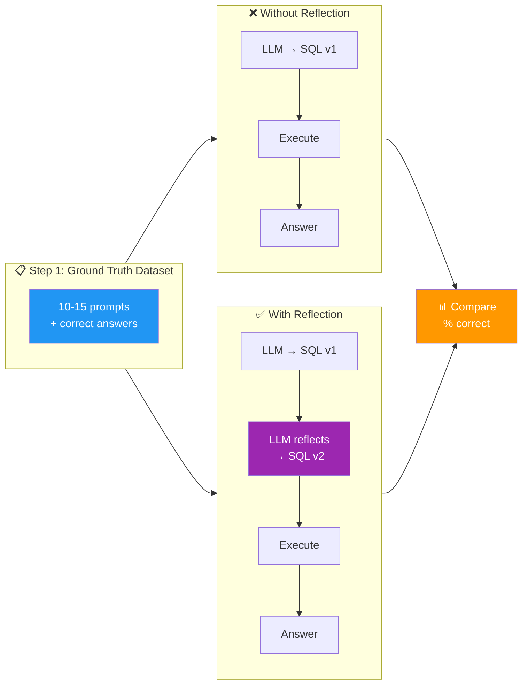
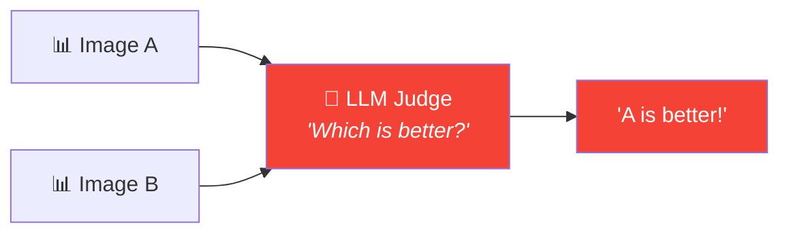
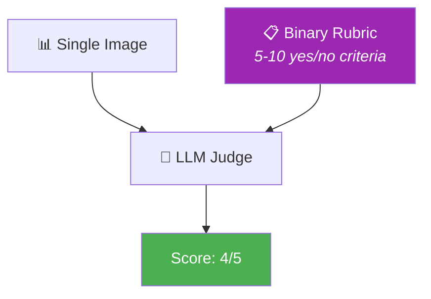

# 04 · Evaluating the Impact of Reflection 📏

---

## 🎯 One Line
> Reflection sounds great in theory — but **measure it** before committing. Build evals: **objective** (code-based, ground truth) or **subjective** (LLM-as-judge with a binary rubric, NOT pair comparison).

---

## 🖼️ The Big Picture



> 💡 **Reflection = extra step = extra latency. Bina eval ke use karna = andhe mein dawai lena — shayad kaam kare, shayad na kare. Pehle test karo, phir commit karo! 💊**

---

## 🧪 Objective Evals — When There's a Right Answer

### The SQL Query Example

You run a retail store. Users ask questions → LLM generates SQL queries → fetches answers from a database.

**Question:** Does adding a reflection step (LLM reviews & improves the SQL) actually get better answers?

### Step-by-Step Approach



### The Ground Truth Dataset

| Prompt | Ground Truth Answer |
|--------|-------------------|
| How many items sold in May 2025? | 1,201 |
| Most expensive item in inventory? | Airflow Sneaker |
| How many styles carried in store? | 14 |
| ... (10-15 total) | ... |

### Results

| Mode | % Correct |
|------|-----------|
| ❌ No Reflection | **87%** |
| ✅ With Reflection | **95%** |

87 → 95% is meaningful! Reflection is earning its keep here.

### The Power Move: Iterate on Prompts

Once you have this eval setup, you can **rapidly experiment**:
- Tweak the reflection prompt → re-run eval → see if % improves
- Add instruction: "make the SQL query run faster" — did it break correctness?
- Change the generation prompt → measure impact
- **The eval becomes your compass** — no more guessing which prompt is "better"

> 💡 **Eval bana lo toh prompt engineering guess-work se data-driven ho jaata hai. Pehle vibes se decide karte the, ab numbers se! 📈**

---

## 🎨 Subjective Evals — When There's No "Right" Answer

### The Problem

For the chart generation workflow (Lesson 03), v1 was a stacked bar chart, v2 was a grouped bar chart. But how do you **systematically prove** one is better — especially across many different chart requests?

```
  📊 v1 (Before)         📊 v2 (After)
  ┌──────────┐           ┌──────────┐
  │ Stacked  │           │ Grouped  │
  │ Bar      │           │ Bar      │
  └──────────┘           └──────────┘
  Which is "better"? 🤔  → No single right answer!
```

---

### ❌ Naive Approach: LLM Pair Comparison

Feed both images to a multimodal LLM and ask: *"Which is better?"*



**This doesn't work well.** Known issues:

| Issue | What Happens |
|-------|-------------|
| **Poor accuracy** | Answers often don't match human expert judgment |
| **Prompt sensitivity** | Slight prompt rewording → completely different "winner" |
| **Position bias** 🎯 | LLM tends to **always pick the first option** regardless of quality |

> 💡 **Position bias = jaise exam mein pehla option dekhke "yeh sahi hai" bol dena bina doosra padhe. Most LLMs first option ko prefer karte hain — jaise hum restaurants mein menu ka pehla item zyada order karte hain! 🍕**

---

### ✅ Better Approach: Rubric-Based Grading

Instead of comparing two images, **grade each image independently** against a rubric with **binary (0/1) criteria**.



### Example Rubric

| # | Criterion | Score |
|---|-----------|-------|
| 1 | Has a clear title | 0 or 1 |
| 2 | Axis labels present | 0 or 1 |
| 3 | Appropriate chart type | 0 or 1 |
| 4 | Axes use appropriate numerical range | 0 or 1 |
| 5 | Visually clean and readable | 0 or 1 |

**Why binary beats 1-5 scale?**

| Scale Rating (1-5) | Binary Criteria (sum of 0/1) |
|--------------------|-----------------------------|
| LLMs are **poorly calibrated** — what's a "3" vs "4"? | Each criterion is clear: it's there or it's not |
| Subjective, inconsistent across runs | **Objective-ish** — much more consistent |
| One vague number | **Decomposed** — you see WHERE it lost points |

> Sum up 5 binary scores → get a score from 0-5. Ten criteria → 0-10. **Same range, way more reliable.**

### Running the Full Eval

| User Query | No Reflection Score | With Reflection Score |
|-----------|--------------------|--------------------|
| Q1 coffee sales comparison | 4 | 6 |
| Monthly revenue trend | 5 | 8 |
| Top sellers bar chart | 5 | 7 |
| ... (10-15 queries) | ... | ... |

Run this **every time you change** the generation prompt or reflection prompt → systematic prompt tuning.

---

## 🧱 The Two Types of Evals — Summary

| | Objective Eval | Subjective Eval |
|---|---------------|----------------|
| **When** | There's a definitive right answer | Quality is fuzzy / multi-dimensional |
| **Method** | Code compares output vs ground truth | LLM-as-Judge with binary rubric |
| **Example** | SQL query → did it return 1,201? ✅/❌ | Chart → has title? labels? right type? |
| **Effort** | Easier to set up and manage | Needs rubric design + tuning |
| **Reliability** | Very high (it's code!) | Good with rubric, bad without |
| **Dataset** | 10-15 prompts + ground truth answers | 10-15 prompts + rubric criteria |

---

## ⚡ The Eval → Iterate Loop


**This is the real unlock:** once evals exist, prompt engineering becomes **scientific** — try idea, measure, keep or discard. No more vibes-based development.

---

## ⚠️ Gotchas

- ❌ **Never skip evals** — reflection adds latency. If it doesn't meaningfully improve output, drop it
- ❌ **Don't use LLM pair comparison** — position bias + poor calibration makes it unreliable
- ❌ **Don't ask LLM to rate 1-5** — it's poorly calibrated on scales. Use binary criteria instead
- ❌ **Small dataset is fine** — 10-15 examples is enough to start. Don't wait for 1000 examples to begin evaluating
- ❌ **Eval isn't one-and-done** — re-run every time you change a prompt

---

## 🧪 Quick Check

<details>
<summary>❓ What are the two categories of evals for reflection workflows?</summary>

1. **Objective evals** — when there's a right answer (SQL returns correct number?). Use code-based comparison against ground truth.
2. **Subjective evals** — when quality is fuzzy (which chart is "better"?). Use LLM-as-Judge with a binary rubric.
</details>

<details>
<summary>❓ Why is LLM pair comparison ("which image is better?") unreliable?</summary>

Three issues: (1) **answers often don't match human judgment**, (2) **prompt sensitivity** — slight rewording changes the winner, (3) **position bias** — most LLMs prefer the first option regardless of actual quality.
</details>

<details>
<summary>❓ Why use binary (0/1) rubric criteria instead of a 1-5 scale?</summary>

LLMs are **poorly calibrated** on scales — what's the difference between a "3" and a "4"? Binary criteria (is the title present? yes/no) are much clearer and more consistent. Sum up 5 binary scores → same 0-5 range, far more reliable.
</details>

<details>
<summary>❓ In the SQL query example, no-reflection got 87% correct, with-reflection got 95%. What's the next step?</summary>

The eval setup is now your **experimentation engine**: tweak the reflection prompt (add instructions like "optimize for speed", "check edge cases"), re-run the eval, see if % correct goes up or down. Prompt engineering becomes data-driven, not vibes-based.
</details>

<details>
<summary>❓ How many ground truth examples do you need for a basic eval?</summary>

**10-15 is enough** to start. Don't let "I don't have enough data" stop you from building evals. A small dataset gives directional signal — you can always add more later.
</details>

---

> **← Prev** [Chart Generation Workflow](03-chart-generation-workflow.md) · **Next →** [Using External Feedback](05-external-feedback.md)
