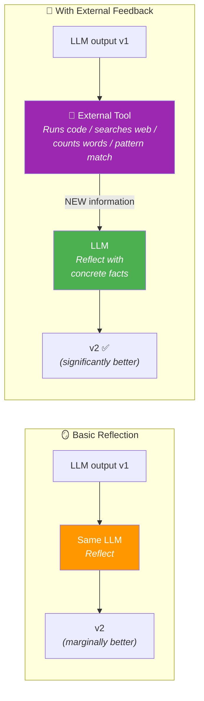
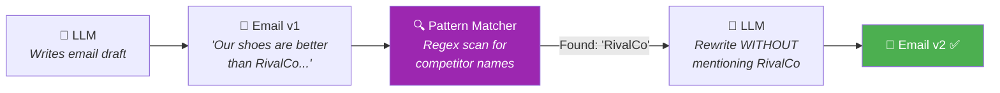
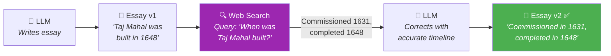
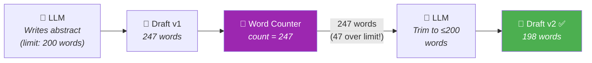
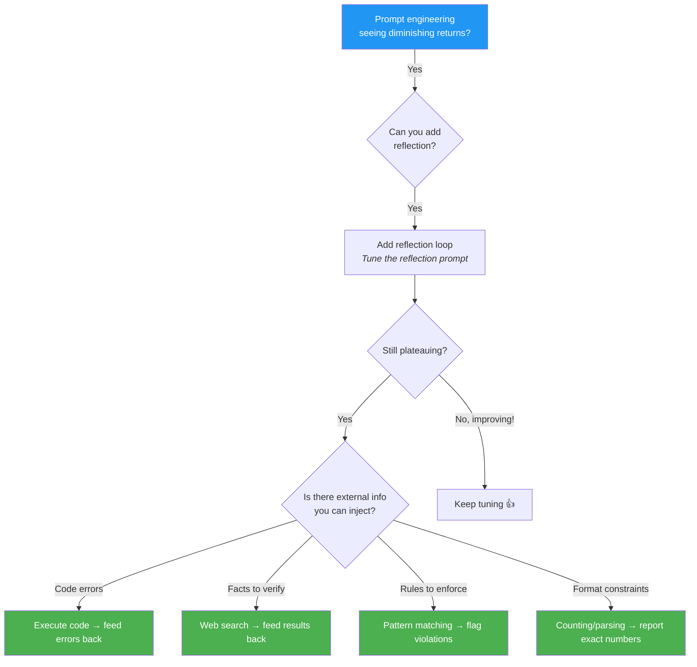
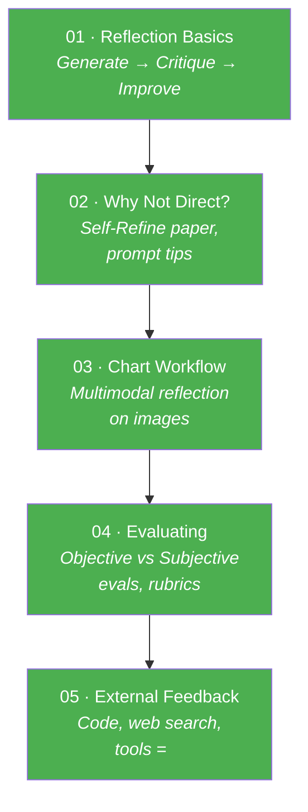

# 05 · Reflection with External Feedback 🔦

---

## 🎯 One Line
> LLM reflecting on its own output = okay. LLM reflecting on **new information from outside** (code errors, web search, pattern matching) = game-changer. External feedback breaks the performance plateau.

---

## 🖼️ The Performance Curve

This is THE mental model for when to escalate your approach:

```
Performance
    ▲
    │                                          ✦ ✦ ✦ Reflection +
    │                                     ✦         External Feedback 🟢
    │                               ✦
    │                          ✦
    │                    ● ● ● ● ● ● ● With Reflection 🟡
    │               ● ●
    │          ● ●
    │     ★ ★ ★ ★ ★ ★ ★ ★ ★ ★ ★ ★ ★ ★ No Reflection 🔴
    │  ★ ★                    (plateaus)
    │ ★
    │★
    └──────────────────────────────────────────► Time spent
                                                  prompt engineering
```

| Approach | What Happens |
|----------|-------------|
| ★ **No reflection** (direct generation) | Improves with prompt tuning, then **plateaus** — diminishing returns |
| ● **With reflection** | Bumps performance above the plateau — sometimes small, sometimes big |
| ✦ **Reflection + external feedback** | Highest trajectory — keeps improving because LLM gets **genuinely new information** each iteration |

> 💡 **Direct generation = apni hi copy check karna bina answer key ke. Reflection = doosre se check karwana (lekin woh bhi andaaze se). External feedback = ANSWER KEY mil gayi — ab pata hai kya galat hai! 🔑**

---

## 🧠 Why External Feedback is So Powerful

The core insight: without external feedback, the LLM is **reflecting on the same information it already had**. It's like re-reading your own essay — you'll catch *some* mistakes, but you'll miss the ones you didn't know were mistakes.

External feedback gives the LLM **new facts** it didn't have before:



> 💡 **Basic reflection = doctor apne aap ko diagnose kar raha hai. External feedback = blood test ke results aa gaye — ab pata hai kya fix karna hai! 🩺**

---

## 🔧 Three Concrete Examples

### 1. Competitor Name Detection 🏷️

**Problem:** LLM writes marketing emails that accidentally mention competitor names.



| Component | What It Does |
|-----------|-------------|
| **Tool** | Regex pattern matching — searches for known competitor names in output |
| **Feedback** | "Found competitor name 'RivalCo' in paragraph 2" |
| **LLM action** | Rewrites text without mentioning the competitor |

Simple code, huge impact. The LLM doesn't need to *know* all competitor names — the pattern matcher handles that.

---

### 2. Fact-Checking via Web Search 🌐

**Problem:** Research agent writes "The Taj Mahal was built in 1648" — technically it was *finished* in 1648, but commissioned in 1631.



| Component | What It Does |
|-----------|-------------|
| **Tool** | Web search or trusted knowledge base lookup |
| **Feedback** | Actual historical facts, dates, context |
| **LLM action** | Rewrites with verified information |

Without web search, the LLM would have NO way of knowing its date was misleading — it was technically "not wrong" but not accurate either.

---

### 3. Word Count Enforcement 📏

**Problem:** LLM writes a blog post / research abstract that's over the word limit. LLMs are notoriously bad at following exact word counts.



| Component | What It Does |
|-----------|-------------|
| **Tool** | Simple code: `len(text.split())` — counts exact words |
| **Feedback** | "Current word count: 247. Limit: 200. Please reduce by 47 words." |
| **LLM action** | Rewrites more concisely to hit the target |

> LLMs can't count words reliably on their own — but a 1-line Python script can. Give it the EXACT number and it knows precisely how much to cut.

---

## 🧱 The Pattern Across All Examples

Every external feedback example follows the **same structure**:

| Step | What | Role |
|------|------|------|
| 1 | LLM generates v1 output | **Creator** |
| 2 | External tool analyzes v1 | **Inspector** — finds concrete issues |
| 3 | Tool's findings fed back to LLM | **New information** the LLM didn't have |
| 4 | LLM reflects with those facts and writes v2 | **Informed fixer** |

The tool doesn't need to be fancy! Pattern matching, web search, code execution, word count — all are **simple code** that produces **specific, actionable feedback**.

> 💡 **Tool ka kaam: LLM ko woh baat batana jo usse khud nahi pata. Jaise GPS batata hai "200m mein left lo" — driver ko road yaad nahi hai, lekin GPS ko pata hai! 🗺️**

---

## ⚡ When to Escalate: The Decision Framework



**Key insight from Andrew Ng:** If direct prompting is plateauing, don't keep burning time on it. Ask: *"Can I add reflection? Can I add external feedback?"* — shift the curve, don't grind on the plateau.

---

## 🗺️ Module 2 Complete — Reflection Recap



**The 3 tiers of power:** Direct generation < Reflection < Reflection + External Feedback

---

## ⚠️ Gotchas

- ❌ **Don't grind a plateau** — if prompt tuning shows diminishing returns, escalate to reflection or external feedback instead of spending more time on the same approach
- ❌ **External feedback tools don't need to be complex** — regex, word count, code execution, web search. Simple code that gives specific facts
- ❌ **External feedback ≠ guaranteed perfection** — it shifts the performance *curve* higher, but still requires prompt tuning on top
- ❌ **Don't confuse "LLM self-reflection" with "external feedback"** — the former uses no new information, the latter always introduces new facts from outside the LLM

---

## 🧪 Quick Check

<details>
<summary>❓ Why is reflection with external feedback more powerful than basic reflection?</summary>

Basic reflection = LLM re-examines **the same information** it already had. External feedback gives the LLM **genuinely new information** (error messages, web search results, word counts, pattern matches) that it couldn't have known otherwise.

Apni copy khud check karna vs answer key mil jaana — obvious difference! 🔑
</details>

<details>
<summary>❓ What are the three examples of external feedback tools from this lesson?</summary>

1. **Pattern matching** — regex to find competitor names in marketing emails
2. **Web search** — fact-check claims like "Taj Mahal built in 1648" against real sources
3. **Word count** — `len(text.split())` to enforce exact word limits LLMs can't count themselves
</details>

<details>
<summary>❓ Draw the performance curve — what are the three tiers?</summary>

Bottom: **Direct generation** (★) — improves then plateaus.  
Middle: **With reflection** (●) — bumps above the plateau.  
Top: **Reflection + external feedback** (✦) — highest trajectory, keeps improving.  

Each tier shifts the entire performance curve upward.
</details>

<details>
<summary>❓ When should you escalate from direct prompting to reflection?</summary>

When prompt engineering shows **diminishing returns** — you're tuning a lot but performance barely improves. Don't grind the plateau. Ask: "Can I add reflection? Can I inject external info?" Shift the curve instead.
</details>

<details>
<summary>❓ What's the common pattern across ALL external feedback examples?</summary>

1. LLM generates v1
2. **External tool** analyzes v1 and finds concrete issues
3. Tool's findings fed back to LLM as **new information**
4. LLM reflects WITH those facts → writes improved v2

The tool is always simple code — its job is to tell the LLM something it couldn't know on its own.
</details>

---

> **← Prev** [Evaluating Impact of Reflection](04-evaluating-reflection.md) · **Next →** Module 3: Tool Use 🔧
