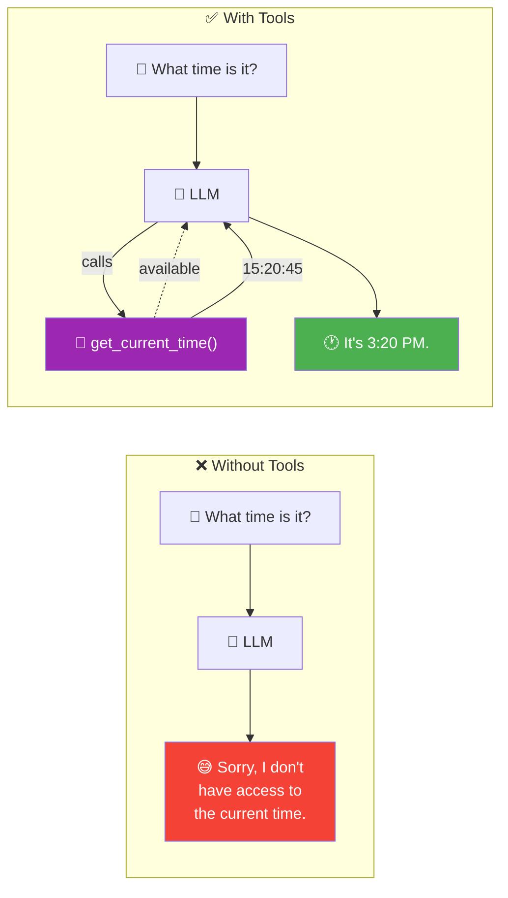
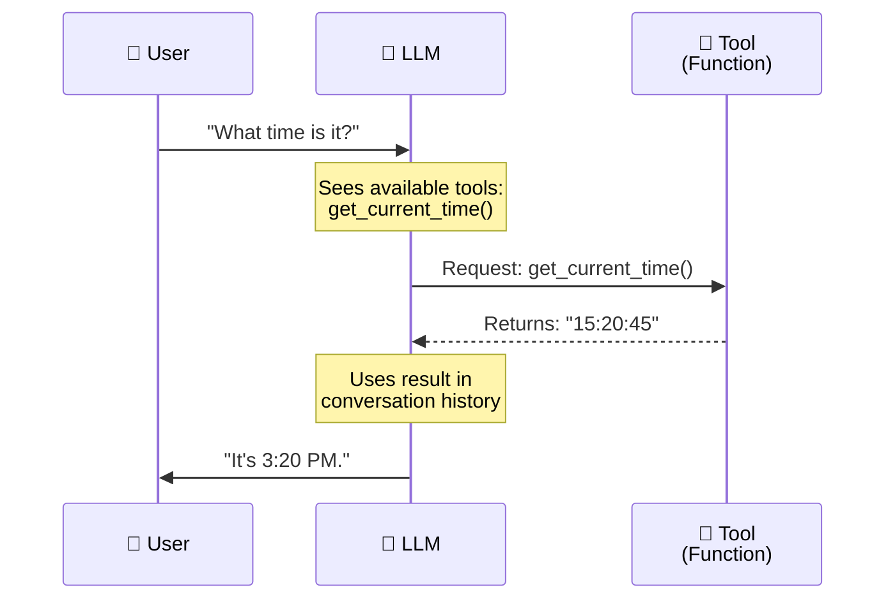
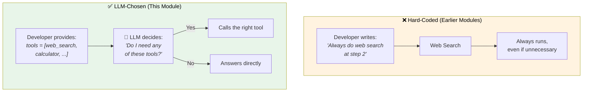
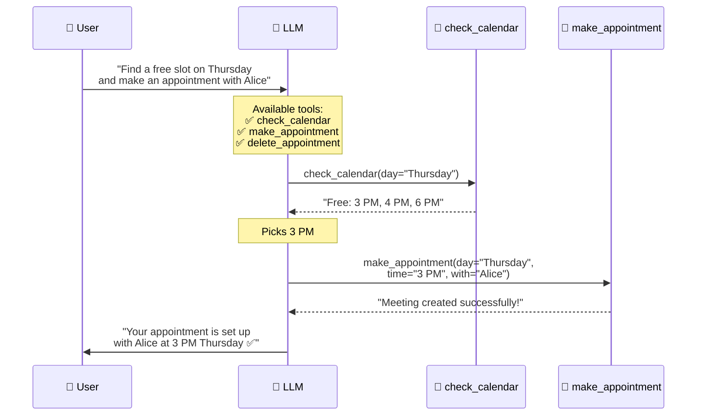
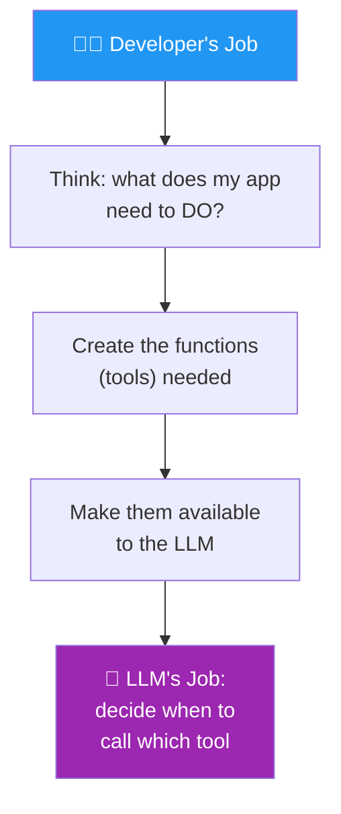

# 01 · What Are Tools? 🔧

---

## 🎯 One Line
> Tools = functions you give to the LLM so it can **request to call them** when it needs to do something beyond generating text — check the time, search the web, query a database, or calculate things.

---

## 🖼️ The Core Idea



> 💡 **LLM bina tools ke = insaan bina haathon ke. Sochne mein bahut achha, lekin duniya mein kuch kar nahi sakta. Tools = haath de do, ab kaam bhi kar sakta hai! 🖐️**

---

## ⚡ How Tool Use Actually Works



### Step by Step

| Step | What Happens | Who Does It |
|------|-------------|------------|
| **1** | User sends prompt | User |
| **2** | LLM sees the prompt + list of available tools | LLM decides |
| **3** | LLM **decides** to call a tool (or not!) | LLM decides |
| **4** | Tool (function) executes and returns a value | Your code |
| **5** | Return value is fed back to the LLM in conversation history | System |
| **6** | LLM generates final output using the tool's result | LLM |

---

## 🔑 Key Insight: LLM CHOOSES When to Use Tools

This is the crucial distinction — the LLM isn't forced to use tools. **It decides whether a tool is needed based on the query:**

```
┌──────────────────────────────────────────────────────────────────┐
│  Same LLM, same tools available:                                 │
│                                                                  │
│  "What time is it?"          → 🔧 Calls get_current_time()      │
│                                  (needs real-time data)          │
│                                                                  │
│  "How much caffeine           → 💬 Answers directly              │
│   is in green tea?"              (already knows this)            │
│                                  "25-50 mg per cup..."           │
└──────────────────────────────────────────────────────────────────┘
```

| Query Type | Tool Needed? | Why |
|-----------|-------------|-----|
| Real-time info (time, weather) | ✅ Yes | LLM's training data is frozen |
| External data (database, web) | ✅ Yes | LLM doesn't have access to your data |
| Calculation | ✅ Yes | LLMs are notoriously bad at math |
| General knowledge | ❌ No | Already in training data |

> 💡 **LLM = decision maker. Tool = servant. LLM decides "mujhe abhi time chahiye" → calls the tool. "Mujhe caffeine info chahiye" → already jaanta hai, no tool needed. Smart delegation! 🧠**

---

## 🧰 Hard-Coded Tools vs LLM-Chosen Tools

Andrew Ng makes an important distinction here — comparing this module's approach to what we saw in earlier modules:



| Approach | Who Decides | Example |
|----------|------------|---------|
| **Hard-coded** | Developer pre-programs when to call | Research agent: "always search web at step 2" |
| **LLM-chosen** | LLM decides at runtime | Calendar agent: LLM picks from check/make/delete based on the request |

The dashed box notation (🔧) in the slides = "tools available for LLM to choose from."

---

## 🧱 Three Real-World Examples

From the course slides (PDF page 5):

| Prompt | Tool Called | What It Returns | Final Output |
|--------|-----------|----------------|-------------|
| *"Find Italian restaurants near Mountain View, CA?"* | `web_search(query="restaurants near Mountain View, CA")` | Search results | "Spaghetti City is an Italian restaurant in Mountain View..." |
| *"Show me customers who bought white sunglasses"* | `query_database(table="sales", product="sunglasses", color="white")` | Database rows | "28 customers bought white sunglasses. Here they are..." |
| *"$500 at 5% interest for 10 years?"* | `interest_calc(principal=500, rate=5, years=10)` OR `eval("500 * (1 + 0.05) ** 10")` | 814.45 | "$814.45" |

> The interest rate example shows TWO approaches — a dedicated tool OR just letting the LLM write code and executing it (more on this in Lesson 04).

---

## 🔧 Multiple Tools: Calendar Assistant Example

Real-world agents need **multiple tools** to complete tasks. The calendar assistant example shows how:



**The LLM made TWO decisions:**
1. First, call `check_calendar` to find free slots
2. Then, call `make_appointment` to book one — it **chose** which tools to call and in what order

It **didn't** call `delete_appointment` because it wasn't needed. Smart tool selection!

---

## 🧠 Your Role as a Developer



| Your Job | LLM's Job |
|----------|----------|
| Decide what tools the app needs | Decide **when** to use them |
| Write the actual functions | Decide **which** tool fits the query |
| Make tools available to the LLM | Decide **what arguments** to pass |
| Handle tool execution + return values | Generate the final response |

> 💡 **Developer = restaurant owner jo menu banata hai. LLM = waiter jo customer ki request sun ke decide karta hai kaunsa dish serve karna hai. Owner ne kabhi apne haath se khana nahi diya customer ko! 🍽️**

---

## ⚠️ Gotchas

- ❌ **Tools aren't always needed** — the LLM should answer directly when it already knows. Don't force tool use on everything
- ❌ **More tools ≠ better** — too many tools can confuse the LLM. Give it what it needs for the specific use case
- ❌ **LLM REQUESTS tool calls, it doesn't execute them** — your code handles the actual execution. The LLM just says "I want to call this function with these args"
- ❌ **Don't confuse hard-coded tool calls with LLM-chosen tool calls** — earlier modules hard-coded "always search web at step 2". This module: LLM decides at runtime

---

## 🧪 Quick Check

<details>
<summary>❓ What does "tool use" mean in the context of LLMs?</summary>

Giving the LLM access to **functions** (tools) that it can **request to call** when it needs to perform actions, gather information, or do computations it can't do from its training data alone. The tools are just regular code functions — web search, database query, calculator, etc.
</details>

<details>
<summary>❓ Does the LLM always use tools when they're available?</summary>

**No!** The LLM decides whether a tool is needed based on the query. "What time is it?" → calls `get_current_time()`. "How much caffeine in green tea?" → answers directly from training data. The LLM is the decision maker.
</details>

<details>
<summary>❓ What's the difference between hard-coded and LLM-chosen tool calls?</summary>

**Hard-coded:** Developer pre-programs "always call web search at step 2" — runs every time regardless.
**LLM-chosen:** Developer provides a set of tools, LLM decides at runtime which (if any) to call based on the specific query. More flexible, more intelligent.
</details>

<details>
<summary>❓ In the calendar assistant example, how many tools were available vs how many were used?</summary>

**3 available:** check_calendar, make_appointment, delete_appointment.
**2 used:** check_calendar (to find free slots), then make_appointment (to book).
**1 skipped:** delete_appointment wasn't needed. LLM was smart enough to only call what it needed.
</details>

<details>
<summary>❓ What's the developer's role vs the LLM's role in tool use?</summary>

**Developer:** Design what tools the app needs, write the functions, make them available.
**LLM:** Decide WHEN to use them, WHICH tool fits, WHAT arguments to pass, and generate the final response.

Developer = menu banata hai. LLM = order decide karta hai! 🍽️
</details>

---

> **Next →** [Creating a Tool](02-creating-a-tool.md)
