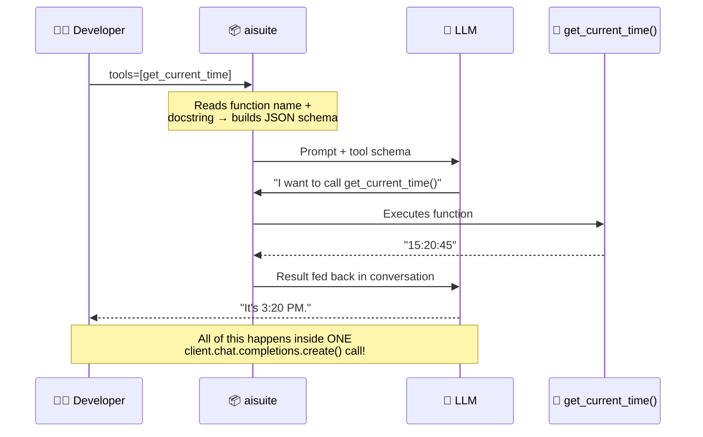
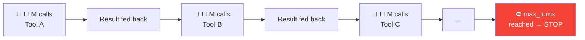

# 02 · Creating a Tool 🛠️

---

## 🎯 One Line
> A tool is just a **Python function** — aisuite reads its name + docstring, auto-generates the JSON schema, and handles the entire call-return loop for you. You write the function, the library does the plumbing.

---

## 🖼️ The Full Flow



> 💡 **Tum sirf function likhte ho. aisuite baaki sab karta hai — JSON schema banana, LLM ko describe karna, function call karna, result wapas feed karna. Ek line mein sab! 🎯**

---

## 🧱 The aisuite Library

**What is it?** An open source package (co-created by Andrew Ng) that provides a **unified interface** to call multiple LLM providers (OpenAI, Anthropic, etc.) with a single API.

### The Code — Simple Tool

```python
from datetime import datetime

def get_current_time():
    """Returns the current time as a string"""     # ← docstring = tool description!
    return datetime.now().strftime("%H:%M:%S")
```

```python
import aisuite as ai

client = ai.Client()

response = client.chat.completions.create(
    model="openai:gpt-4o",          # provider:model format
    messages=messages,               # conversation history
    tools=[get_current_time],        # ← just pass the function!
    max_turns=5                      # ceiling on consecutive tool calls
)
```

**That's it.** You pass the function object, aisuite handles everything.

---

## 🔑 Behind the Scenes: Auto-Generated JSON Schema

This is what aisuite creates and passes to the LLM **automatically**:

```
┌─────────────────────────────┐    ┌──────────────────────────────────────┐
│  YOUR CODE                  │    │  WHAT LLM ACTUALLY SEES              │
│                             │    │  (JSON Schema - auto-generated)      │
│  def get_current_time():    │───▶│  {                                   │
│      """Returns the current │    │    "type": "function",               │
│      time as a string"""    │    │    "function": {                     │
│      return datetime.now()  │    │      "name": "get_current_time",    │
│          .strftime(...)     │    │      "description": "Returns the    │
│                             │    │        current time as a string",   │
│                             │    │      "parameters": {}               │
│                             │    │    }                                 │
└─────────────────────────────┘    │  }                                   │
                                   └──────────────────────────────────────┘
```

| What's Extracted | Where From |
|-----------------|-----------|
| **Function name** | `def get_current_time` → `"name": "get_current_time"` |
| **Description** | Docstring `"""Returns the current time..."""` → `"description": "..."` |
| **Parameters** | Function signature → `"parameters": {}` (none in this case) |

> 💡 **Docstring = tool ka resume. LLM docstring padh ke decide karta hai "yeh tool mujhe chahiye ya nahi." Achha docstring likho = LLM better decisions lega! 📄**

---

## ⚡ With Parameters: Timezone Example

```python
from datetime import datetime
from zoneinfo import ZoneInfo

def get_current_time(timezone):
    """Returns current time for the given time zone"""    # ← description
    tz = ZoneInfo(timezone)                               # ← parameter used
    return datetime.now(tz).strftime("%H:%M:%S")
```

### Auto-Generated JSON Schema (more complex now)

```json
{
  "type": "function",
  "function": {
    "name": "get_current_time",
    "description": "Returns current time for the given time zone",
    "parameters": {
      "timezone": {
        "type": "string",
        "description": "The IANA time zone string, e.g., 
                        'America/New_York' or 'Pacific/Auckland'."
      }
    }
  }
}
```

Now the LLM knows:
1. **What** the function does (from docstring)
2. **What parameter** it needs (`timezone`)
3. **What format** the parameter should be (IANA timezone string)
4. **Examples** of valid values (`America/New_York`, `Pacific/Auckland`)

---

## 🔄 What `max_turns` Does



| Parameter | What It Does | Default Suggestion |
|-----------|-------------|-------------------|
| `max_turns=5` | Maximum consecutive tool calls before stopping | 5 is fine for most cases |

**Why it exists:** After a tool returns, the LLM might call another tool, then another... `max_turns` prevents infinite loops. In practice, you almost never hit this limit.

> Andrew Ng: *"I wouldn't worry about the max turns parameter. I usually just set it to five."*

---

## 🧰 aisuite vs Manual JSON Schema

| Approach | What You Write | Who Builds Schema | Effort |
|----------|---------------|-------------------|--------|
| **aisuite** ✅ | Just the Python function + docstring | aisuite auto-generates | Minimal |
| **Manual (other APIs)** | Python function + hand-written JSON schema | You write it yourself | More work |

Some APIs require you to manually construct the JSON schema and pass it to the LLM. aisuite handles this automatically — it reads the function name, docstring, and parameters to build the schema for you.

> aisuite also handles the **execute-and-feed-back loop** — when the LLM requests a tool call, aisuite runs the function and feeds the result back, all inside `client.chat.completions.create()`. Other implementations may require you to handle this step manually.

---

## 📝 Docstring = Tool Description (CRITICAL)

Your docstring is THE thing the LLM reads to understand the tool:

| Docstring Quality | LLM Behavior |
|------------------|-------------|
| ✅ `"""Returns current time for the given time zone"""` | LLM knows exactly when to use it and what to pass |
| ❌ `"""Helper function"""` | LLM has no idea what this does — won't use it properly |
| ❌ No docstring at all | LLM can't decide when to call it |

> **Write docstrings like you're explaining the function to a smart colleague who's never seen your code.** Clear, specific, with examples of valid parameter values.

---

## ⚠️ Gotchas

- ❌ **Bad docstrings = bad tool usage** — the LLM decides whether to call a tool based on its description. Vague docstrings → wrong decisions
- ❌ **LLM REQUESTS the call, it doesn't execute** — aisuite handles execution for you, but conceptually the LLM is just saying "please call this function with these args"
- ❌ **`max_turns` isn't critical** — set it to 5 and forget about it. You'll almost never hit the limit unless something is looping unexpectedly
- ❌ **aisuite syntax ≈ OpenAI syntax** — if you know OpenAI's API, aisuite feels familiar. Key difference: `model="openai:gpt-4o"` (provider prefix) and `tools=[function_object]` (pass function directly)

---

## 🧪 Quick Check

<details>
<summary>❓ What does aisuite auto-generate from your function?</summary>

A **JSON schema** describing the tool — extracts the function **name**, **description** (from docstring), and **parameters** (from function signature). This schema is what the LLM actually sees to decide when and how to call the tool.
</details>

<details>
<summary>❓ Why are docstrings so important for tool use?</summary>

The docstring IS the tool's description to the LLM. The LLM reads it to decide: "Should I call this function? What does it do? What args should I pass?" Bad docstring = bad tool decisions. It's the function's resume! 📄
</details>

<details>
<summary>❓ What happens inside `client.chat.completions.create()` when tools are provided?</summary>

1. aisuite sends the prompt + tool schemas to the LLM
2. If LLM requests a tool call → aisuite **executes the function** for you
3. Result is fed back to the LLM in conversation history
4. LLM may call more tools (up to `max_turns`)
5. Final response is returned

All in ONE function call — aisuite handles the entire loop.
</details>

<details>
<summary>❓ What's `max_turns` and should you worry about it?</summary>

`max_turns` = ceiling on consecutive tool calls to prevent infinite loops. Set it to **5** and forget about it. Andrew Ng: "In practice, you almost never hit this limit." Only matters if your code is doing something unusually ambitious.
</details>

<details>
<summary>❓ aisuite vs manual API — what's the key convenience?</summary>

aisuite: pass the **function object directly** (`tools=[get_current_time]`) → schema auto-generated, execution handled.
Manual: you write the JSON schema by hand AND handle the execute-feed-back loop yourself.
</details>

---

> **← Prev** [What Are Tools?](01-what-are-tools.md) · **Next →** [Tool Syntax](03-tool-syntax.md)
