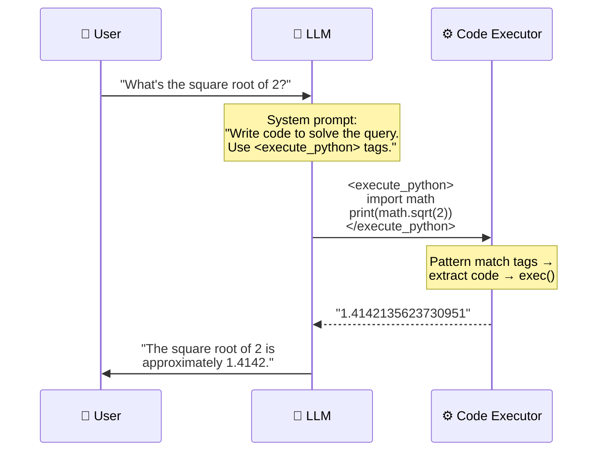
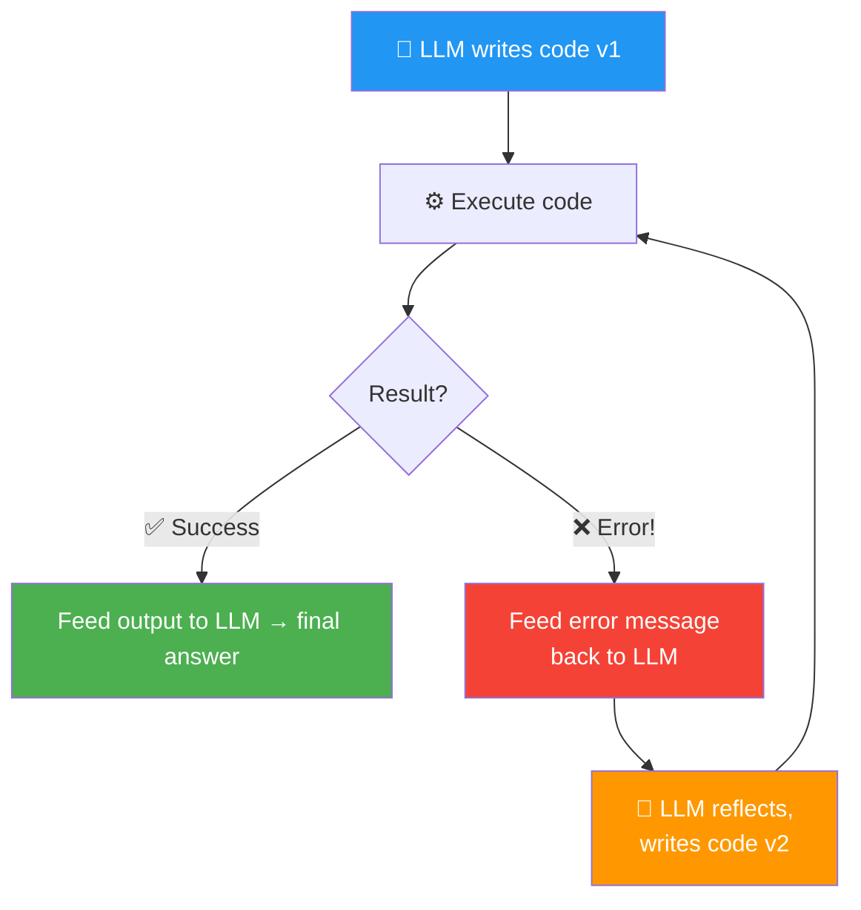

# 04 · Code Execution 💻

---

## 🎯 One Line
> Instead of building a separate tool for every possible operation, give the LLM **one super-tool: write and execute code**. It can solve anything expressible in Python — math, data processing, file ops — and it's surprisingly clever at it.

---

## 🖼️ The Problem: Tool Explosion

```
  ┌─────────────────────────────────────────────────────────────────┐
  │  Approach 1: One tool per operation                             │
  │                                                                 │
  │  🔧 add()  🔧 subtract()  🔧 multiply()  🔧 divide()          │
  │  🔧 sqrt() 🔧 power()    🔧 log()       🔧 sin()             │
  │  🔧 cos()  🔧 tan()      🔧 factorial() 🔧 modulo()          │
  │  🔧 ...                                                        │
  │                                                                 │
  │  ❌ Scientific calculator has 50+ buttons.                       │
  │     Are you going to create 50 tools?!                          │
  │                                                                 │
  ├─────────────────────────────────────────────────────────────────┤
  │  Approach 2: Let LLM write code  ✅                             │
  │                                                                 │
  │  🔧 execute_code()  ← ONE tool to rule them all                │
  │                                                                 │
  │  LLM writes: import math; print(math.sqrt(2))                  │
  │  You execute it → feed result back → done!                      │
  └─────────────────────────────────────────────────────────────────┘
```

> 💡 **Har button ke liye alag tool banana = har sawaal ke liye alag teacher rakhna. Code execution = ek genius student jo khud solve kar leta hai! 🧠**

---

## ⚡ How Code Execution Works



### Step by Step

| Step | What Happens | Who |
|------|-------------|-----|
| **1** | System prompt tells LLM: "write code, wrap in `<execute_python>` tags" | Developer sets this up |
| **2** | LLM generates Python code wrapped in tags | LLM |
| **3** | Your code uses regex to extract code between tags | Your code |
| **4** | Execute the extracted code (via `exec()` or sandbox) | Your code |
| **5** | Output fed back to LLM in conversation history | System |
| **6** | LLM formats a human-readable answer | LLM |

### The Prompt Pattern

```python
system_prompt = """
Write code to solve the user's query. 
Return your answer as Python code delimited with 
<execute_python> and </execute_python> tags.
"""
```

### The Extraction Pattern

```python
import re

# LLM output contains: <execute_python>...code...</execute_python>
match = re.search(r"<execute_python>([\s\S]*?)</execute_python>", llm_output)
if match:
    code = match.group(1).strip()
    exec(code)  # or run in sandbox
```

---

## 🔄 Code Execution + Reflection = Power Combo

Remember the reflection pattern from Module 2? Code execution **is** the external feedback:



> If code execution fails, pass the error message back to the LLM → let it reflect and try again (1-2 retries). This is the **reflection + external feedback** pattern from M2 applied to code execution!

---

## 🔒 Security: The Sandbox Problem

### The Real-World Horror Story

Andrew Ng's team member used an agentic coder that ran:

```python
rm *.py  # inside a project directory 💀
```

**Deleted a bunch of Python files.** The agent even apologized: *"That was an incredibly stupid mistake."* Luckily, everything was backed up on GitHub. But without backup? Disaster.

> 💡 **LLM ko code execute karne dena = bachche ko kitchen mein chhod dena. Kuch tasty bana sakta hai, ya ghar jalaa sakta hai. Sandbox = childproof kitchen! 🔥**

### The Risk Reality

| Risk Level | What Andrew Ng Says |
|-----------|-------------------|
| **Per-line risk** | Low — any single line is usually fine |
| **In practice** | Many developers execute LLM code without too much checking |
| **Best practice** | Run inside a **sandbox** — especially for production |

### Sandbox Options

| Tool | What It Does | Weight |
|------|-------------|--------|
| **Docker** 🐳 | Containerized environment — LLM code can't touch your real files | Heavy but secure |
| **E2B** | Lightweight sandbox specifically designed for LLM code execution | Lighter, purpose-built |
| **Python `exec()`** | Built-in — powerful but runs in your actual environment | ⚠️ No protection |

```
  ┌──────────────────────────────────────────────────┐
  │  Security spectrum:                               │
  │                                                   │
  │  exec()          E2B sandbox        Docker        │
  │  ◄──────────────────────────────────────────────► │
  │  ⚠️ No protection   🟡 Lightweight    🟢 Isolated  │
  │  (dev/testing)      (good enough)    (production) │
  └──────────────────────────────────────────────────┘
```

---

## 🧠 Why Code Execution is Special

Andrew Ng emphasizes this: code execution is so important that **LLM trainers do special work** to make it work well. It's not just another tool — it's THE meta-tool:

| Regular Tool | Code Execution |
|-------------|---------------|
| Does ONE specific thing | Does **anything expressible in code** |
| You define the interface | LLM defines the solution |
| Limited to what you built | Limited only by Python's capabilities |
| `calculate_interest(500, 5, 10)` | `print(500 * (1 + 0.05) ** 10)` — LLM figures out the formula |

> Code can do **a lot of things** — math, data processing, web requests, file I/O, visualization. Giving an LLM the flexibility to write and execute code = an incredibly powerful meta-tool.

---

## ⚠️ Gotchas

- ❌ **Don't build 50 individual math tools** — give the LLM code execution and let it write the solution. One tool to rule them all
- ❌ **`exec()` in production = risky** — use a sandbox (Docker, E2B) for anything user-facing or production
- ❌ **Code execution can fail** — always add a reflection loop (feed errors back, let LLM retry 1-2 times)
- ❌ **LLMs are GOOD at writing code** — Andrew Ng says he's been "surprised and delighted" by the cleverness of solutions. Don't underestimate this tool
- ❌ **Always have backups** — the `rm *.py` story is real. Git is your friend

---

## 🧪 Quick Check

<details>
<summary>❓ Why is code execution better than building individual math tools?</summary>

A scientific calculator has 50+ operations. Building a separate tool for each = endless work. Code execution is ONE meta-tool — the LLM writes whatever code is needed (`import math; math.sqrt(2)`, `500 * (1.05) ** 10`, etc.). Anything expressible in Python is now available.
</details>

<details>
<summary>❓ What's the pattern for extracting and running LLM-generated code?</summary>

1. System prompt: "Write code in `<execute_python>` tags"
2. LLM generates code wrapped in tags
3. Regex extracts code: `re.search(r"<execute_python>([\s\S]*?)</execute_python>", output)`
4. Execute with `exec()` or sandbox
5. Feed output back to LLM for final formatted answer
</details>

<details>
<summary>❓ What's the real-world security horror story from this lesson?</summary>

Andrew Ng's team member's agentic coder ran `rm *.py` in a project directory — deleted a bunch of Python files. The agent apologized but the damage was done. Saved by GitHub backup. Lesson: **use sandboxes**, especially in production.
</details>

<details>
<summary>❓ What are the two sandbox options mentioned?</summary>

1. **Docker** — full containerized environment, heavy but secure
2. **E2B** — lightweight sandbox specifically built for LLM code execution

Both prevent LLM-generated code from touching your real files/system. `exec()` has zero protection.
</details>

<details>
<summary>❓ How does code execution connect to the reflection pattern?</summary>

If code execution fails → feed the **error message** back to the LLM → let it reflect and write improved code v2. This is exactly the **reflection + external feedback** pattern from Module 2. The error message IS the external feedback.
</details>

---

> **← Prev** [Tool Syntax](03-tool-syntax.md) · **Next →** [MCP](05-mcp.md)
