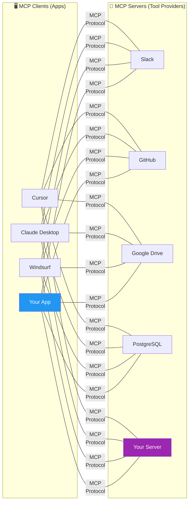
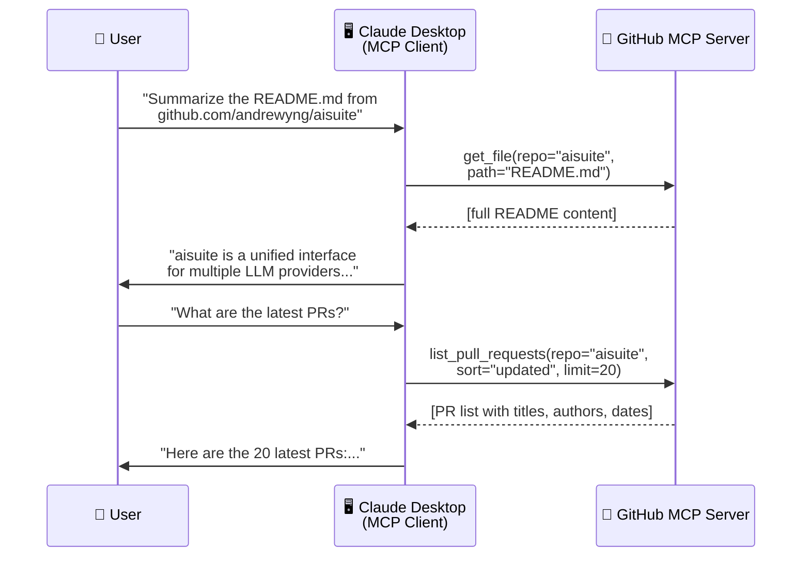
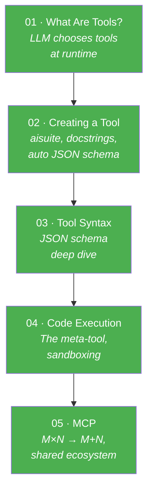

# 05 · MCP (Model Context Protocol) 🔌

---

## 🎯 One Line
> MCP is a **standard protocol** (by Anthropic, now industry-wide) that turns M×N integration work into **M+N** — apps (clients) connect to shared tool servers instead of each building their own wrappers for Slack, GitHub, Google Drive, etc.

---

## 🖼️ The Problem MCP Solves

```
  ❌ WITHOUT MCP: M × N integrations
  
  App 1 ──┬── Slack wrapper
          ├── GDrive wrapper     Each app builds its OWN
          ├── GitHub wrapper     wrappers for each service.
          └── PostgreSQL wrapper
  
  App 2 ──┬── Slack wrapper      3 apps × 4 services = 12 wrappers 😩
          ├── GDrive wrapper
          ├── GitHub wrapper
          └── PostgreSQL wrapper
  
  App 3 ──┬── Slack wrapper
          ├── GDrive wrapper
          ├── GitHub wrapper
          └── PostgreSQL wrapper


  ✅ WITH MCP: M + N connections
  
  App 1 ─┐                  ┌── Slack MCP Server
  App 2 ─┼── MCP Protocol ──┼── GDrive MCP Server
  App 3 ─┘                  ├── GitHub MCP Server
                            └── PostgreSQL MCP Server
  
  3 apps + 4 servers = 7 connections 🎯
```

> 💡 **MCP = USB port for LLMs. Pehle har device ke liye alag cable chahiye thi. Ab ek standard port — koi bhi device plug in karo! 🔌**

---

## 🏗️ Architecture: Clients & Servers



| Component | What It Is | Examples |
|-----------|-----------|---------|
| **MCP Client** | App that **consumes** tools/data | Cursor, Claude Desktop, Windsurf, your app |
| **MCP Server** | Service that **provides** tools/data | Slack, GitHub, Google Drive, PostgreSQL servers |
| **MCP Protocol** | The **standard** connecting them | JSON-based communication format |

> **Two paths for you:**
> - Build your app as an **MCP client** → instantly access tons of pre-built servers
> - Build an **MCP server** → let other developers use your tools/data

---

## 🔑 What MCP Provides

The initial design focused on **data/context** (hence "Context Protocol"), but it's evolved:

| MCP Capability | What It Means | Example |
|---------------|--------------|---------|
| **Resources** (data/context) | Fetch data from external sources | Read a README from GitHub, get Slack messages |
| **Tools** (functions/actions) | Take actions in external services | Create a PR, send a Slack message, write to DB |

---

## 💡 Live Example: Claude Desktop + GitHub MCP

From the course demo (PDF page 22):



**Two different requests → two different tools on the same MCP server.** The LLM decides which tool to call based on the query — same pattern as Lesson 01!

---

## 📐 The M×N → M+N Math

| Metric | Without MCP | With MCP |
|--------|------------|----------|
| **Integrations needed** | M apps × N services = M×N | M clients + N servers = M+N |
| **3 apps, 4 services** | 12 custom wrappers | 7 connections |
| **10 apps, 20 services** | 200 wrappers 😱 | 30 connections ✅ |
| **Who builds wrappers** | Every app team, separately | Server built once, shared by all |

> The bigger the ecosystem grows, the more MCP saves. At scale, the difference between M×N and M+N is massive.

---

## 🗺️ Module 3 Complete — Tool Use Recap



**Andrew Ng's teaser for Module 4:** *"The next module — evaluations and error analysis — is maybe the most important module of this entire course."* 🔥

---

## ⚠️ Gotchas

- ❌ **MCP is a standard, not a product** — it's a protocol that anyone can implement. Many clients and servers already exist
- ❌ **MCP servers are pre-built** — you don't need to write Slack/GitHub wrappers yourself. Just connect to existing MCP servers
- ❌ **Initial focus was data ("Context"), but it does actions too** — resources (read data) AND tools (take actions) are both part of MCP
- ❌ **Rapidly evolving ecosystem** — new clients and servers being added constantly. Check the MCP docs for the latest

---

## 🧪 Quick Check

<details>
<summary>❓ What problem does MCP solve?</summary>

**M×N integration problem.** Without MCP, every app builds its own wrappers for each service (M apps × N services = M×N work). MCP standardizes the connection: M clients + N servers = **M+N** work. Build once, share with everyone.
</details>

<details>
<summary>❓ What's the difference between an MCP client and an MCP server?</summary>

**Client** = your app that wants to USE tools/data (Cursor, Claude Desktop, your app).
**Server** = the service that PROVIDES tools/data (GitHub server, Slack server, PostgreSQL server).
Client requests → Server responds via the MCP protocol.
</details>

<details>
<summary>❓ What are MCP "resources" vs "tools"?</summary>

**Resources** = data fetching (read a file from GitHub, get Slack messages) — the original focus of MCP.
**Tools** = actions (create a PR, send a message, write to DB) — broader capability added over time.
</details>

<details>
<summary>❓ In the Claude Desktop demo, what happened with the GitHub MCP server?</summary>

Two requests: (1) "Summarize the README" → `get_file()` tool fetched the README, LLM summarized it. (2) "Latest PRs?" → `list_pull_requests()` tool fetched 20 PRs, LLM formatted them. Same server, different tools — LLM chose which to call each time.
</details>

<details>
<summary>❓ Who proposed MCP and who uses it now?</summary>

**Proposed by Anthropic**, but now adopted industry-wide — many companies and developers build to this standard. Rapidly growing ecosystem of both clients and servers. DeepLearning.AI has a dedicated deeper course on MCP.
</details>

---

> **← Prev** [Code Execution](04-code-execution.md) · **Next →** Module 4: Practical Tips (Evals & Error Analysis) 📏
