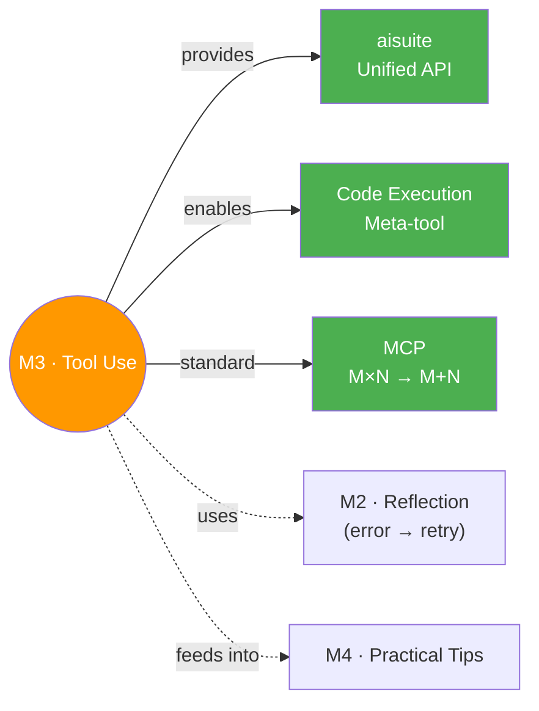

# 🔧 Module 3 — Tool Use

> LLMs alone can only generate text — tools give them hands to interact with the real world.

---

## 🧠 Brain — How This Connects

## 📊 Progress

| # | Lesson | Confidence | Revised |
|---|--------|-----------|---------|
| 01 | [What Are Tools?](01-what-are-tools.md) | 🟡 | — |
| 02 | [Creating a Tool](02-creating-a-tool.md) | 🟡 | — |
| 03 | [Tool Syntax](03-tool-syntax.md) | 🟡 | — |
| 04 | [Code Execution](04-code-execution.md) | 🟡 | — |
| 05 | [MCP](05-mcp.md) | 🟡 | — |

## 🧩 Memory Fragments

> - Tools = functions LLM CHOOSES to call (not hard-coded like M1-M2 workflows)
> - aisuite auto-generates JSON schema from docstring — the docstring IS the tool's resume
> - max_turns = 5 — set it and forget it, you'll almost never hit the limit
> - Code execution = THE meta-tool. Why build 50 tools when LLM can write Python?
> - Andrew Ng's team had an agent run `rm *.py` — always sandbox in production!
> - MCP by Anthropic — now industry-wide. USB port for LLMs 🔌
> - `<execute_python>` tag pattern reappears from M2 visualization notebook

---

## 🎬 Teach Mode — Lesson Flow

| # | Lesson | What You'll Learn | Key Concept |
|---|--------|-------------------|-------------|
| 01 | [What Are Tools?](01-what-are-tools.md) | LLM-chosen vs hard-coded tool calls | Calendar assistant: 3 tools, LLM picks 2 |
| 02 | [Creating a Tool](02-creating-a-tool.md) | aisuite, unified multi-provider API | Docstring → JSON schema (automatic!) |
| 03 | [Tool Syntax](03-tool-syntax.md) | JSON schema structure, max_turns | What the LLM actually sees |
| 04 | [Code Execution](04-code-execution.md) | THE meta-tool, sandbox, exec pattern | One tool to rule them all 👑 |
| 05 | [MCP](05-mcp.md) | Model Context Protocol, Resources vs Tools | M×N → M+N standard |

**Supporting:**
- [Flashcards](flashcards.md) — 15+ cards across all 5 lessons
- [↑ Parent Flashcards](../flashcards.md) — cross-module self-test

---

## 📚 Sources
> - 🎓 [Agentic AI](https://learn.deeplearning.ai/courses/agentic-ai) — Module 3
> - 🔌 [MCP Docs](https://modelcontextprotocol.io/) — Anthropic's Model Context Protocol

## 🔗 Connected Topics

> → [Module 2 · Reflection](../module-2-reflection/) (code exec = external feedback)
> → [Module 4 · Practical Tips](../module-4-practical-tips/) (next module)
> → [Agent Memory](../../agent-memory/) (tools for memory CRUD)

## 30-Second Recall 🧠
> Tools = functions you give the LLM to **request to call** when it needs real-time data, external info, or computation. The LLM CHOOSES when to use them (not hard-coded). aisuite auto-generates JSON schemas from your function's name + docstring — one line to register a tool. **Code execution** is the ultimate meta-tool: instead of 50 individual tools, let the LLM write Python and execute it (but use a sandbox!). **MCP** standardizes tool sharing across the ecosystem: M×N custom wrappers → M+N shared connections. Clients (apps) connect to servers (tool providers) via a standard protocol.
