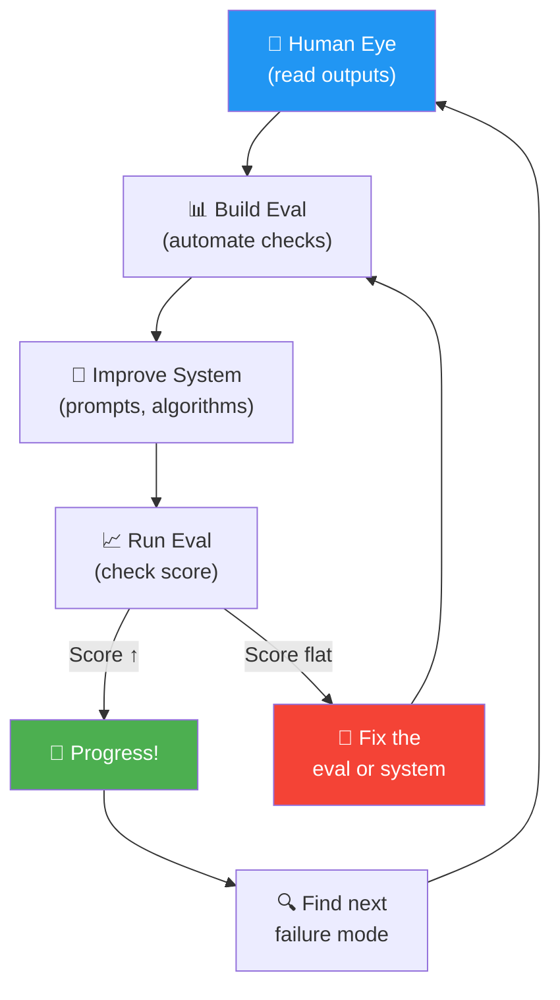

# 01 · Evaluations (Evals) 📊

---

## 🎯 One Line
> Evals = **automated tests for your AI system** — you feed it known inputs, check the outputs against expected results, and track whether your changes are making things better or worse.

---

## 🖼️ The Big Picture


> 💡 **Eval = exam for your AI. Student (AI) ne answer diya, tum answer key se match karo. Score badha toh acha, nahi toh wapas padhai karo! 📝**

---

## 🧱 The Development Loop

Don't sit around theorizing for weeks about how to build the perfect system. **Build quick, look at it, then fix what's broken.**

| Step | What You Do | Why It Matters |
|------|------------|----------------|
| **1. Build quick & dirty** | Get a working prototype fast (safely, responsibly) | You can't know what breaks until you run it |
| **2. Look at outputs** | Run 10-20 examples, manually check results | Reveals actual failure modes (not theoretical ones) |
| **3. Note failure patterns** | "Invoice 2: mixed up dates", "Invoice 20: mixed up dates" | You'll see **clusters** — same type of error repeated |
| **4. Build targeted eval** | Write code/prompt to measure that specific failure | Now you have a **score** to track progress |
| **5. Iterate & improve** | Tweak prompts, try different algorithms, re-run eval | The metric tells you if you're actually getting better |

> 💡 **Prototype pehle, perfection baad mein. Jab tak chalaya nahi, pata nahi kya tootega! 🔨**

---

## 📋 Three Real-World Eval Examples

### Example 1: Invoice Date Extraction 🧾

**System:** Extract 4 fields from invoices (biller, address, amount, due date) → save to DB

**Problem found:** After checking 20 invoices, many had the **due date mixed up with the invoice date**

```
Invoice 1  → ✅ Fine
Invoice 2  → ❌ Mixed up due date with invoice issue date
Invoice 3  → ✅ Fine
...
Invoice 20 → ❌ Mixed up dates again
```

**Eval built:**

```
┌─────────────────────────────────────────────────┐
│  1. Manually extract due dates from 10-20       │
│     invoices (= ground truth)                   │
│                                                 │
│  2. Tell LLM: format due date as YYYY/MM/DD     │
│                                                 │
│  3. Use regex to extract the date from LLM      │
│     response:                                   │
│     date_pattern = r'\d{4}/\d{2}/\d{2}'         │
│     extracted_date = re.findall(pattern, resp)   │
│                                                 │
│  4. Compare:                                    │
│     if extracted_date == actual_date:            │
│         num_correct += 1                        │
└─────────────────────────────────────────────────┘
```

| Property | Value |
|----------|-------|
| **Eval type** | Code-based (objective) |
| **Ground truth** | ✅ Per-example (each invoice has its own correct due date) |
| **Eval set size** | 10-20 invoices |

---

### Example 2: Marketing Copy Length 📱

**System:** Generate Instagram captions for product images (max 10 words)

**Problem found:** Captions keep exceeding the word limit

| Product | Words Generated | Status |
|---------|:-:|:-:|
| Sunglasses | 17 | ❌ |
| Coffee machine | ✅ OK | ✅ |
| Blue shirt | 14 | ❌ |
| Blender | 11 | ❌ |

**Eval built:**

```python
word_count = len(text.split())
if word_count <= 10:
    num_correct += 1
```

| Property | Value |
|----------|-------|
| **Eval type** | Code-based (objective) |
| **Ground truth** | ❌ No per-example — target is always 10 words, same for every input |
| **Eval set size** | 10-20 product image + prompt pairs |

---

### Example 3: Research Agent Coverage 🔬

**System:** Multi-step research agent (search → fetch → write essay)

**Problem found:** Sometimes misses important points that a human expert would've included

| Prompt | Issue |
|--------|-------|
| Black hole science | Missed a high-profile result with lots of news coverage |
| Renting vs buying in Seattle | ✅ Good |
| Robotics for fruit harvesting | Didn't mention a leading equipment company |

**Eval built:**

```
┌───────────────────────────────────────────────────┐
│  1. For each topic, define 3-5 gold standard      │
│     talking points                                │
│     Black holes → event horizon, radio telescope  │
│     Robotic harvesting → RoboPick, pinchers       │
│                                                   │
│  2. Use LLM-as-a-judge to count how many gold     │
│     standard points appear in the essay           │
│                                                   │
│  3. Prompt:                                       │
│     "Determine how many of the 5 gold-standard    │
│      talking points are present in the essay.     │
│      Return JSON: {score: 0-5, explanation: ...}" │
└───────────────────────────────────────────────────┘
```

| Property | Value |
|----------|-------|
| **Eval type** | LLM-as-a-judge (subjective) |
| **Ground truth** | ✅ Per-example (each topic has its own gold standard points) |
| **Why LLM judge?** | Talking points can be mentioned in many different ways — regex/code can't reliably detect that |

---

## 🗂️ The 2×2 Eval Framework

This is the key mental model. **Two axes** determine what kind of eval to build:

```
              │  Per-Example        │  No Per-Example
              │  Ground Truth       │  Ground Truth
──────────────┼─────────────────────┼──────────────────────
 Code-based   │  Invoice date       │  Marketing copy
 (Objective)  │  extraction         │  length check
              │                     │
              │  extracted_date     │  word_count <= 10
              │  == actual_date     │
──────────────┼─────────────────────┼──────────────────────
 LLM-as-Judge │  Research agent     │  Chart grading
 (Subjective) │  talking points     │  with rubric
              │                     │
              │  "How many of 5     │  "Does this chart
              │   points appear?"   │   have clear axes?"
```

### When to use what?

| Situation | Eval Method |
|-----------|------------|
| Output is **exact & checkable** (dates, numbers, yes/no) | ✅ Code-based |
| Output is **open-ended / creative** (essays, explanations) | ✅ LLM-as-a-judge |
| Each input has a **unique correct answer** | ✅ Per-example ground truth |
| You're checking against a **universal rule** (length, format, rubric) | ✅ No per-example ground truth |

> 💡 **Code eval = math ka paper (exact answer hai). LLM judge = English ka paper (subjective marking hai, but rubric follow karo). 📝**

---

## 🎯 Tips for Designing End-to-End Evals

| Tip | Details |
|-----|---------|
| **Quick & dirty is fine to start** | Don't get paralyzed. 10-20 examples + simple code = you're in business. Many teams waste weeks overthinking this. |
| **Plan to iterate on evals too** | Just like you iterate on the system, your eval will get better over time |
| **Grow the eval set over time** | Start with 20. Add more as you discover edge cases your eval doesn't cover |
| **Blend metrics + human eye** | Early on, rely more on manually reading outputs. As evals mature, shift trust to automated metrics |
| **Fix mismatches** | If you *know* the new system is better but the eval score didn't go up → your eval needs improvement |
| **Compare to expert humans** | Look for where AI performs worse than a human expert → that's where to focus |

These are called **end-to-end evals** because they test the **entire pipeline** — from user input (one end) to final output (the other end).

---

## ⚡ The Iteration Flywheel



> 💡 **Eval banana = exam set banana. System improve karna = student ko padhana. Score measure karna = result dekhna. Rinse and repeat until topper! 🏆**

---

## ⚠️ Gotchas
- ❌ **Don't theorize for weeks** — build a prototype first, then figure out what's broken
- ❌ **Don't skip evals because "they take too long"** — even 10 examples is better than zero
- ❌ **Don't trust only the eval score** — always keep a human eye in the loop, especially early on
- ❌ **Don't use code evals for subjective tasks** — regex can't judge essay quality, use LLM-as-a-judge
- ❌ **Don't freeze your eval set** — add examples as you discover new failure modes

---

## 🧪 Quick Check

<details>
<summary>❓ You built a chatbot and users complain answers are too long. What kind of eval would you build?</summary>

**Code-based eval, no per-example ground truth.**
Measure `len(response.split())` and check against a word limit — same limit for every example. Like the marketing copy length eval.

</details>

<details>
<summary>❓ Your summarizer sometimes misses key facts. Which quadrant of the 2×2 grid?</summary>

**LLM-as-a-judge + per-example ground truth.** Each document has different key facts (per-example), and checking if a fact is "adequately mentioned" requires understanding, not pattern matching (LLM judge).

</details>

<details>
<summary>❓ Why does Andrew Ng say "quick and dirty is fine" for evals?</summary>

Because teams get **paralyzed** thinking evals need to be a massive multi-week effort. Starting with 10-20 examples and basic code gives you a metric that, combined with human review, can already drive development. Evals improve over time — just like the system itself.

</details>

---

> **Next →** [Error Analysis & Prioritizing](02-error-analysis.md)
