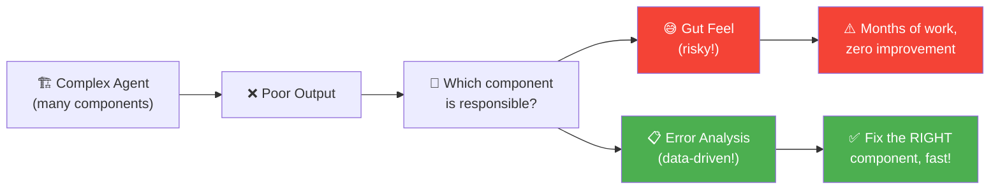
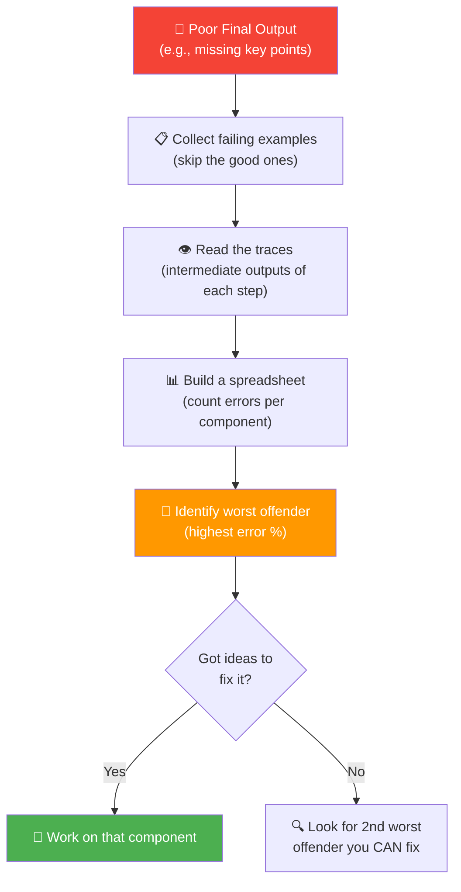

# 02 · Error Analysis & Prioritizing Next Steps 🔍

---

## 🎯 One Line
> Error analysis = **look at what broke at each step (traces), count where failures cluster, then fix the worst offender first** — data-driven prioritization, not gut feeling.

---

## 🖼️ The Core Idea



> 💡 **Gut se kaam mat karo, data se karo. Andrew Ng khud bolte hain: "gut feeling leads to months of work with very little progress." 😬**

---

## 🧱 Key Concepts

| Term | What It Is | Analogy |
|------|-----------|---------|
| **Trace** | The full set of intermediate outputs from ALL steps of one agent run | A patient's complete medical case file — every test result |
| **Span** | Output of a **single step** in the trace | One blood test result (part of the full file) |
| **Error Analysis** | Systematically counting which step failed, across many examples | Checking subject-wise marks to find which subject you're failing |
| **Error Mode** | A category of failure that repeats across examples (e.g., "misses key points") | Getting calculation wrong in every exam → math is weak |

> 💡 **Trace = crime scene investigation. Har step ka output = clue. Tum detective ho. 🕵️**

---

## ⚡ The Error Analysis Process



### Step-by-Step

| Step | What You Do |
|------|------------|
| **1. Focus on failures** | Collect only the examples where the final output was unsatisfactory. Set aside the good ones. |
| **2. Read traces** | For each failing example, look at the intermediate outputs (span by span). Get an informal feel for which steps look wrong. |
| **3. Compare to human expert** | At each step, ask: "Would a human expert do significantly better given the same input?" If yes → that step is the problem. |
| **4. Build a spreadsheet** | For each example + each component, mark if the output was subpar. Count up the error rates. |
| **5. Prioritize** | Fix the component with the **highest error rate** — BUT only if you have actionable ideas. High errors + no fix ideas = skip for now. |

---

## 📊 Research Agent Example: Error Analysis in Action

**Observed problem:** Essay misses key points a human expert would have made.

**Possible causes across the pipeline:**

```
User Query
    │
    ▼
┌──────────────────┐
│   Search Web     │ ← Bad search terms? (wrong keywords?)
└──────────────────┘
    │
    ▼
┌──────────────────┐
│  Web Search      │ ← Low quality search results? (wrong engine/params?)
└──────────────────┘
    │
    ▼
┌──────────────────┐
│ Pick 5 Best URLs │ ← Poor selection of sources? (chose bad articles?)
└──────────────────┘
    │
    ▼
┌──────────────────┐
│   Web Fetch      │ ← (Usually fine — fetching is mechanical)
└──────────────────┘
    │
    ▼
┌──────────────────┐
│  Write Essay     │ ← Bad reasoning over texts? (ignored fetched content?)
└──────────────────┘
```

**Trace example for "Recent black hole science":**

| Step | Output Seen | Expert Verdict |
|------|------------|----------------|
| Search terms | "Black hole theories Einstein", "Event Horizon Telescope Radio", "New physics black holes" | ✅ Reasonable — similar to what a human would use |
| Web search results | astrokidnews.com, spaceblog2000.com, spacefunnews.com | ❌ Too many blogs/popular press, not enough scientific papers |
| 5 best sources | Astro Kid News, SpaceBot2000, Space Fun News... | ⚠️ Not great — but that's because the inputs were all bad. Can't blame this step for bad raw material. |

> 💡 **Important: If a step's INPUT was already garbage, and it did the best it could with that garbage, don't blame that step. Blame the step that produced the garbage input! 🗑️**

**Spreadsheet counts (across many examples):**

| Component | Error Rate |
|-----------|:----------:|
| Search Terms | 5% |
| Search Results | **45%** ← 🎯 FIX THIS |
| Picking 5 Best Sources | 10% |
| Essay Writing | — |

**Conclusion:** Web search engine is the bottleneck. Try a different search engine or tune search parameters.

---

## 🔑 The Prioritization Rule

Not every problematic component deserves equal attention:

```
Priority = Error Rate × Fixability
```

| Situation | Priority |
|-----------|:--------:|
| High error rate + have ideas to fix it | 🔴 **HIGH** — do this now |
| High error rate + no ideas to fix it | 🟡 Medium — skip for now, return later |
| Low error rate + easy fix | 🟡 Medium — quick win if time permits |
| Low error rate + no fix ideas | 🟢 Low — ignore |

---

## 🎯 Tips for Error Analysis

| Tip | Why |
|-----|-----|
| **Develop a habit of reading traces** | Gives you intuition about your system's behaviour even before formal analysis |
| **Focus only on failing examples** | Passing examples don't tell you what's wrong |
| **Compare each step to a human expert** | Sets a clear bar: "would a human do significantly better here?" |
| **Use a spreadsheet to count** | Informal impressions can mislead. Count up the actual error rates. |
| **Error analysis ≠ fixing** | Error analysis tells you WHERE to fix. Then you decide whether to act. |

> 💡 **Error analysis skill = biggest predictor of team efficiency. Andrew Ng ne directly bola. 🏆**

---

## ⚠️ Gotchas
- ❌ **Don't go by gut** — gut feel leads to months of work, zero improvement in overall system
- ❌ **Don't blame downstream steps for upstream failures** — if step 3 got garbage input from step 2, fix step 2
- ❌ **Don't skip the trace-reading habit** — it builds intuition you can't get any other way
- ❌ **Don't confuse "problematic" with "prioritizable"** — a broken step you can't fix should be parked, not obsessed over

---

## 🧪 Quick Check

<details>
<summary>❓ What's the difference between a "trace" and a "span"?</summary>

- **Trace** = all intermediate outputs from ALL steps of one full agent run
- **Span** = output of a **single step** within that trace

Analogy: Trace = full medical case file. Span = one specific test result in that file.

</details>

<details>
<summary>❓ Your research agent's "Pick 5 best sources" step keeps selecting low-quality articles. Where should you look first?</summary>

At the **step before it** — the web search results. If the raw search results only returned blogs and popular press, the "Pick 5 best sources" step had no good options to choose from. It's not to blame. Fix the web search quality first.

</details>

<details>
<summary>❓ Error analysis shows Step A has 50% error rate and Step B has 20%. You have a clear fix idea for Step B but not Step A. What do you work on?</summary>

**Step B** — even though Step A has higher errors, if you have no idea how to fix it, working on it is low-ROI. Error analysis guides WHERE, but **fixability** determines priority. Fix Step B (20% errors, clear fix), then come back to Step A with fresh thinking.

</details>

---

> **Next →** [More Error Analysis Examples](03-more-error-analysis.md)
