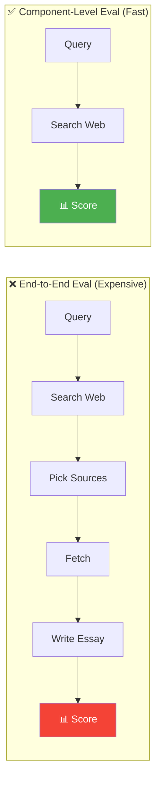
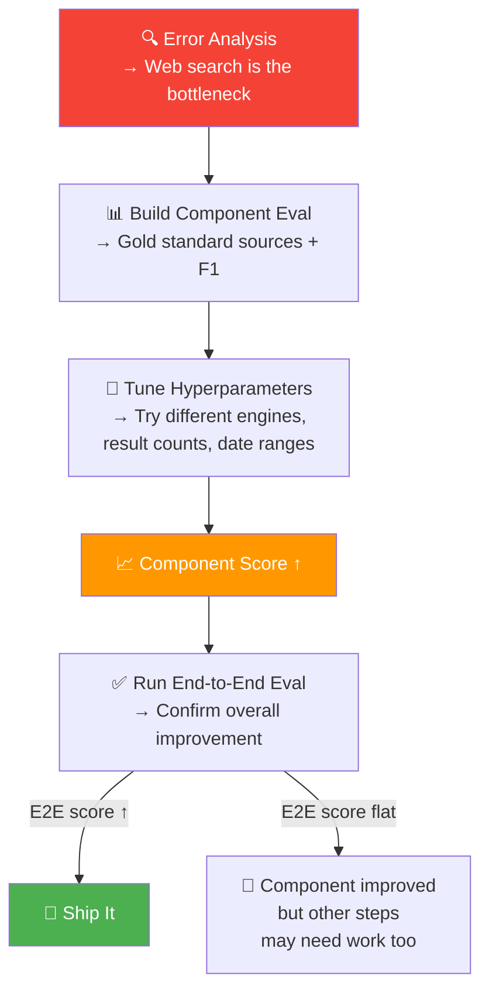

# 04 · Component-Level Evals 🔬

---

## 🎯 One Line
> Instead of re-running the entire end-to-end pipeline every time you tweak one piece, **build a focused eval for just that component** — faster feedback, clearer signal, less noise.

---

## 🖼️ End-to-End vs Component-Level



> 💡 **End-to-end eval = poora exam do har baar. Component eval = sirf math ka chapter test do jab math fix kar rahe ho. Zyada fast, zyada clear! 🎯**

---

## 🤔 Why Not Just Use End-to-End Evals?

Two problems with relying only on end-to-end evals when improving a single component:

| Problem | What Happens |
|---------|-------------|
| **Expensive** | Every small tweak requires re-running the entire multi-step pipeline — all the LLM calls, web fetches, everything |
| **Noisy** | Other components introduce randomness. Even if web search improved slightly, noise from the essay-writing LLM might mask the improvement in the final score |

---

## 📋 Building a Component-Level Eval: Web Search Example

Error analysis revealed that **web search results** were the bottleneck (45% error rate from Lesson 02). Now you want to improve it. Here's how to eval just that component:

### Step-by-Step

```
┌───────────────────────────────────────────────────┐
│  COMPONENT EVAL: Web Search                       │
│                                                   │
│  1. Create a list of gold standard web resources  │
│     → For each query, have an expert identify     │
│       the most authoritative sources              │
│                                                   │
│  2. Write code that calculates how many search    │
│     results correspond to gold standard websites  │
│     → Use F1-score (standard information          │
│       retrieval metric for overlap measurement)   │
│                                                   │
│  3. Track as you vary hyperparameters:            │
│     • Search engine (Google, Bing, DuckDuckGo,    │
│       Tavily, u.com, etc.)                        │
│     • Number of results                           │
│     • Date range                                  │
│                                                   │
│  4. Before calling it done, run an end-to-end     │
│     eval to confirm overall system improved       │
└───────────────────────────────────────────────────┘
```

### What the eval looks like in practice

| Query | Gold Standard Sources | Search Engine A | Search Engine B |
|-------|----------------------|:---------------:|:---------------:|
| Black hole science | Nature, ArXiv, NASA | 2/5 found (F1: 0.4) | 4/5 found (F1: 0.8) |
| Renting vs buying Seattle | Zillow, Redfin, NYT | 3/5 found | 4/5 found |
| Robotics harvesting | IEEE, RoboPick, USDA | 1/5 found | 3/5 found |

Now you can rapidly compare search engines, tweak parameters, and see scores move — without running the full essay pipeline each time.

### Hyperparameters you can tune

| Component | Hyperparameters to Vary |
|-----------|------------------------|
| **Web search** | Search engine, number of results, date range |
| **RAG retrieval** | Similarity threshold, chunk size |
| **ML models** (speech recognition, people detection, etc.) | Detection threshold |

---

## 🔄 The Workflow: Component Eval → End-to-End Confirmation



**Key point:** Component evals are for rapid iteration during development. But always **validate with end-to-end evals** before declaring victory — a component improvement doesn't guarantee overall system improvement.

---

## ✅ Benefits of Component-Level Evals

| Benefit | Details |
|---------|---------|
| **Clearer signal** | Measures exactly the component you're working on — no noise from other steps |
| **Avoids end-to-end noise** | Other components' randomness won't mask small but real improvements |
| **Faster iteration** | Run just one step, not the whole pipeline — much cheaper and quicker |
| **Team-friendly** | One team can own their component's metric without worrying about the rest of the system |
| **More targeted** | Lets you work on a smaller, well-defined problem |

---

## 🧪 Quick Check

<details>
<summary>❓ You're tuning your RAG retrieval system and want to compare 3 different chunk sizes. Should you run end-to-end evals for each?</summary>

No — build a **component-level eval** for the retrieval step. Define gold standard relevant chunks for a set of queries, measure overlap (e.g., recall, F1) for each chunk size. Much faster than running the full RAG pipeline end-to-end for every chunk size. Once you find the best chunk size, then confirm with one end-to-end eval.

</details>

<details>
<summary>❓ Your component eval shows web search improved from F1 0.4 to 0.8, but the end-to-end essay score didn't change. What happened?</summary>

Other components may be the new bottleneck. Better search results are going in, but maybe the "Pick 5 best sources" step or the essay writing step is now the limiting factor. Run error analysis again on the updated system to find the next bottleneck.

</details>

<details>
<summary>❓ When should you NOT bother with a component-level eval?</summary>

When the component is simple enough that you can judge it by eye (e.g., PDF-to-text on 10 invoices), or when the full pipeline is so fast and cheap that end-to-end evals are already practical. Component evals add value mainly when end-to-end runs are expensive or noisy.

</details>

---

> **Next →** [How to Address Problems](05-addressing-problems.md)
