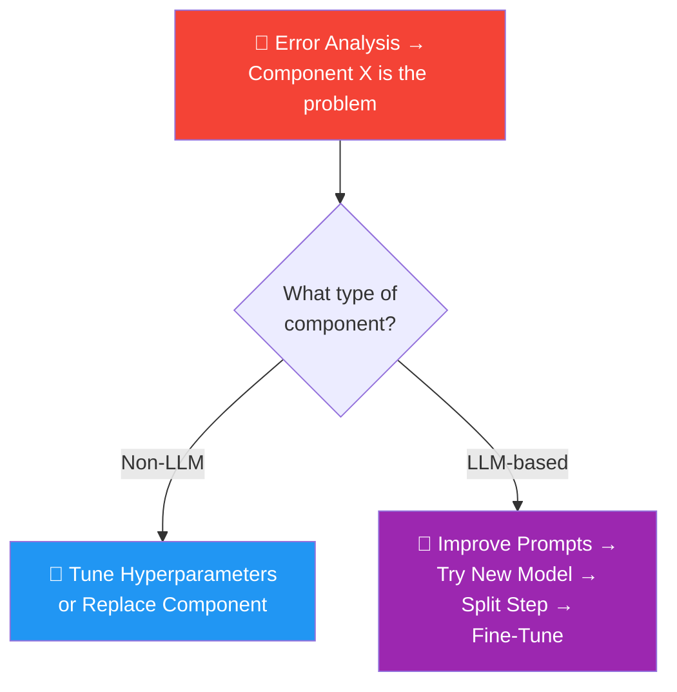
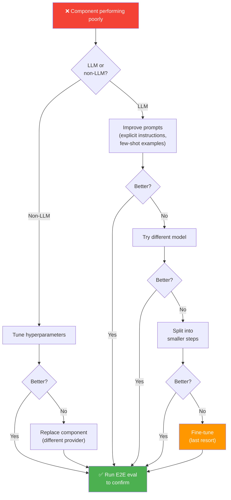

# 05 · How to Address Problems You Identify 🔧

---

## 🎯 One Line
> Once error analysis tells you WHICH component to fix, your improvement strategy depends on whether it's an **LLM-based** or **non-LLM-based** component — each has a different playbook.

---

## 🖼️ Two Playbooks



---

## 🔧 Improving Non-LLM Components

These are the "tool" parts of your workflow — web search, RAG retrieval, code execution, ML models, etc.

**Two main strategies:**

### 1. Tune Hyperparameters

| Component | Hyperparameters You Can Tune |
|-----------|------------------------------|
| **Web search** | Number of results, date range |
| **RAG text retrieval** | Similarity threshold, chunk size |
| **ML models** (speech recognition, people detection, etc.) | Detection threshold (trades off false positives vs false negatives) |

### 2. Replace the Component

Try swapping in a completely different provider:
- Different **web search engine** (Google, Bing, DuckDuckGo, Tavily, u.com)
- Different **RAG provider**
- Different **ML model** for the task

Because non-LLM components are so diverse (search engines, databases, ML models, APIs), the improvement techniques vary heavily depending on what the component actually does.

---

## 🤖 Improving LLM Components

Four strategies, **roughly in order of what to try first:**

| Strategy | What It Means | When to Use |
|----------|--------------|-------------|
| **1. Improve prompts** | Add more explicit instructions, or add input-output examples (few-shot prompting) | Always try this first — cheapest and fastest |
| **2. Try a different model** | Swap in a different LLM using aisuite or similar tools, use evals to compare | When prompting alone isn't enough |
| **3. Split up the step** | Decompose one complex LLM call into 2-3 simpler sequential calls (or add a reflection step) | When a single LLM struggles with too many instructions at once |
| **4. Fine-tune a model** | Train a custom model on your own data | Last resort — expensive in developer time, but can squeeze out those last few % of performance |

### The fine-tuning decision

```
┌────────────────────────────────────────────────────┐
│  Fine-tuning is a LAST RESORT because:             │
│                                                    │
│  • Much more complex to implement than prompting   │
│  • Requires training data                          │
│  • Expensive in developer time                     │
│  • Best for mature applications where you've       │
│    exhausted other options but need to go from      │
│    ~90-95% → ~99%                                  │
│                                                    │
│  Andrew Ng: "I tend not to fine-tune until I've    │
│  really exhausted the other options."              │
└────────────────────────────────────────────────────┘
```

> 💡 **Prompting = free ka fix. Model swap = easy try. Fine-tuning = last option jab sab kuch try kar chuke. Pehle sasta wala try karo! 💰**

---

## 🧠 PII Redaction Example: Model Intelligence Matters

**Task:** Remove all personally identifiable information from customer call summaries.

**Input text:**
> On July 14, 2023, Jessica Alvarez (SSN: 555-44-3333) of 1024 Maple Ridge Lane, Boulder, CO 80301, submitted a support ticket…

**Prompt:**
> Identify all cases of PII in the text below. Then return a list of the identified PII classified by type, and then redact all the identified PII with "\*\*\*\*\*". Separate the list and the redacted text with "REDACTED: ".

### Results: Small vs Large Model

| | Llama 3.1 8B (smaller) | GPT-5 (larger/frontier) |
|---|---|---|
| **Followed format?** | ❌ Showed list, then redacted text, then another list (wasn't asked for) | ✅ Followed formatting instruction exactly |
| **Found all PII?** | ❌ Missed the name. Only caught SSN and address | ✅ Identified all PII (name, SSN, address) |
| **Redaction quality** | ❌ Didn't fully redact the address (left "Boulder, CO 80301" visible) | ✅ Correctly redacted everything |

**Key insight:** Larger frontier models are much better at **following complex instructions**. Smaller models can answer simple factual questions fine, but struggle when instructions have multiple steps or specific formatting requirements.

---

## 🎯 Developing Intuition for Model Intelligence

Knowing which models are good at what lets you make faster, better decisions. Here's how to build that intuition:

| Practice | What It Does |
|----------|-------------|
| **Play with models often** | Every new model release, try it out with different queries — proprietary and open-weight |
| **Keep a personal eval set** | A handful of queries you always test on new models to calibrate their capabilities |
| **Read other people's prompts** | Published prompts online, friends at companies, open-source packages — read the prompts to learn best practices |
| **Try different models in your workflows** | Use aisuite to swap models easily, compare with traces and evals |

**What you'll develop intuition for:**
- Which models excel at which types of tasks (coding, instruction following, factual niche knowledge)
- Performance vs price vs speed trade-offs
- When a model is "good enough" vs when you need to upgrade

> 💡 **Doosron ke prompts padho — Andrew Ng khud open-source packages download karke unke prompts dhundhta hai. Prompt-reading = prompt-writing ka shortcut! 📖**

---

## 📊 Full Decision Flowchart



---

## ⚠️ Gotchas
- ❌ **Don't jump to fine-tuning first** — it's expensive and complex. Try prompting, model swap, and step decomposition first
- ❌ **Don't assume one model is best for everything** — different models excel at different tasks. Always evaluate.
- ❌ **Don't ignore the non-LLM components** — sometimes the fix is as simple as switching to a better search engine or adjusting a threshold
- ❌ **Don't forget to validate with end-to-end evals** — improving a component in isolation doesn't guarantee overall system improvement

---

## 🧪 Quick Check

<details>
<summary>❓ Your LLM-based summarizer isn't following your formatting instructions. What's your first move?</summary>

**Improve the prompt** — add more explicit instructions, maybe include a few-shot example showing the exact format you want. If that doesn't work, try a larger/more capable model (frontier models are much better at instruction following).

</details>

<details>
<summary>❓ Your RAG system retrieves irrelevant chunks. Is this an LLM or non-LLM problem?</summary>

**Non-LLM** — the retrieval component is a non-LLM tool. Try tuning hyperparameters first (chunk size, similarity threshold), then consider replacing the RAG provider entirely.

</details>

<details>
<summary>❓ Why does Andrew Ng recommend reading other people's prompts?</summary>

Because it **hones your intuition** for what types of instructions models follow well, what formatting tricks work, and what prompting patterns are considered best practice. He personally downloads open-source packages and digs through them to find the prompts. Prompt-reading makes you a better prompt-writer.

</details>

---

> **Next →** [Latency & Cost Optimization](06-latency-cost.md)
