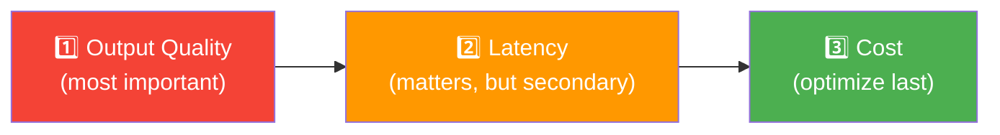

# 06 · Latency & Cost Optimization ⚡💰

---

## 🎯 One Line
> Benchmark every step's time and cost individually, then focus optimization on the most expensive/slowest components — but **only after output quality is good enough**.

---

## 🖼️ Priority Order



Andrew Ng's advice is clear: **quality first, speed second, cost third.** Getting high-quality outputs is the hardest part. Cost and latency optimization should happen only after the system actually works well.

> 💡 **Pehle khaana achha bana lo, uske baad sochna kitna sasta bana sakte ho. Sasta banaane ki race mein khaana hi kharab ho gaya toh kya faayda? 🍳**

---

## ⏱️ Optimizing Latency

### Step 1: Benchmark every step

Time each component in your pipeline to find the bottleneck:

**Research Agent — Timing Breakdown (from course slides):**

```
User Query
    │
    ▼
┌──────────────────┐
│  LLM: Search Web │  ⏱️ 7s
└──────────────────┘
    │
    ▼
┌──────────────────┐
│  Web Search      │  ⏱️ 5s    ← Consider parallelism?
└──────────────────┘
    │
    ▼
┌──────────────────┐
│  LLM: Pick 5     │  ⏱️ 3s
│  Best Sources    │
└──────────────────┘
    │
    ▼
┌──────────────────┐
│  Web Fetch +     │  ⏱️ 11s   ← Consider parallelism?
│  PDF to Text     │
└──────────────────┘
    │
    ▼
┌──────────────────┐
│  LLM: Write Essay│  ⏱️ 18s   ← Slowest! Try smaller model
└──────────────────┘             or faster LLM provider?
                    ─────────
              Total: ~44s
```

### Step 2: Apply optimization strategies

| Strategy | When to Use | Example |
|----------|------------|---------|
| **Parallelism** | Multiple independent operations that don't depend on each other | Fetch 5 web pages simultaneously instead of one at a time |
| **Smaller/faster model** | LLM step takes too long and doesn't need frontier-level intelligence | Use a smaller model for search term generation (7s → maybe 2s) |
| **Faster LLM provider** | Same model available from multiple providers, some have specialized hardware | Some APIs return tokens much faster due to optimized serving infrastructure |

---

## 💰 Optimizing Cost

### Step 1: Calculate cost per step

Three types of costs in an agentic workflow:

| Cost Type | How You're Charged | Examples |
|-----------|-------------------|----------|
| **LLM steps** | Per token (input + output) | Generating search terms, picking sources, writing essay |
| **API-calling tools** | Per API call | Web search API, database queries |
| **Compute steps** | Based on server capacity/cost | PDF-to-text processing, code execution |

### Research Agent — Cost Breakdown (from course slides)

```
User Query
    │
    ▼
┌──────────────────┐
│  LLM: Search Web │  💰 Tokens: $0.0004
└──────────────────┘
    │
    ▼
┌──────────────────┐
│  Web Search      │  💰 API call: $0.016  ← Most expensive step!
└──────────────────┘
    │
    ▼
┌──────────────────┐
│  LLM: Pick 5     │  💰 Tokens: $0.0004
│  Best Sources    │
└──────────────────┘
    │
    ▼
┌──────────────────┐
│  Web Fetch +     │  💰 API: $0.002 + PDF-to-text: $0.03
│  PDF to Text     │
└──────────────────┘
    │
    ▼
┌──────────────────┐
│  LLM: Write Essay│  💰 Tokens: $0.009
└──────────────────┘
```

| Step | Cost | % of Total |
|------|:----:|:----------:|
| LLM: Search terms | $0.0004 | ~1% |
| Web Search API | $0.016 | ~33% |
| LLM: Pick sources | $0.0004 | ~1% |
| Web Fetch API | $0.002 | ~4% |
| PDF-to-text | $0.03 | ~62% |
| LLM: Write essay | $0.009 | ~18% |

This benchmarking exercise is **clarifying** — it instantly tells you which components matter and which aren't worth worrying about. The LLM token costs for search terms ($0.0004) are negligible — don't waste time optimizing that.

---

## 🔑 Key Principles

| Principle | Details |
|-----------|---------|
| **Quality first** | Don't optimize cost/latency until the system actually produces good outputs |
| **Measure before optimizing** | Benchmark each step. Don't guess which step is slowest or most expensive |
| **Some components don't matter** | If a step costs $0.0004, it's not worth any engineering effort to make it cheaper |
| **Cost is a good problem** | "We have so many users that cost became a problem" — that means you built something people want! |
| **Latency > Cost in priority** | Users feel latency directly. Cost matters more at scale. |

---

## ⚠️ Gotchas
- ❌ **Don't optimize before quality is good** — a fast, cheap system that produces garbage is worthless
- ❌ **Don't guess where the latency is** — always benchmark. The slowest step is often not what you expect
- ❌ **Don't optimize negligible costs** — if LLM tokens cost $0.0004 per call, leave it alone
- ❌ **Don't assume all LLM providers are the same speed** — specialized hardware can make the same model much faster from one provider vs another

---

## 🧪 Quick Check

<details>
<summary>❓ Your pipeline takes 44 seconds total. The essay-writing LLM takes 18 seconds. What would you try first?</summary>

Two options: (1) Try a **smaller/less intelligent model** for that step — if it still produces good enough essays, you could cut that 18s significantly. (2) Try a **faster LLM provider** — some providers have optimized hardware that serves the same model faster. Always re-check quality with your evals after making changes.

</details>

<details>
<summary>❓ Your web fetch step fetches 5 pages sequentially, taking 11 seconds. How would you speed this up?</summary>

**Parallelism.** The 5 web fetches don't depend on each other — run them all simultaneously. If each takes ~2 seconds, parallel execution cuts the step from 11s to ~2s.

</details>

<details>
<summary>❓ When should you start worrying about cost optimization?</summary>

After your system (1) produces high-quality outputs and (2) has enough users that cost actually becomes material. Andrew Ng says having high costs because of high usage is "a good problem to have." Focus on quality first, then optimize cost when scale demands it.

</details>

---

> **Next →** [Development Process Summary](07-dev-process-summary.md)
