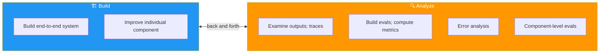
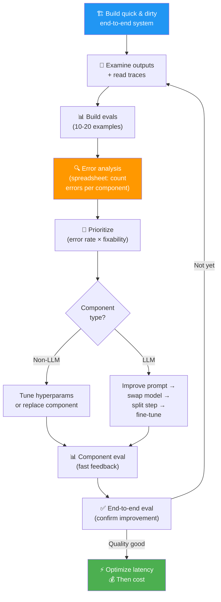

# 07 · Development Process Summary 🔄

---

## 🎯 One Line
> Building agentic AI is a **back-and-forth between building and analyzing** — less experienced teams over-index on building, while the best teams spend equal time on analysis to know exactly WHERE to build next.

---

## 🖼️ The Build ↔ Analyze Cycle

This is the core diagram from the course slides — the two activities and how they feed each other:



**Key insight:** This is NOT a linear process. You bounce between building and analyzing constantly. Analysis isn't "not progress" — it's what ensures your building time is well spent.

---

## 📈 The Maturity Progression

As your system matures, your analysis becomes more disciplined:

| Stage | Build Activity | Analyze Activity |
|:-----:|---------------|-----------------|
| **1. Start** | Quick & dirty end-to-end implementation | Manually examine a few outputs, read traces informally |
| **2. Early** | Tune components based on gut sense from traces | Build small eval sets (10-20 examples), compute basic metrics |
| **3. Growing** | Focused improvements on specific components | Systematic error analysis — spreadsheet counting errors per component |
| **4. Mature** | Targeted component improvements with clear metrics | Component-level evals for isolated, fast feedback loops |

```
Maturity Timeline:
━━━━━━━━━━━━━━━━━━━━━━━━━━━━━━━━━━━━━━━━━━━━━━━━━━━━━━━━━━━━━━

Early                                                    Mature
├──────────┼──────────────┼────────────────┼─────────────────┤
│ Build    │ Manual       │ End-to-end     │ Component       │
│ quick &  │ output       │ evals +        │ evals +         │
│ dirty    │ review +     │ error          │ targeted        │
│ system   │ read traces  │ analysis       │ improvements    │
━━━━━━━━━━━━━━━━━━━━━━━━━━━━━━━━━━━━━━━━━━━━━━━━━━━━━━━━━━━━━━
```

---

## ⚡ The Full Development Flow

Putting all of Module 4 together in one view:



---

## 🧩 Module 4 Recap — All Concepts in One Table

| Lesson | Core Concept | Key Technique |
|--------|-------------|---------------|
| [01 - Evals](01-evaluations.md) | Automated tests for your AI system | 2×2 framework: code vs LLM-judge × per-example vs no ground truth |
| [02 - Error Analysis](02-error-analysis.md) | Find which component is failing most | Read traces (spans), build spreadsheet, count error rates |
| [03 - More Error Analysis](03-more-error-analysis.md) | Practice with invoice + email examples | Errors aren't mutually exclusive; obvious culprit often isn't the real one |
| [04 - Component Evals](04-component-level-evals.md) | Eval one component in isolation | Gold standard + F1 score, vary hyperparameters, confirm with E2E |
| [05 - Addressing Problems](05-addressing-problems.md) | How to fix once you know what's broken | Non-LLM: tune/replace. LLM: prompt → model → split → fine-tune |
| [06 - Latency & Cost](06-latency-cost.md) | Speed up and reduce cost | Benchmark each step, parallelism, smaller models, faster providers |
| [07 - Dev Process](07-dev-process-summary.md) | The big picture workflow | Build ↔ Analyze cycle, maturity stages |

---

## 🔑 What Separates Good from Great

| Less Experienced Teams | Experienced Teams |
|:----------------------:|:-----------------:|
| Spend most time building | Balance building + analyzing equally |
| Go by gut to pick what to fix | Use error analysis spreadsheets |
| Build for weeks, hope it improves | Build eval → measure → iterate with data |
| Use only end-to-end evals (expensive) | Add component-level evals for fast feedback |
| Optimize cost/latency early | Focus on quality first, optimize later |

> 💡 **Andrew Ng bola — agar tum is module ka fraction bhi implement karo, toh tum "vast majority of developers" se aage ho. Yeh nahi ki aur log code nahi likh sakte — woh analysis nahi karte! 🏆**

---

## 🛠️ Practical Tools Note

- Many tools exist for monitoring traces, logging runtime, computing costs (several from DeepLearning.ai partners)
- Andrew uses some of these, BUT most agentic workflows are custom enough that you'll need **custom evals** tailored to your specific failure modes
- Off-the-shelf tools + custom evals = best combo

---

## ⚠️ Gotchas
- ❌ **Don't spend all your time building** — analysis that tells you WHERE to build is equally valuable
- ❌ **Don't treat the process as linear** — you'll bounce between building and analyzing constantly
- ❌ **Don't expect your first eval to be perfect** — evals mature alongside the system
- ❌ **Don't rely only on off-the-shelf monitoring tools** — your failure modes are unique, your evals should be too

---

## 🧪 Quick Check

<details>
<summary>❓ What's the biggest difference between less experienced and experienced agentic AI teams?</summary>

**Time spent on analysis.** Less experienced teams spend most of their time building and not enough time on error analysis, building evals, and understanding where the system fails. Experienced teams balance building and analyzing equally, which means their building time is far more productive because they know exactly where to focus.

</details>

<details>
<summary>❓ In what order should you add analysis sophistication?</summary>

1. **Manual examination** — look at outputs, read traces informally
2. **End-to-end evals** — small dataset (10-20 examples), basic metrics
3. **Error analysis** — spreadsheet counting errors per component
4. **Component-level evals** — isolated metrics for the specific component you're improving

Each level builds on the previous one. Don't jump to component evals before you've done error analysis.

</details>

---

> **🎉 Module 4 Complete!** Next → [Module 5: Autonomous Agents](../module-5-autonomous-agents/)
