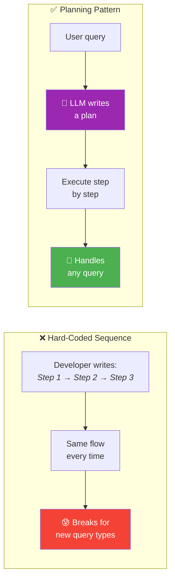
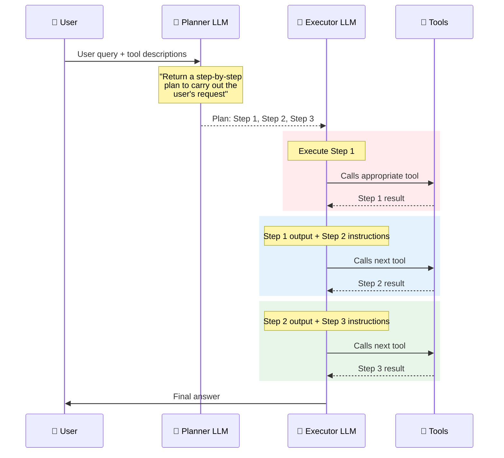
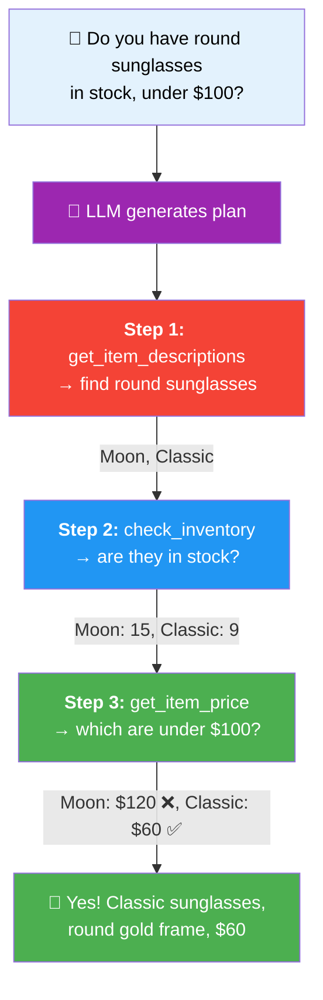
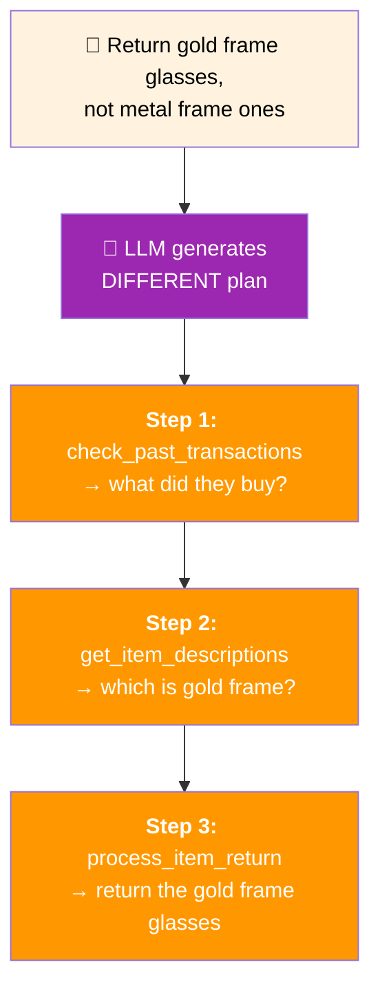
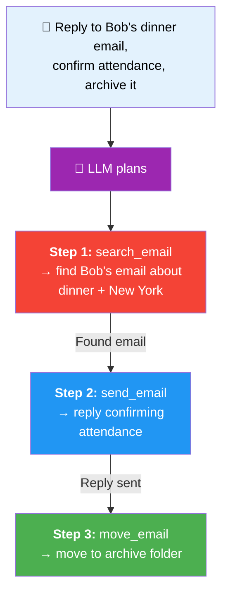

# 01 · Planning Workflows 📋

---

## 🎯 One Line
> Planning = instead of hard-coding "call tool A, then B, then C", you let the **LLM itself decide** what sequence of steps to take — it writes a plan, then executes it step by step.

---

## 🖼️ The Big Picture



> 💡 **Hard-coded agent = train 🚂 — ek hi track pe chalti hai. Planning agent = taxi 🚕 — bolo kahaan jaana hai, rasta khud nikal lega!**

---

## 🧱 How Planning Works (The Core Mechanism)



### The Recipe

| Phase | What Happens | Who Does It |
|-------|-------------|------------|
| **1. Plan** | LLM reads the query + available tools → writes a multi-step plan | Planner LLM |
| **2. Execute** | Each step is fed to an LLM one at a time, with the previous step's output as context | Executor LLM |
| **3. Tool Calls** | At each step, the LLM picks the right tool and calls it | Executor LLM + Tools |
| **4. Chain** | Output of step N becomes input context for step N+1 | System orchestration |
| **5. Final Answer** | After all steps, LLM generates the response for the user | Executor LLM |

The key prompt that drives everything:

```
You have access to the following tools:
{description of tools}

Return a step-by-step plan to carry out the user's request.
```

> 💡 **Basically: "Yeh tools tere paas hain, plan bana aur bol kya karega" — aur LLM itna smart hai ki sahi sequence khud nikal leta hai!**

---

## 🛒 Example 1: Sunglasses Customer Service Agent

The PDF shows a concrete inventory database:

| ID | Name | Description | Price | Stock |
|----|------|------------|-------|-------|
| 1001 | Aviator | Timeless pilot style, metal frame | $80 | 12 |
| 1002 | Catseye | Glamorous 1950s profile, plastic frame | $60 | 28 |
| 1003 | Moon | Oversized round style, plastic frame | $120 | 15 |
| 1004 | Classic | Classic round profile, gold frame | $60 | 9 |

**Customer asks:** *"Do you have any round sunglasses in stock that are under $100?"*

### Available Tools

```
┌─────────────────────────────────────────────────────┐
│  🔧 Tools Available to the LLM:                     │
│                                                      │
│  📝 get_item_descriptions   📦 check_inventory      │
│  💰 get_item_price          📜 check_past_transactions│
│  🔄 process_item_return     🛒 process_item_sale     │
└─────────────────────────────────────────────────────┘
```

### The Plan LLM Generates



**Notice:** Only 3 out of 6 tools were used. `process_item_return`, `process_item_sale`, and `check_past_transactions` were **not needed** for this query — and the LLM knew that.

### Step-by-Step Execution Flow

| Step | Input to LLM | Tool Called | Output |
|------|-------------|------------|--------|
| **1** | Step 1 instructions + tools + query | `get_item_descriptions` | Round sunglasses = Moon, Classic |
| **2** | Step 1 output + Step 2 instructions | `check_inventory` | Moon: 15 in stock, Classic: 9 in stock |
| **3** | Step 2 output + Step 3 instructions | `get_item_price` | Moon: $120 (too expensive), Classic: $60 ✅ |
| **Final** | Step 3 output → generate response | — | "Yes, we have Classic sunglasses, $60" |

---

## 🔄 Same Agent, Different Query → Different Plan

**New query:** *"I'd like to return the gold frame glasses I purchased, but not the metal frame ones."*



| Query | Tools Used | Tools Skipped |
|-------|-----------|--------------|
| "Round sunglasses under $100?" | get_item_descriptions → check_inventory → get_item_price | process_item_return, process_item_sale, check_past_transactions |
| "Return gold frame glasses" | check_past_transactions → get_item_descriptions → process_item_return | check_inventory, get_item_price, process_item_sale |

**Same 6 tools. Completely different plans.** That's the power of planning — you don't hard-code anything!

---

## 📧 Example 2: Email Assistant

**User says:** *"Reply to that email invitation from Bob about dinner in New York, tell him I'll attend. Then archive his email."*

### Available Tools

| Tool | What It Does |
|------|-------------|
| `search_email` | Find emails matching criteria |
| `send_email` | Send/reply to emails |
| `move_email` | Move email to a folder |
| `delete_email` | Delete an email |

### The Plan



Again: `delete_email` was available but **not used** — the LLM understood "archive" ≠ "delete."

---

## 🏗️ Where Planning Works Today

```
┌────────────────────────────────────────────────────────────────┐
│                    Planning Adoption Spectrum                   │
│                                                                │
│  🟢 Works Great              🟡 Growing              🔴 Early │
│  ─────────────              ────────                 ──────── │
│  Agentic Coding             Customer Service         General   │
│  Systems                    Email Assistants          Purpose  │
│  (write complex             (multi-step              Agents   │
│   software with              queries)                         │
│   planning +                                                   │
│   checklists)                                                  │
└────────────────────────────────────────────────────────────────┘
```

| Domain | Status | Why |
|--------|--------|-----|
| **Agentic coding** | 🟢 Proven | "Build this app" → LLM plans components, builds one by one. Works really well! |
| **Other applications** | 🟡 Growing | Customer service, email — promising but still more experimental |

---

## ⚠️ The Control Trade-Off

Planning gives you **flexibility** but takes away **predictability**:

| Aspect | Hard-Coded Agent | Planning Agent |
|--------|-----------------|---------------|
| **Sequence of steps** | Developer decides | LLM decides at runtime |
| **Predictability** | 100% — same steps every time | Varies — different plan per query |
| **Flexibility** | Low — only handles what you coded for | High — handles novel queries |
| **Debuggability** | Easy — you know exactly what runs | Harder — what plan will it come up with? |
| **Range of tasks** | Narrow | Broad |

> 💡 **Hard-coded = recipe follow karna. Planning = fridge mein jo hai usse kuch bana lena. Flexibility zyada, but kabhi kabhi ajeeb dish bhi ban jaati hai 😂**

---

## 🧪 Quick Check

<details>
<summary>❓ What is the planning design pattern?</summary>

Instead of hard-coding the sequence of tool calls, you give the LLM a set of tools + a prompt saying "return a step-by-step plan." The LLM generates the plan itself, and then executes it one step at a time, passing each step's output as context to the next step.
</details>

<details>
<summary>❓ In the sunglasses example, why is planning better than hard-coding?</summary>

Because different customer queries need **different tool sequences**. "Round sunglasses under $100?" needs descriptions → inventory → price. "Return gold frame glasses" needs past transactions → descriptions → process return. Hard-coding would need a separate flow for each query type. Planning handles both (and novel queries) automatically.
</details>

<details>
<summary>❓ What's the biggest challenge with the planning pattern?</summary>

**Control and predictability.** As a developer, you don't know at runtime what plan the LLM will generate. This makes the system harder to debug and predict. That's why adoption is strong in coding systems (where it works great) but still growing in other domains.
</details>

<details>
<summary>❓ How does step chaining work in planning?</summary>

Step 1's text is sent to an LLM → it executes and produces output → that output + Step 2's text is sent to the LLM → produces output → that output + Step 3's text → and so on until all steps are done. Each step has the **cumulative context** of previous steps.
</details>

<details>
<summary>❓ Does the LLM always use all available tools in a plan?</summary>

**No!** In the sunglasses example, only 3 of 6 tools were used per query. The LLM selects only the tools relevant to that specific query. Different queries activate different subsets of tools.
</details>

---

> **Next →** [Creating & Executing LLM Plans](02-llm-plans.md)
