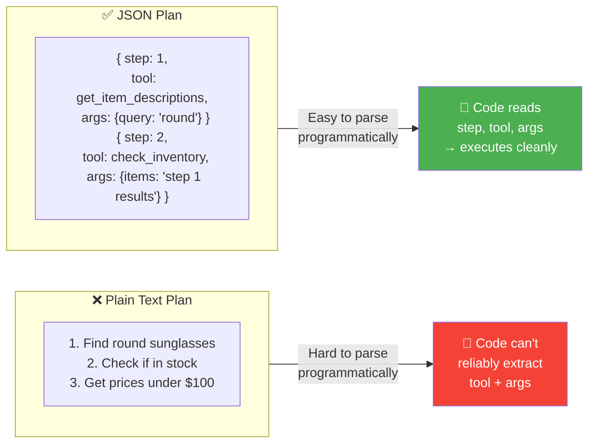
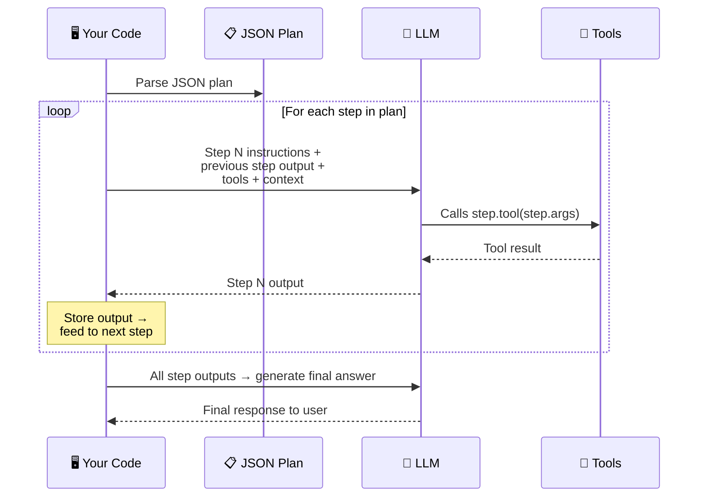

# 02 · Creating & Executing LLM Plans 📋

---

## 🎯 One Line
> To make plans **parseable and executable by code**, ask the LLM to output the plan in a structured format like JSON — with step number, description, tool name, and arguments clearly separated.

---

## 🖼️ From Vague Text → Structured Plan



> 💡 **Plain text plan = handwritten recipe — padh toh sakte ho, lekin machine se padhwao toh gadbad. JSON plan = printed label with barcode — machine ek dum scan kar legi! 🏷️**

---

## ⚡ The System Prompt That Makes It Work

In Lesson 01, we saw the basic planning prompt. The upgrade here is telling the LLM **how to format** the plan:

```
You have access to the following tools:
{description of tools}

Create a step-by-step plan in JSON format.
Each step should have the following items:
  step number, description, tool name, and args.
```

### What the LLM Outputs

```json
{
  "plan": [
    {
      "step": 1,
      "description": "Find round sunglasses",
      "tool": "get_item_descriptions",
      "args": { "query": "round sunglasses" }
    },
    {
      "step": 2,
      "description": "Check available stock",
      "tool": "check_inventory",
      "args": { "items": "results from step 1" }
    },
    {
      "step": 3,
      "description": "Get prices and filter under $100",
      "tool": "get_item_price",
      "args": { "items": "results from step 2" }
    }
  ]
}
```

Now your downstream code can simply **loop through the list**, extract `tool` and `args` for each step, execute it, and pass the output to the next step. No string parsing, no guessing.

---

## 📊 Plan Format Comparison

| Format | Example | Parseability | Reliability |
|--------|---------|-------------|------------|
| **JSON** ⭐ | `{"step": 1, "tool": "...", "args": {...}}` | Excellent — `json.loads()` and done | High — clear keys, no ambiguity |
| **XML** | `<step number="1"><tool>...</tool></step>` | Very good — XML parsers handle it | High — tags clearly delimit fields |
| **Markdown** | `### Step 1\n- Tool: ...\n- Args: ...` | Okay — needs custom parsing | Medium — slightly ambiguous |
| **Plain text** | `1. Use get_item_descriptions to find round sunglasses` | Poor — regex/heuristics needed | Low — hard to extract tool + args reliably |

```
┌─────────────────────────────────────────────────────┐
│            Reliability Ranking                       │
│                                                      │
│   JSON  ████████████████████  ⭐ Best                │
│   XML   ███████████████████   Great                  │
│   MD    █████████████░░░░░░   Okay                   │
│   Text  ████████░░░░░░░░░░   Least reliable          │
└─────────────────────────────────────────────────────┘
```

**Why JSON wins:**
- All leading LLMs are **very good** at generating valid JSON
- Standard parsers exist in every language (`json.loads()` in Python, `JSON.parse()` in JS)
- Keys and values are unambiguous — `"tool"` always means the tool name
- Easy to validate structure before execution

---

## 🔄 The Execution Loop

Once you have a JSON plan, executing it is straightforward:



| Phase | What Your Code Does |
|-------|-------------------|
| **Parse** | `json.loads(llm_output)` → get list of steps |
| **Loop** | For each step: extract `tool`, `args`, `description` |
| **Execute** | Feed step text + previous output to LLM → LLM calls the tool |
| **Chain** | Collect output → pass as context to next step |
| **Finalize** | After all steps → LLM generates the answer |

---

## 🧪 Quick Check

<details>
<summary>❓ Why format plans as JSON instead of plain text?</summary>

Plain text plans are hard to parse programmatically — your code would need regex or heuristics to extract tool names and arguments, which is unreliable. JSON gives you clear, structured key-value pairs (`step`, `tool`, `args`) that standard parsers can handle perfectly. No ambiguity, no guessing.
</details>

<details>
<summary>❓ What four fields should each step in a JSON plan have?</summary>

1. **step** — the step number (ordering)
2. **description** — what this step does (human-readable)
3. **tool** — which tool to call
4. **args** — arguments to pass to that tool
</details>

<details>
<summary>❓ JSON vs XML — which is better for LLM plans?</summary>

Both are great options and work well. JSON is slightly more popular because LLMs are excellent at generating it, and JSON parsers are simpler/more universal. XML works equally well — some developers prefer it. Both are significantly better than markdown or plain text.
</details>

<details>
<summary>❓ How does the execution loop work after parsing a JSON plan?</summary>

Your code parses the JSON → loops through each step → feeds the step description + previous step's output + tool descriptions to the LLM → LLM calls the appropriate tool → output is collected and passed as context to the next step → after all steps, LLM generates the final answer.
</details>

---

> **Next →** [Planning with Code Execution](03-planning-code-execution.md)
