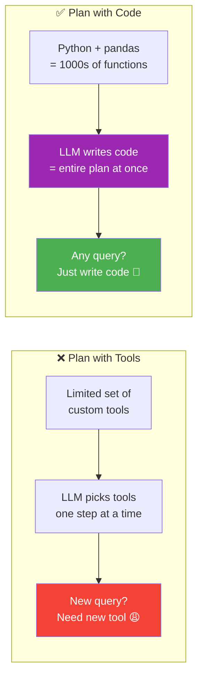
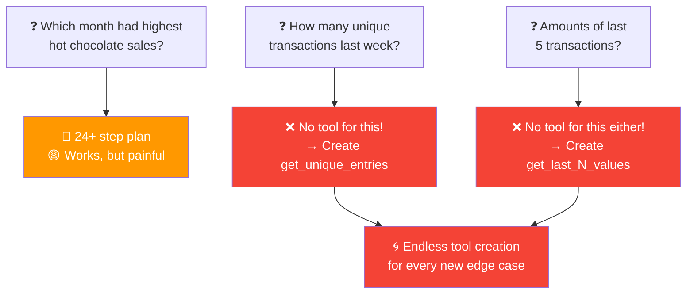
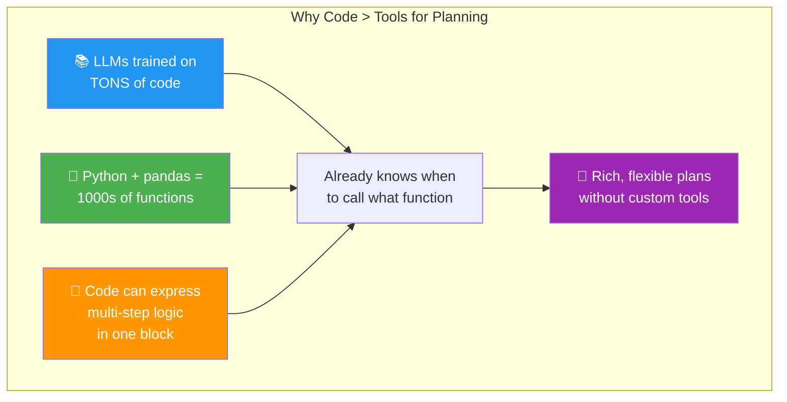
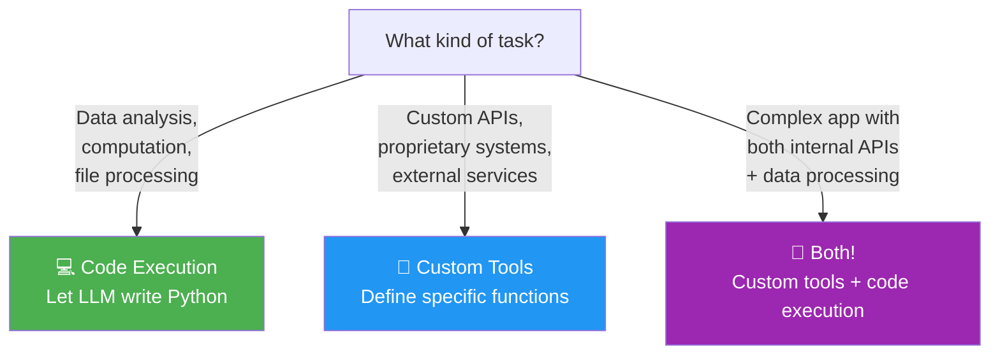

# 03 · Planning with Code Execution 💻

---

## 🎯 One Line
> Instead of giving the LLM a fixed set of tools to plan with, let it **write Python code** as its plan — code IS the plan, and executing it carries out multiple steps at once.

---

## 🖼️ The Core Shift



> 💡 **Tools = limited menu card with 6-7 items. Code = poore kitchen ka access — jo marzi bana lo! 🍳**

---

## 🤯 The Problem: Too Many Tools

Imagine you have a **coffee sales CSV** and want to answer questions about it:

| date | price | coffee_name | size |
|------|-------|------------|------|
| 2024-01-28 | 3.87 | Hot Chocolate | M |
| 2024-03-01 | 2.89 | Cappuccino | S |
| 2024-03-04 | 3.87 | Latte | M |
| ... | ... | ... | ... |

You give the LLM these tools:

```
┌──────────────────────────────────────────────────────┐
│  🔧 Data Analysis Tools:                             │
│                                                       │
│  get_column_max    get_column_min    get_column_mean  │
│  get_column_median sum_rows          filter_rows      │
└──────────────────────────────────────────────────────┘
```

### Query: "Which month had the highest sales of hot chocolate?"

The LLM has to generate this **absurdly long plan**:

```
Step 1:  filter_rows → January + Hot Chocolate
Step 2:  get_column_mean → January average
Step 3:  filter_rows → February + Hot Chocolate
Step 4:  get_column_mean → February average
Step 5:  filter_rows → March + Hot Chocolate
Step 6:  get_column_mean → March average
  ...repeat for ALL 12 months...
Step 23: filter_rows → December + Hot Chocolate
Step 24: get_column_mean → December average
Step 25: Compare all results → pick the max
```

**24+ steps** for one question! 😱 And it gets worse:



### The Three Problems (from PDF)

| Problem | What Goes Wrong |
|---------|----------------|
| **Brittle** | Plan breaks if the query doesn't fit your limited tools exactly |
| **Inefficient** | Simple queries need absurdly many steps (24 steps for 1 question!) |
| **Edge case treadmill** | Every new query type → create yet another tool → never-ending cycle |

> 💡 **Tool-based planning for data = building furniture with only a hammer and screwdriver. Possible? Yes. Pleasant? Absolutely not. 😤**

---

## ✅ The Solution: Let the LLM Write Code

Instead of "pick from these 6 tools", you prompt the LLM:

```
Write code to solve the user's query.
Return your answer as Python code delimited with
<execute_python> and </execute_python> tags.
```

Now the LLM has access to **the entire Python language + pandas library** = hundreds/thousands of functions it already knows how to use from training data!

### Example 1: "What were the amounts of the last 5 transactions?"

```python
<execute_python>
import pandas as pd

# Step 1: Load CSV
df = pd.read_csv("transactions.csv")

# Step 2: Ensure date column is parsed as datetime
df["date"] = pd.to_datetime(df["date"])

# Step 3: Sort by date to get most recent transactions
df_sorted = df.sort_values(by="date", ascending=False)

# Step 4: Select the last 5 transactions
last_5 = df_sorted.head(5)

# Step 5: Show just the price column (amounts)
print("Last 5 transaction amounts:")
print(last_5["price"].to_list())
</execute_python>
```

**Each comment IS a step of the plan.** The code IS the plan — load, parse, sort, select, print. 5 steps, expressed directly in executable code.

### Example 2: "How many unique transactions last week?"

```python
<execute_python>
import pandas as pd

# Step 1: Read CSV and parse the "date" column as datetime
df = pd.read_csv("transactions.csv", parse_dates=["date"])

# Step 2: Define time window
today = pd.Timestamp.today()
week_ago = today - pd.Timedelta(days=7)

# Step 3: Filter rows where date is within last week
last_week = df[df["date"].between(week_ago, today)]

# Step 4: Drop duplicate rows and count
print(last_week.drop_duplicates().shape[0])
</execute_python>
```

**No new tools needed!** The same approach handles both queries — and any future query.

---

## 🔑 Why Code Works So Well



| Factor | Custom Tools | Code as Plan |
|--------|-------------|-------------|
| **Available functions** | 6-10 you hand-picked | Hundreds/thousands (entire language + libraries) |
| **LLM familiarity** | Needs tool descriptions in prompt | Already trained on massive code data |
| **New query types** | Need to build new tools | Just writes different code |
| **Steps per query** | One tool call per step, many LLM calls | Multiple steps in a single code block |
| **Expressiveness** | Limited to what your tools can do | Anything Python can do |

---

## 📊 Research: Code > JSON > Text

Adapted from **"Executable Code Actions Elicit Better LLM Agents"** (Wang et al. 2024):

```
┌─────────────────────────────────────────────────────────────┐
│          Task Completion Rate (%) — Higher is Better         │
│                                                              │
│  Plan Format        Performance                              │
│  ─────────────      ───────────                              │
│  📝 Plain Text      ████████░░░░░░░░  Lowest                 │
│  📋 JSON            ██████████░░░░░░  Better                  │
│  💻 Code            █████████████░░░  Best! 🏆               │
│                                                              │
│  This trend holds across multiple LLM models                 │
└─────────────────────────────────────────────────────────────┘
```

| Plan Format | How It Works | Performance |
|-------------|-------------|-------------|
| **Plain text** | "First do X, then do Y, then do Z" | Lowest ❌ |
| **JSON** | `{"step": 1, "tool": "filter_rows", "args": {...}}` | Better 🟡 |
| **Code** | `df = pd.read_csv(...); df_filtered = df[df["col"] > 5]` | Best 🟢 |

Why the ranking? Code is the most **precise and unambiguous** format — no interpretation needed, just execute it.

---

## ⚠️ Caveats & Trade-offs

| Consideration | Details |
|--------------|---------|
| **🔒 Security: Sandbox needed** | LLM-generated code could be malicious/buggy — run in a sandboxed environment (Docker, VM, etc.) |
| **🤷 Real-world caveat** | Many developers skip the sandbox (not best practice, but happens) |
| **🔧 Not always applicable** | Some tasks need custom tools that aren't standard Python functions (proprietary APIs, internal systems) |
| **✅ Best use case** | Data analysis, agentic coding, anything where the task maps naturally to code |

---

## 🧩 Tools vs Code: When to Use What



---

## 🧪 Quick Check

<details>
<summary>❓ What's the main problem with tool-based planning for data analysis?</summary>

**Brittle, inefficient, and endless edge cases.** A simple query like "which month had highest hot chocolate sales" needs 24+ steps with limited tools. New query types require creating new tools every time — you end up on an infinite tool-creation treadmill.
</details>

<details>
<summary>❓ How does "planning with code" solve this?</summary>

Instead of picking from 6 custom tools, the LLM writes Python code. Python + libraries like pandas give access to **thousands of built-in functions** the LLM already knows from training. The code itself IS the plan — each step is expressed directly as executable code. No new tools needed for new query types.
</details>

<details>
<summary>❓ According to Wang et al. 2024, which plan format performs best?</summary>

**Code > JSON > Plain text.** Across multiple LLM models, expressing plans as executable code achieved the highest task completion rates. Code is the most precise and unambiguous format — no interpretation gap between plan and execution.
</details>

<details>
<summary>❓ Why do LLMs write such good Python code for planning?</summary>

Because LLMs are trained on **massive amounts of code**. They've seen Python and pandas used in millions of examples, so they already know which functions to call, when, and how. This is essentially a huge pre-built library of "tools" the LLM is already expert at using.
</details>

<details>
<summary>❓ Should you always use code execution instead of custom tools?</summary>

**No.** Code execution is great for data analysis, computation, and tasks that map naturally to Python. But if your task involves proprietary APIs, internal systems, or custom business logic, you still need custom tools. Sometimes you use both.
</details>

---

> **Next →** [Multi-Agentic Workflows](04-multi-agent.md)
