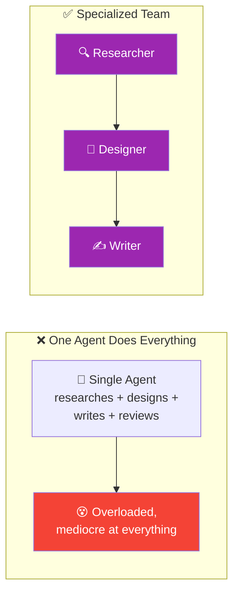
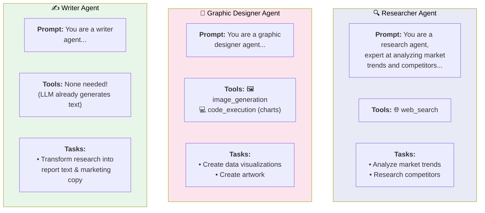
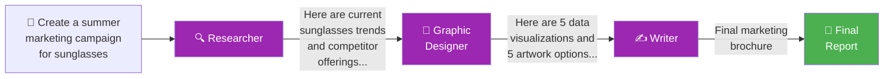
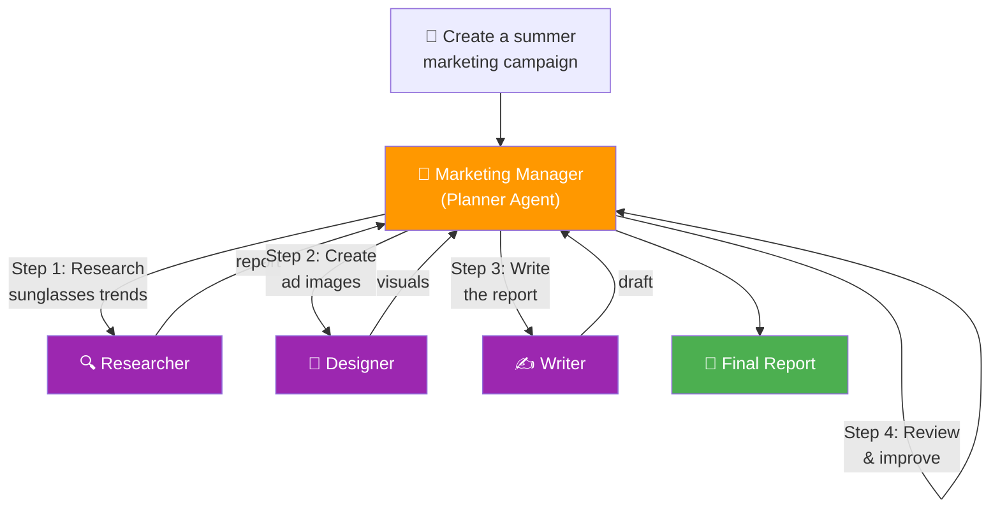

# 04 · Multi-Agentic Workflows 👥

---

## 🎯 One Line
> Instead of building one mega-agent to do everything, **decompose the task into specialized agents** — a researcher, a designer, a writer — each with their own role, prompt, and tools, then orchestrate them together.

---

## 🖼️ Why Multiple Agents?



### But wait — it's the same LLM underneath!

People often ask: *"Why do I need multiple agents? It's just the same LLM prompted over and over."*

Two analogies that make it click:

| Analogy | Explanation |
|---------|------------|
| **💻 Processes on a computer** | Even though your laptop has one CPU, you still decompose work into multiple processes/threads. It's easier to write and manage code that way. Same idea — multiple agents = easier to design, build, and debug. |
| **👥 Hiring a team** | Instead of "who is the ONE person I'd hire?", think "what TEAM of 3-4 people with different roles would I put together?" This mental model helps decompose complex tasks into clear sub-tasks. |

> 💡 **Ek talented insaan se sab karwaoge toh thak jaayega. Team banao — ek research kare, ek design kare, ek likhe. Wahi kaam, better results! 🏢**

---

## 🏗️ Real-World Task Decomposition

From the course — tasks that naturally break into team roles:

| Task | Team Members | Why This Split? |
|------|-------------|----------------|
| **Marketing assets** | 🔍 Researcher, 🎨 Graphic Designer, ✍️ Writer | Research trends → create visuals → write copy |
| **Research article** | 🔍 Researcher, 📊 Statistician, ✍️ Lead Writer, ✏️ Editor | Online research → compute stats → draft → polish |
| **Legal case** | 👔 Associate, 📋 Paralegal, 🔎 Investigator | Legal strategy → document prep → fact-finding |

The pattern: **these match how real human teams already work.** If you'd hire 3 different people for the job, build 3 different agents.

---

## 🔧 Building Individual Agents

Each agent = **a prompted LLM** with its own role, tasks, and tools:



| Agent | How You Build It | Tools Needed |
|-------|-----------------|-------------|
| **Researcher** | Prompt LLM: "You are a research agent, expert at analyzing market trends..." | 🌐 Web search |
| **Graphic Designer** | Prompt LLM: "You are a graphic designer agent..." | 🖼️ Image generation, 💻 Code execution (charts) |
| **Writer** | Prompt LLM: "You are a writer agent..." | None! LLM already generates text |

**Key insight:** Different agents get different tools. The researcher gets web search (because a human researcher would Google things). The designer gets image generation. The writer needs nothing extra — text generation IS the LLM's native capability.

---

## 📐 Pattern 1: Linear Workflow

The simplest multi-agent pattern — agents work one after another, like a relay race:



| Step | Agent | Input | Output |
|------|-------|-------|--------|
| **1** | 🔍 Researcher | User prompt | Research report on trends + competitors |
| **2** | 🎨 Graphic Designer | Research report | Data visualizations + artwork options |
| **3** | ✍️ Writer | Research + visuals | Final marketing brochure |

**Simple. Each agent does its piece and passes the baton.** Output of agent N = input of agent N+1.

---

## 📐 Pattern 2: Manager-Coordinated (Planning + Multi-Agent)

A more powerful pattern — combine **planning** (from Lesson 01) with agents instead of tools:



### How It Works

The **marketing manager** is itself an LLM-based agent with this prompt:

```
You are a marketing manager and have the following
team of agents to work with:
{description of agents}

Return a step-by-step plan to carry out the user's request.
```

**This is exactly like planning with tools — but tools are replaced by agents!**

| Planning with Tools (Lesson 01) | Planning with Agents (This Lesson) |
|--------------------------------|-----------------------------------|
| LLM sees: `🔧 tools = [get_price, check_inventory, ...]` | LLM sees: `👥 agents = [researcher, designer, writer]` |
| Plan: "Step 1: call get_item_descriptions" | Plan: "Step 1: ask researcher to research trends" |
| Green boxes (tools) | Purple boxes (agents) |
| Each step → tool call | Each step → delegate to an agent |

### The Manager = The 4th Agent

```
┌────────────────────────────────────────────────────┐
│  The system is actually 4 agents:                   │
│                                                      │
│  🟠 Marketing Manager  → plans + delegates + reviews│
│  🟣 Researcher         → does the research          │
│  🟣 Graphic Designer   → creates visuals            │
│  🟣 Writer             → writes the copy            │
│                                                      │
│  Manager doesn't just orchestrate — it can also     │
│  REFLECT and improve the final output!              │
└────────────────────────────────────────────────────┘
```

> 💡 **Linear plan = assembly line 🏭 — sab apna kaam karo, aage bhejo. Manager plan = team lead jo kaam baanta hai, check karta hai, aur final approval deta hai! 🧑‍💼**

---

## 🔄 Linear vs Manager-Coordinated

| Aspect | Linear | Manager-Coordinated |
|--------|--------|-------------------|
| **Flow** | A → B → C (fixed order) | Manager decides order at runtime |
| **Flexibility** | Low — same sequence every time | High — plan changes per query |
| **Review step** | No built-in review | Manager can reflect + improve |
| **Complexity** | Simple to build | More complex, more powerful |
| **Best for** | Predictable pipelines | Dynamic tasks with varied needs |

---

## 🔑 Key Benefits of Multi-Agent Design

| Benefit | Explanation |
|---------|------------|
| **🧩 Focus one at a time** | Build the best researcher you can, while your teammate builds the writer. Easier to design and iterate. |
| **🔄 Reusability** | Built a great graphic designer for brochures? Reuse it for social media posts, webpages, presentations! |
| **🧪 Independent testing** | Test each agent in isolation — is the researcher finding good data? Is the writer producing quality copy? |
| **🏗️ Modularity** | Swap out agents without rebuilding the whole system — upgrade the designer without touching the researcher |

---

## ⚠️ Gotchas

- ❌ **Don't over-split** — if a task is simple enough for one agent, one agent is fine. Multi-agent adds orchestration complexity.
- ❌ **Same LLM underneath** — multi-agent doesn't mean multiple AIs. It's the same LLM with different prompts and tools. The value is in the **decomposition**, not the number of LLMs.
- ❌ **Communication is a design decision** — how agents talk to each other matters enormously. Linear vs manager vs other patterns (covered in next lesson).

---

## 🧪 Quick Check

<details>
<summary>❓ Why use multiple agents instead of one?</summary>

For the same reason you'd hire a team instead of one person: complex tasks decompose naturally into specialized roles. Each agent gets a focused prompt + relevant tools, making it easier to design, build, test, and reuse. It's also the same reason we use multiple processes on a single CPU — decomposition makes the problem manageable.
</details>

<details>
<summary>❓ How do you actually BUILD an agent?</summary>

An agent = an LLM prompted with a specific role + given specific tools. For example, a researcher agent is an LLM prompted with "You are a research agent, expert at analyzing market trends..." and given the `web_search` tool. Different agents get different prompts and different tools.
</details>

<details>
<summary>❓ What's the difference between planning with tools vs planning with agents?</summary>

Same concept, different building blocks. With tools: the planner LLM sees a list of functions and decides which to call. With agents: the planner LLM sees a list of agents and decides which to delegate to. Tools = green boxes, Agents = purple boxes. The planning mechanism (generate plan → execute step by step) is identical.
</details>

<details>
<summary>❓ In the manager-coordinated pattern, how many agents are there really?</summary>

**Four!** The manager is itself an agent — it plans, delegates, and can review/reflect on the output. Plus the 3 worker agents (researcher, designer, writer). The manager is not just an orchestrator — it's an LLM-based agent with its own prompt and decision-making.
</details>

<details>
<summary>❓ Can you reuse agents across different applications?</summary>

Yes! That's a key benefit. A well-built graphic designer agent for marketing brochures might also work for social media posts, webpages, and presentations. Build once, reuse across workflows.
</details>

---

> **Next →** [Communication Patterns](05-communication-patterns.md)
