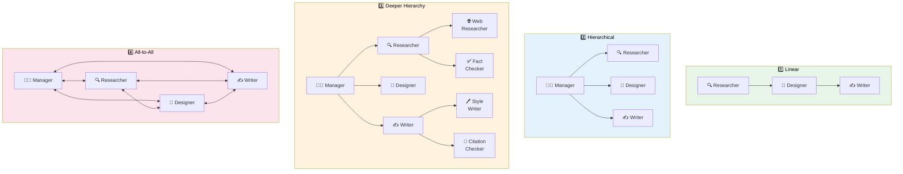
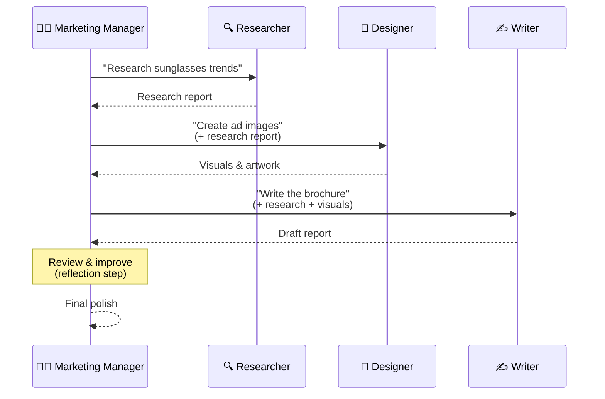
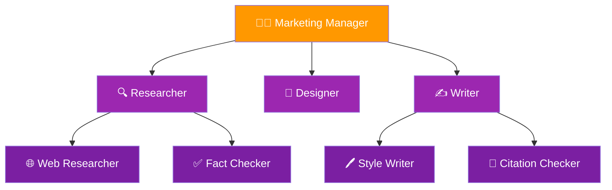
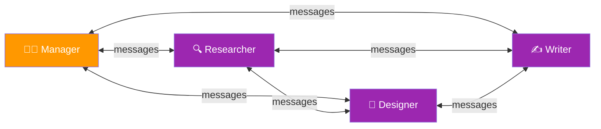
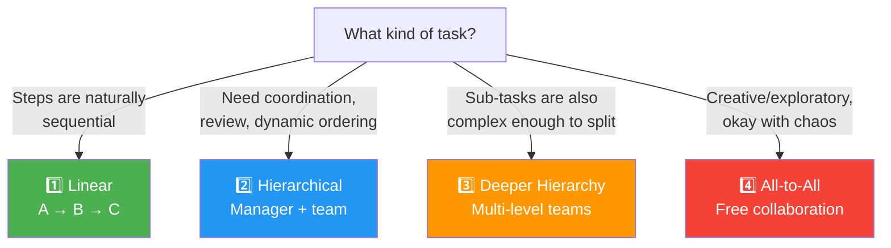

# 05 · Communication Patterns for Multi-Agent Systems 🔀

---

## 🎯 One Line
> The **communication pattern** — who talks to whom, and when — is one of the most critical design decisions in multi-agent systems. Linear and hierarchical are the two most common; deeper hierarchies and all-to-all exist but are harder to control.

---

## 🖼️ The Four Patterns at a Glance



> 💡 **Linear = assembly line 🏭. Hierarchical = office mein boss + team 🧑‍💼. Deep hierarchy = company with departments 🏢. All-to-all = group chat where everyone's talking at once 💬😅**

---

## 1️⃣ Linear Pattern

The simplest — agents work in **sequence**, passing output forward like a relay race.


| Aspect | Details |
|--------|---------|
| **Flow** | A → B → C → Done |
| **Who talks to whom** | Each agent only talks to the next one in line |
| **Control** | High — completely predictable |
| **Usage** | ⭐ One of the **two most common** patterns today |
| **Best for** | Tasks where steps are naturally sequential (research → design → write) |

---

## 2️⃣ Hierarchical Pattern (Hub-and-Spoke)

A **manager agent** coordinates the team — delegates tasks, collects results, decides next steps.



| Aspect | Details |
|--------|---------|
| **Flow** | Manager → Agent → back to Manager → next Agent → ... |
| **Who talks to whom** | All agents talk **only to the manager**, not to each other |
| **Control** | High — manager decides everything |
| **Usage** | ⭐ One of the **two most common** patterns today |
| **Best for** | Tasks needing coordination, review steps, dynamic ordering |

**Implementation detail:** In practice, it's simpler to have each worker agent report back to the manager, rather than pass results directly to the next worker. The manager handles all the routing.

---

## 3️⃣ Deeper Hierarchy

Some agents **have their own sub-agents** — like departments within a company.



| Agent | Sub-Agents | Why? |
|-------|-----------|------|
| 🔍 Researcher | Web Researcher + Fact Checker | Research is complex enough to split into raw search + verification |
| 🎨 Designer | None (works solo) | Design task is focused enough for one agent |
| ✍️ Writer | Style Writer + Citation Checker | Writing needs both creative drafting + academic rigor |

| Aspect | Details |
|--------|---------|
| **Flow** | Multi-level tree — managers delegate to sub-managers who delegate further |
| **Control** | Moderate — more moving parts to manage |
| **Usage** | Less common today — significantly more complex than single-level hierarchy |
| **Best for** | Very complex tasks where even sub-tasks need decomposition |

---

## 4️⃣ All-to-All Pattern

**Everyone can talk to everyone.** Any agent can message any other agent at any time.



### How It's Implemented

| Step | What Happens |
|------|-------------|
| **Prompt each agent** | Tell all 4 agents about the 3 others they can call on |
| **Message passing** | When Agent A sends a message to Agent B, it gets added to B's context |
| **Async collaboration** | Each agent thinks, responds, and can initiate conversations with any other |
| **Termination** | Agents declare "I'm done" → when all agree (or writer says it's good enough) → output |

| Aspect | Details |
|--------|---------|
| **Flow** | Free-form — anyone talks to anyone |
| **Control** | Low — results are hard to predict |
| **Usage** | Experimental — few projects use this |
| **Best for** | Tasks where you can tolerate chaos and just re-run if the output isn't good |

> 💡 **All-to-all = WhatsApp group jahan sab ek saath baat kar rahe hain 😂 — kabhi brilliant ideas aate hain, kabhi pure chaos. Result guaranteed nahi, lekin interesting zaroor! 💬**

---

## 📊 Pattern Comparison

| Pattern | Control | Complexity | Predictability | Usage Today |
|---------|---------|-----------|---------------|-------------|
| **1️⃣ Linear** | 🟢 High | 🟢 Simple | 🟢 Very predictable | ⭐ Most common |
| **2️⃣ Hierarchical** | 🟢 High | 🟡 Moderate | 🟢 Predictable | ⭐ Most common |
| **3️⃣ Deeper Hierarchy** | 🟡 Moderate | 🔴 Complex | 🟡 Somewhat predictable | 🟡 Less common |
| **4️⃣ All-to-All** | 🔴 Low | 🔴 Very complex | 🔴 Hard to predict | 🔴 Experimental |

```
                        Control
                    High ◄──────► Low
                     │              │
    Linear ──────────┤              │
    Hierarchical ────┤              │
                     │              │
    Deeper Hierarchy─┤──────────────┤
                     │              │
                     │          ────┤── All-to-All
                     │              │
                  Simple ◄──────► Complex
                       Complexity
```

---

## 🧩 How to Choose



**Practical advice from the course:**
- Start with **Linear** or **Hierarchical** — they cover most use cases
- Use **Deeper Hierarchy** only when sub-tasks genuinely need further decomposition
- Use **All-to-All** only when you're okay with unpredictable results and can just re-run

---

## ⚠️ Gotchas

- ❌ **Don't over-engineer** — Linear and Hierarchical handle the vast majority of real-world tasks. Start simple.
- ❌ **All-to-all ≠ better** — more communication doesn't mean better results. It often means more chaos.
- ❌ **Designing communication patterns is genuinely hard** — like designing org charts for humans. There's no universal "best" pattern.
- ❌ **Deeper hierarchies multiply failure points** — every extra layer adds latency, cost, and potential for miscommunication between agents.

---

## 🧪 Quick Check

<details>
<summary>❓ What are the two most common communication patterns?</summary>

**Linear** (A → B → C, sequential relay) and **Hierarchical** (manager coordinates a team of agents). These two cover most production use cases today.
</details>

<details>
<summary>❓ How does the all-to-all pattern work?</summary>

Every agent is told about all other agents and can message any of them at any time. When Agent A messages Agent B, that message gets added to B's context. Agents collaborate freely until they all declare "done" or the output is deemed sufficient. Results are hard to predict — it's experimental and chaotic.
</details>

<details>
<summary>❓ In a deeper hierarchy, what does the marketing team look like?</summary>

Marketing Manager → (Researcher, Designer, Writer). The Researcher has sub-agents: Web Researcher + Fact Checker. The Writer has sub-agents: Style Writer + Citation Checker. The Designer works solo. It's a multi-level tree where some agents manage their own mini-teams.
</details>

<details>
<summary>❓ When should you use all-to-all vs hierarchical?</summary>

**Hierarchical:** When you need control and predictable results — the manager coordinates everything. **All-to-all:** Only when the task is creative/exploratory AND you're okay with unpredictable outputs that you might need to re-run. If you need reliability, avoid all-to-all.
</details>

<details>
<summary>❓ Why is designing communication patterns compared to org charts?</summary>

Because it's the same fundamental problem — deciding who reports to whom, who collaborates with whom, and how information flows. Just like designing a company structure, there's no single right answer, and the best pattern depends on the specific task and team.
</details>

---

> **🎉 Module 5 Complete!** Back to [Module 5 Overview](README.md) | [Course Home](../README.md)
