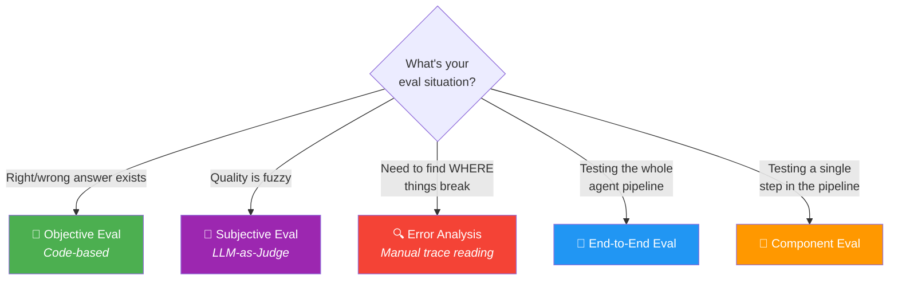
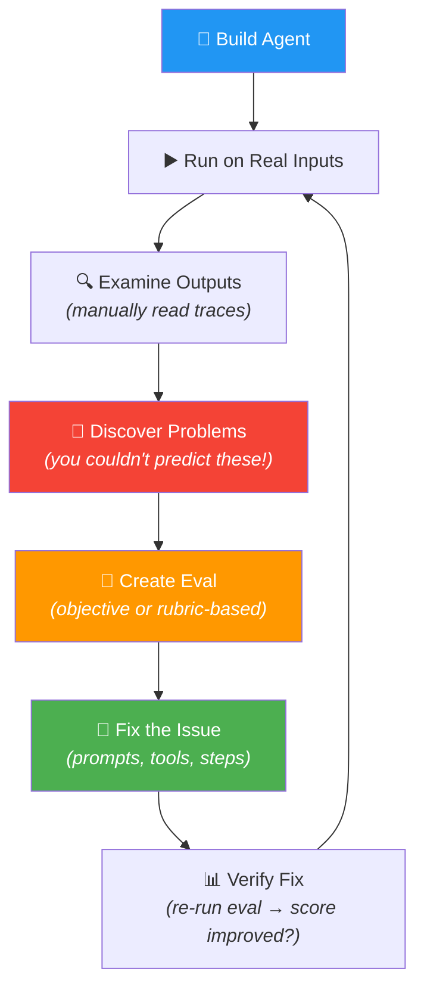

# ⚔️ Evals & Error Analysis — The Complete Comparison

> Andrew Ng's #1 course differentiator: "Evals + Error Analysis = what separates good builders from great ones." This page tracks **every eval technique** taught across the entire course.

---

## Quick Pick



---

## One-Liner Each

> **Objective Eval** = code checks output against a known right answer (binary: correct or not)
> **Subjective Eval (LLM-as-Judge)** = another LLM scores the output when there's no single right answer
> **Rubric-Based Grading** = binary checklist scored by LLM — way more reliable than pair comparison or 1-5 scale
> **Error Analysis** = manually reading agent traces step-by-step to find WHERE things break
> **End-to-End Eval** = measures final output quality of the whole pipeline
> **Component Eval** = measures each individual step's output — pinpoints the broken step

---

## 📊 The Master Comparison

| Eval Type | When to Use | How It Works | Reliability | Effort | Introduced In |
|-----------|------------|-------------|-------------|--------|---------------|
| **📐 Objective (Code-based)** | Clear right/wrong answer | Write code: compare output vs ground truth | ⭐⭐⭐⭐⭐ Highest | Low — just code | M1/07 Evals |
| **🧑‍⚖️ LLM-as-Judge (1-5 scale)** | Fuzzy quality, quick-and-dirty | Prompt LLM: "rate this 1-5" | ⭐⭐ Poor — LLMs poorly calibrated | Low | M1/07 Evals |
| **❌ LLM Pair Comparison** | DON'T USE — unreliable | Feed 2 outputs, ask "which is better?" | ⭐ Worst — position bias | Low | M2/04 Evaluating Reflection |
| **✅ Rubric-Based Grading** | Subjective quality, need consistent scores | Binary (0/1) checklist scored by LLM | ⭐⭐⭐⭐ Good | Medium — need to design rubric | M2/04 Evaluating Reflection |
| **🔍 Error Analysis** | Need to find root cause | Manually read intermediate traces | ⭐⭐⭐⭐⭐ Best for debugging | High — manual work | M1/07 Evals |
| **🎯 End-to-End Eval** | Overall quality check | Run full pipeline, measure final output | Varies by metric type | Low-Medium | M1/07 Evals |
| **🔧 Component Eval** | Pinpoint which step fails | Measure each step's output independently | Varies by metric type | Medium-High | M1/07 Evals |

---

## 🔬 Deep Dive: Subjective Eval Methods (from worst → best)

Andrew Ng progressively teaches BETTER ways to do subjective evals:

```
❌ 1-5 Scale Rating (M1/07)
      ↓  "LLMs aren't well calibrated on scales"
❌ Pair Comparison (M2/04)
      ↓  "Position bias — LLM always picks first option"
✅ Binary Rubric (M2/04)
      ↓  "5 yes/no criteria → sum to 0-5 → much more consistent"
```

| Method | How | Problem | Reliability |
|--------|-----|---------|-------------|
| **1-5 Scale** | "Rate this essay 1-5" | What's a 3 vs 4? LLM doesn't know either | ⭐⭐ Poor |
| **Pair Comparison** | "Which of A vs B is better?" | Position bias — first option always wins | ⭐ Worst |
| **Binary Rubric** | "Has clear title? 0/1. Labels present? 0/1." Sum scores. | Each criterion is clear, decomposed, actionable | ⭐⭐⭐⭐ Good |

### Binary Rubric — Example

```
Rubric for chart evaluation:
1. Has clear title                    → 0 or 1
2. Axis labels present                → 0 or 1
3. Appropriate chart type             → 0 or 1
4. Axes use appropriate range         → 0 or 1
5. Visually clean and readable        → 0 or 1
                                        ──────
                            Total:     0 to 5
```

> 💡 **Scale rating = "kitna accha hai?" (vague). Binary rubric = "title hai? labels hai? chart type sahi hai?" (specific). Jitna specific poochoge, utna reliable jawab milega! 🎯**

---

## 🔄 The Eval Workflow (Andrew Ng's Meta-Process)

This is the PROCESS he teaches throughout the course — not a one-time thing, but a continuous loop:



**Key insight:** DON'T try to write all evals upfront. Build first → discover failures → then create targeted evals.

---

## 📍 Where Evals Appear in the Course

| Module | Lesson | What's Taught | Eval Type |
|--------|--------|--------------|-----------|
| **M1** | 07 — Evals | Intro to evals + error analysis | Objective (competitor name check), Subjective (1-5 scale), Error Analysis, End-to-End vs Component |
| **M2** | 04 — Evaluating Reflection | Ground truth dataset, LLM-as-Judge pitfalls | Objective (SQL correctness), Rubric-based grading, Position bias warning |
| **M2** | 05 — External Feedback | Tools that create eval-like feedback | Code execution (errors), Regex (pattern match), Web search (fact-check), Word count |
| **M3** | 04 — Code Execution | Code errors as external feedback for reflection | Reflection + code execution = retry loop with error messages. Code execution IS the eval in real-time! |
| **M4** | _TBD — Practical Tips_ | Advanced eval techniques, cost/latency optimization | _Coming soon_ |

---

## 🧠 Error Analysis — The Underrated Superpower

Error analysis isn't a "type of eval" — it's the **detective work** that tells you WHICH eval to build.

```
┌──────────────────────────────────────────────────────┐
│  Agent Pipeline:  Step 1 → Step 2 → Step 3 → Output │
│                                                      │
│  Error Analysis = read EACH step's output:           │
│                                                      │
│  Step 1: "Generate SQL"     → ✅ Query looks good    │
│  Step 2: "Execute SQL"      → ✅ Results returned     │
│  Step 3: "Format answer"    → ❌ Mentioned competitor! │
│                               ↑                      │
│  ROOT CAUSE FOUND → build eval for Step 3            │
│                                                      │
│  Without error analysis:                             │
│  "The final answer is wrong" → but WHERE? 🤷         │
└──────────────────────────────────────────────────────┘
```

| What Error Analysis Gives You | What Automated Evals Give You |
|------------------------------|------------------------------|
| **Where** things break (which step) | **Whether** things are broken (final output score) |
| Root cause understanding | Trend tracking over time |
| Ideas for new evals to build | Quantitative measurement |
| Qualitative, manual, deep | Quantitative, automated, scalable |

> 💡 **Eval = thermometer 🌡️ (tells you there's a fever). Error Analysis = stethoscope 🩺 (tells you WHERE the problem is). Dono chahiye!**

---

## ✅ Decision Cheat Sheet

| I want to... | Use this |
|-------------|----------|
| Check if output matches a known answer | **Objective eval** (code-based) |
| Score quality when there's no right answer | **Binary rubric** (NOT 1-5 scale, NOT pair comparison) |
| Find which step in my pipeline is breaking | **Error analysis** (manual trace reading) |
| Measure overall agent quality | **End-to-end eval** |
| Debug a specific broken step | **Component eval** |
| Compare before/after a prompt change | **Re-run eval dataset** (10-15 examples) |
| Quick-and-dirty first check | 1-5 LLM rating (but plan to upgrade to rubric) |

---

## 🔗 Connected Lessons

- [M1/07 — Evals](module-1-intro/07-evals.md) — Intro to evals, error analysis, objective vs subjective
- [M2/04 — Evaluating Reflection](module-2-reflection/04-evaluating-reflection.md) — Ground truth datasets, rubric grading, position bias
- [M2/05 — External Feedback](module-2-reflection/05-external-feedback.md) — Tools as eval sources

---

> 🎯 **"The #1 skill that separates good agent builders from great ones? Disciplined dev process — evals + error analysis."** — Andrew Ng
