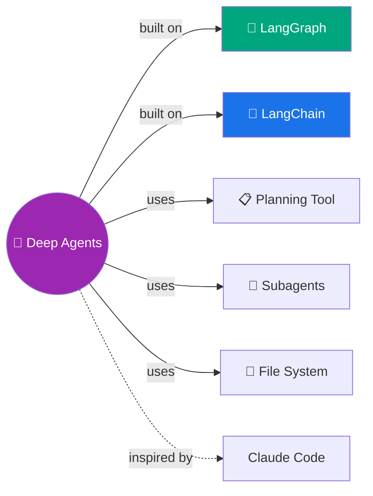

# 🧠 Deep Agents — Plan, Delegate, Execute

> Claude Code jaisa agent banana hai? Planning + Subagents + File System = Deep Agent! 🚀

---

## 🧠 Brain — How This Connects

## 📊 Progress: 0/18 episodes · 🔴 Not started

> Full episode list: [`_playlists/deepagents/`](../../_playlists/deepagents/README.md)

## 🧩 Memory Fragments
> - _Add fragments as you learn..._

## 📚 Sources
> - 📄 [Deep Agents Docs](https://docs.langchain.com/oss/python/deepagents/overview)
> - 🎬 YouTube Playlist: _link after first publish_

## 🔗 Connected Topics
> → [LangChain](../langchain/) · [LangGraph](../langgraph/) (prerequisites) · [Agentic AI](../agentic-ai/)
