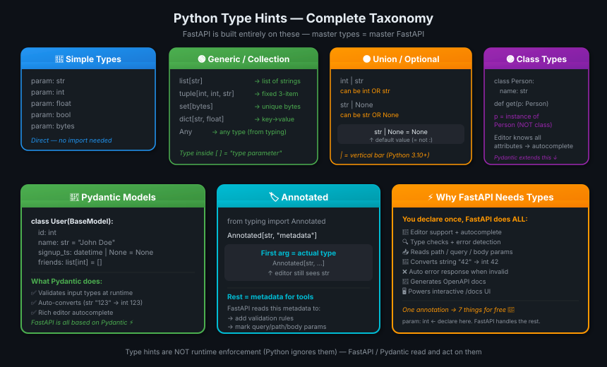
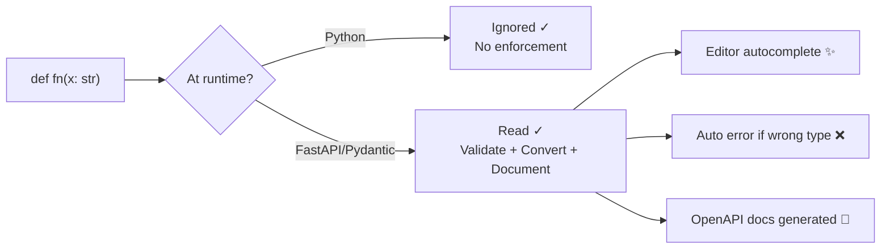

# 01 · Python Types Intro 🏷️

---

## 🎯 One Line
> Type hints = labels on your variables so editors (and FastAPI) know what's inside — Python itself ignores them at runtime, but FastAPI reads and acts on them.

---

## 🖼️ The Full Picture



> 💡 **Analogy:** Type hints are like labels on jars in a kitchen. Python ke fridge mein "SUGAR" likha hai, but andar aata bhi rakh sako — runtime pe koi rok nahi. FastAPI wala chef zaroor check karta hai — wrong jar = error before serving! 🍳

---

## 🧱 Type Categories

| Category | Syntax | Example |
|----------|--------|---------|
| **Simple** | `param: type` | `name: str`, `age: int`, `active: bool` |
| **List** | `list[inner]` | `list[str]` → list of strings |
| **Tuple** | `tuple[t1, t2, ...]` | `tuple[int, int, str]` → fixed 3-item |
| **Set** | `set[inner]` | `set[bytes]` → unique bytes |
| **Dict** | `dict[key, val]` | `dict[str, float]` → name→price |
| **Union** | `t1 \| t2` | `int \| str` → either type |
| **Optional** | `str \| None` | can be string or nothing |
| **Any** | `Any` | skip type check (`from typing import Any`) |
| **Class** | `param: ClassName` | `p: Person` → instance of Person |
| **Annotated** | `Annotated[type, meta]` | `Annotated[str, "extra info"]` |

---

## ⚡ How Type Hints Work



> 💡 Type hints are **metadata** — like comments that tools can read. Python never crashes on `def f(x: int): return x` called with `f("hello")`. But FastAPI will reject it.

---

## 📦 Simple Types — The Basics

```python
def get_items(
    item_a: str,       # string
    item_b: int,       # integer
    item_c: float,     # decimal
    item_d: bool,      # True / False
    item_e: bytes      # raw bytes
):
    return item_a, item_b, item_c, item_d, item_e
```

**Why types help in editor:**
- Without types → `first_name.` → Ctrl+Space → **nothing useful** (editor doesn't know it's a string)
- With `first_name: str` → `first_name.` → Ctrl+Space → `.title()`, `.upper()`, `.strip()` ... ✨

---

## 🗂️ Generic / Collection Types

Types that **contain other types** — called **Generics**. Use `[ ]` to specify the inner type (called **type parameter**).

```python
# list — each item is str
def process_items(items: list[str]):
    for item in items:
        print(item)          # editor knows: item is str ✓

# tuple — fixed structure: (int, int, str)
def process_items(items_t: tuple[int, int, str]):
    pass

# set — unique bytes
def process_items(items_s: set[bytes]):
    pass

# dict — keys: str, values: float
def process_items(prices: dict[str, float]):
    for name, price in prices.items():
        print(name, price)   # editor knows types of both ✓
```

> 💡 `list[str]` literally means: "A list where every element is a `str`." The `str` inside brackets is the **type parameter**.

---

## 🔀 Union Types

A variable that can hold **more than one type**.

```python
# int OR str — use | (vertical bar)
def process_item(item: int | str):
    print(item)

# str OR None — "optional string"
def say_hi(name: str | None = None):
    if name is not None:
        print(f"Hey {name}!")
    else:
        print("Hello World")
```

| Syntax | Meaning |
|--------|---------|
| `int \| str` | Can be int OR str |
| `str \| None` | Can be str OR None (nothing) |
| `str \| None = None` | Optional, defaults to None |

> ⚠️ **Gotcha:** `:` vs `=` — these are DIFFERENT things!
> - `first_name: str` → **type hint** (what type it is)
> - `first_name = "john"` → **default value** (what it starts as)
> - `first_name: str = "john"` → **both** (type hint + default)

---

## 🏛️ Classes as Types

Any class can be used as a type annotation. The editor then knows **all its attributes and methods**.

```python
class Person:
    def __init__(self, name: str):
        self.name = name

def get_person_name(one_person: Person):
    return one_person.name   # editor knows .name exists and is str ✓
```

> ⚠️ `one_person: Person` means "this is an **instance** of Person" — NOT "this is the class Person itself."

---

## 🧱 Pydantic Models — Types on Steroids

**Pydantic** = Python library for data validation using type hints.

```python
from datetime import datetime
from pydantic import BaseModel

class User(BaseModel):
    id: int
    name: str = "John Doe"
    signup_ts: datetime | None = None
    friends: list[int] = []

external_data = {
    "id": "123",            # string "123" → auto-converted to int 123
    "signup_ts": "2017-06-01 12:22",   # string → datetime ✓
    "friends": [1, "2", b"3"],         # mixed → all int ✓
}
user = User(**external_data)
print(user.id)   # 123  (int, not "123")
```

| Feature | Without Pydantic | With Pydantic |
|---------|-----------------|---------------|
| Type validation | Manual `isinstance()` | Automatic |
| Type conversion | Manual `int()`, `str()` etc. | Automatic |
| Error messages | You write them | Auto-generated |
| Editor autocomplete | Partial | Full (knows all fields) |

> 💡 Pydantic is like a **strict airport security** for your data: wrong format → rejected at the gate with a clear error, never reaches the function. FastAPI ka poora system isi pe bana hai! ✈️

---

## 🏷️ Annotated — Metadata on Type Hints

`Annotated` lets you **attach extra info** to a type hint. Python ignores the metadata, but FastAPI reads it.

```python
from typing import Annotated

def say_hello(name: Annotated[str, "this is just metadata"]) -> str:
    return f"Hello {name}"
```

**Structure:**
```
Annotated[  actual_type  ,  metadata_for_tools  ]
              ↑ str              ↑ FastAPI reads this
```

| Part | Role |
|------|------|
| First arg (`str`) | The **actual type** — editor + Python see this |
| Rest (`"metadata"`) | Extra info — only tools (FastAPI) read this |

> 💡 Now it looks like "just metadata." Later in FastAPI, this becomes powerful:
> `Annotated[str, Query(max_length=50)]` → FastAPI validates max 50 chars automatically!

---

## 💡 "Aha!" Moments

**Why `:` matters so much in FastAPI**
> FastAPI reads your function signatures. `name: str` tells it: "this param should be a string." FastAPI then validates incoming requests, converts types, and generates API docs — all from that one `:`. Ek colon, saat kaam! 🎯

**Type hints ≠ Runtime enforcement**
> Python `def f(x: int): pass` called with `f("hello")` — no crash! Type hints are purely advisory for humans/tools. FastAPI/Pydantic are the ones that actually enforce them.

---

## ⚠️ Gotchas

- ❌ Don't confuse `name: str` (type hint) with `name = "john"` (default value) — they look similar but are completely different
- ❌ `list` without `[str]` is valid but loses editor help — always add the inner type
- ❌ `str | None` without `= None` means it's required but can be None — add `= None` if truly optional
- ❌ `one_person: Person` means instance, NOT the class — never use it expecting class methods
- ❌ `Any` disables all type checking — use only when genuinely needed, not as a lazy escape hatch

---

## 🧪 Quick Check

<details>
<summary>❓ What's the difference between <code>name: str</code> and <code>name = "john"</code>?</summary>

`name: str` is a **type hint** — it tells editors and FastAPI what type to expect. Python itself doesn't enforce it.
`name = "john"` is a **default value** — what the variable starts with if nothing is passed.
You can combine both: `name: str = "john"` — has both a type hint AND a default.
</details>

<details>
<summary>❓ What does <code>list[str]</code> mean? What is <code>str</code> here?</summary>

`list[str]` means "a list where every element is a string." The `str` inside the square brackets is called the **type parameter**. Without it (`list` alone), the editor doesn't know what's inside and can't help you.
</details>

<details>
<summary>❓ Why does FastAPI care so much about type hints?</summary>

FastAPI reads your function's type annotations to: (1) validate incoming request data, (2) convert types automatically (e.g. string "5" → int 5), (3) generate error messages when types are wrong, (4) build OpenAPI docs automatically, (5) power the interactive /docs UI. One annotation → 5+ things for free.
</details>

<details>
<summary>❓ What does Pydantic actually do differently from just type hints?</summary>

Plain type hints are passive — Python ignores them at runtime. Pydantic's `BaseModel` **actively validates** data when you create an instance: wrong types get rejected or auto-converted, missing required fields raise errors, and you get full editor autocomplete on the resulting object.
</details>

---

> **Next →** [First Steps](02-first-steps.md)
