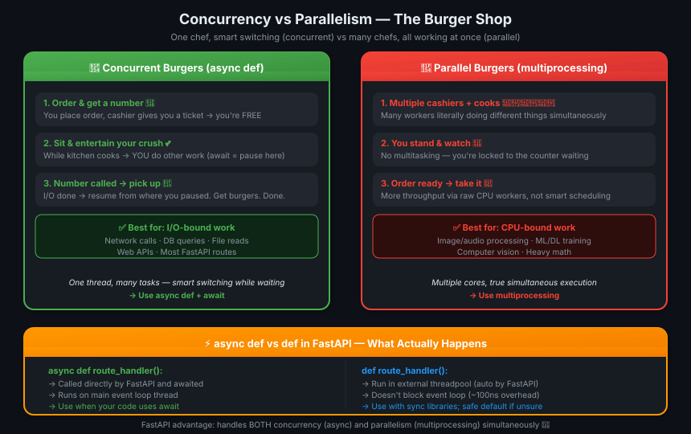
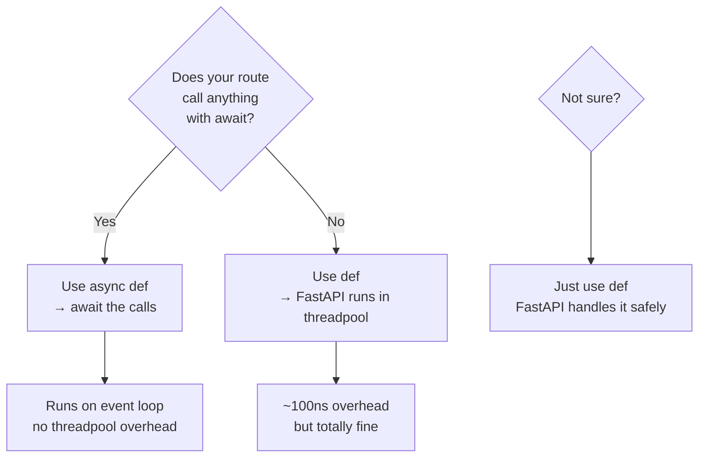
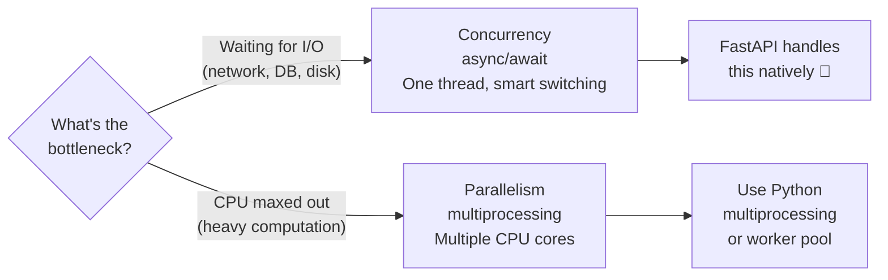
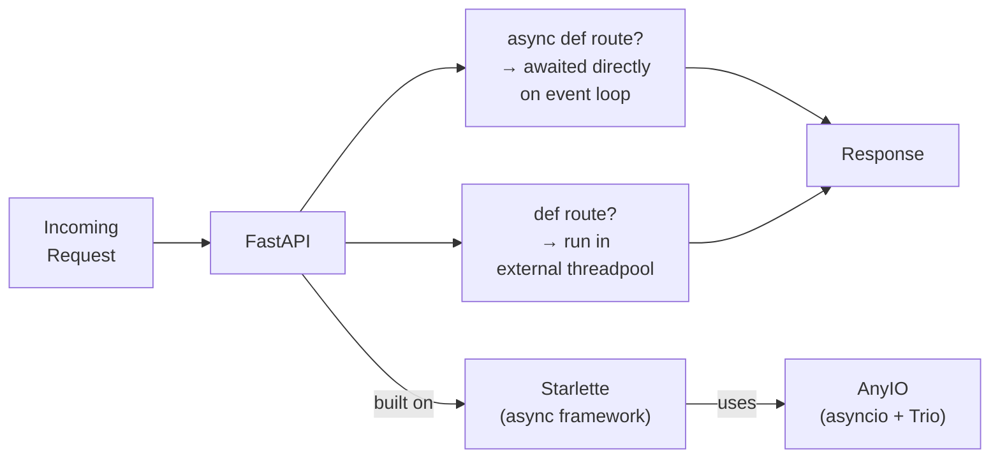

# 02 · Concurrency &amp; Async / Await ⚡

---

## 🎯 One Line
> Concurrency = one smart worker pausing and switching tasks while waiting. Parallelism = many workers doing things simultaneously. Web APIs need concurrency; heavy CPU work needs parallelism.

---

## 🖼️ The Burger Shop



> 💡 **Analogy:** Concurrent waiter = aaya, order liya, bola "number 42 pe announce hoga," aur crush ke saath baithne chala gaya. Parallel waiter = counter pe khada raha, crush ko ignore karta raha, dono awkward. Web server mein hamesha concurrent ban! 🍔

---

## 🧱 Core Concepts

| Term | Kya hai | Real world |
|------|---------|-----------|
| **Async code** | Code that can pause and let others run while waiting for I/O | Chef starts burgers, goes to help another table |
| **Concurrency** | Multiple tasks making progress by interleaving (one thread, smart switching) | Single waiter juggling 5 tables |
| **Parallelism** | Multiple tasks truly running at the same instant (multiple cores/workers) | 5 waiters each with 1 table |
| **I/O-bound** | Bottleneck = waiting for network/disk/DB — not CPU | API call, DB query, file read |
| **CPU-bound** | Bottleneck = actual computation — CPU is maxed out | Image resize, ML training, math |
| **Coroutine** | What `async def` returns — a pauseable function | A recipe card that says "wait here while oven heats" |

---

## ⚡ Async / Await Syntax

```python
# async def = "this function CAN pause"
async def get_burgers(number: int):
    # ... do async work ...
    return burgers

# await = "pause HERE until this finishes"
burgers = await get_burgers(2)

# Full FastAPI route — async version
@app.get('/burgers')
async def read_burgers():
    burgers = await get_burgers(2)   # pause, let others run while waiting
    return burgers

# Full FastAPI route — sync version (also fine!)
@app.get('/results')
def results():
    results = some_sync_library()    # no await needed
    return results
```

**The two rules:**
1. `await` can ONLY be used inside an `async def` function
2. To call an `async def` function, you MUST `await` it

---

## 🔀 When to Use What in FastAPI



| Scenario | Use |
|----------|-----|
| Calling async DB library (e.g. `asyncpg`, `motor`) | `async def` + `await` |
| Calling sync DB library (e.g. `psycopg2`, `SQLAlchemy`) | `def` |
| External HTTP call with `httpx` async client | `async def` + `await` |
| External HTTP call with `requests` (sync) | `def` |
| Not sure | `def` — safe default |
| You accidentally used `async def` with no `await` inside | Still works, just wastes async overhead |

> 💡 **FastAPI safety net:** If you declare `def` (not async), FastAPI automatically runs it in a **threadpool** — so it doesn't block the main server thread. You get safety without async complexity.

---

## 🍔 Concurrency vs Parallelism — Decision Guide



| Type | Best For | Python Tool |
|------|----------|-------------|
| **Concurrency** | Web APIs, DB calls, HTTP requests, file I/O | `async def` / `await` / `asyncio` |
| **Parallelism** | Image processing, audio, ML/DL training, computer vision, heavy math | `multiprocessing`, worker processes |

> 💡 **FastAPI's superpower:** It can leverage BOTH simultaneously — async routes for I/O-bound, plus spawn worker processes for CPU-bound tasks if needed.

---

## 🏗️ FastAPI's Internal Architecture



| Layer | What it does |
|-------|-------------|
| **FastAPI** | Your routes, validation, serialization |
| **Starlette** | Async framework foundation (ASGI) |
| **AnyIO** | Concurrency layer — works with asyncio AND Trio |
| **uvicorn** | ASGI server that actually runs it all |

---

## 🔬 Very Technical Details (for the curious)

**What is a coroutine exactly?**
An `async def` function doesn't execute when called — it returns a **coroutine object**. That object starts running only when you `await` it. Under the hood, it's a pauseable state machine.

```python
async def say_hello():
    return "hello"

# This does NOT run the function:
coro = say_hello()      # returns a coroutine object

# This actually runs it:
result = await say_hello()   # returns "hello"
```

**Why does `def` in FastAPI run in a threadpool?**
FastAPI runs on an async event loop (via Starlette/AnyIO). If a plain `def` function blocks (does sync I/O), it would freeze the entire event loop — no other requests could be served. So FastAPI automatically offloads `def` routes to a thread pool, keeping the event loop unblocked.

**The overhead:**
- `async def` → directly awaited → 0 extra overhead
- `def` → sent to threadpool → ~100 nanoseconds extra — imperceptible

---

## 💡 "Aha!" Moments

**The `await` keyword is a "pause and come back" marker**
> `await some_function()` means: "Start this operation, but while it's running, go handle other stuff. When it's done, come back HERE and continue." Loop chal raha hai — ye line pe rukta nahi, dusre kaam karta hai, phir wapas aata hai. 🔄

**Concurrency ≠ Parallelism**
> Concurrency = one juggler with 5 balls (one at a time, but fast switching). Parallelism = 5 jugglers with 1 ball each (truly simultaneous). Web servers need concurrency, not raw parallelism.

---

## ⚠️ Gotchas

- ❌ Don't `await` a regular (non-async) function — `await some_sync_fn()` will crash
- ❌ Don't call `async def` without `await` — you'll get a coroutine object, not the result
- ❌ Don't use blocking sync I/O inside `async def` — it WILL freeze the event loop (e.g. `requests.get()` inside `async def`)
- ❌ Don't assume `async def` is always faster — for simple CPU-bound work with no I/O, it adds zero benefit
- ❌ Don't use `async def` just because it sounds cool — if your libraries are all sync, use `def`

---

## 🧪 Quick Check

<details>
<summary>❓ What is the difference between concurrency and parallelism?</summary>

**Concurrency** = multiple tasks making progress by interleaving on a single thread — one task pauses while waiting, another runs. Like one waiter serving multiple tables by smartly switching attention.

**Parallelism** = multiple tasks truly running at the same instant on different CPU cores/workers. Like multiple waiters each serving their own table simultaneously.

Web APIs need concurrency (lots of waiting for I/O). Heavy computation needs parallelism.
</details>

<details>
<summary>❓ What happens when you use plain <code>def</code> (not async) in a FastAPI route?</summary>

FastAPI automatically runs it in an **external threadpool** — it doesn't block the main event loop. There's a tiny ~100ns overhead, but it's safe and efficient. This is why `def` is the safe default if you're unsure.
</details>

<details>
<summary>❓ Can you use <code>await</code> outside an <code>async def</code> function?</summary>

No. `await` can ONLY appear inside an `async def` function. Trying to use it in a regular `def` is a syntax error.
</details>

<details>
<summary>❓ Your route calls a sync database library (e.g. psycopg2). Should you use async def or def?</summary>

Use `def` (not async). The sync library has no `await` support — using `async def` gives you no benefit and you can't `await` its calls. FastAPI will run your `def` route in a threadpool safely. Switch to `async def` only when you adopt an async DB library like `asyncpg`.
</details>

---

> **Next →** [First Steps](03-first-steps.md)
