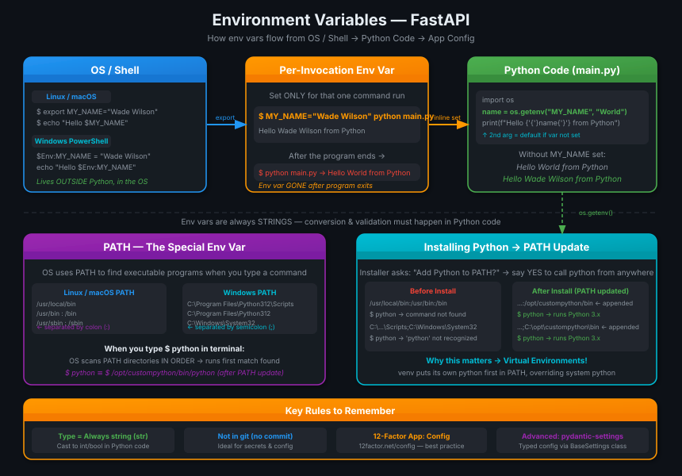
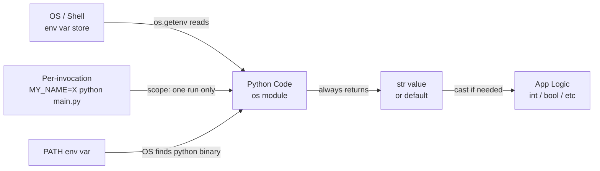

# 03 · Environment Variables 🌿

## 🎯 One Line

An **environment variable** is a named value that lives in the operating system — outside your Python code — and can be read by any program, including Python, making it the standard way to pass config, secrets, and settings without hardcoding them.

---

## 🖼️ The Picture



> 💡 **Analogy:** Environment variable = ghar ke bahar likha hua notice. Code ke andar kuch hardcode nahi kiya — OS ne bata diya, Python ne padh liya. Git mein kuch gaya nahi. Safe hai, clean hai.

---

## 🧱 Key Concepts

| Concept | Kya hai | Yaad rakhne ka trick |
|---------|---------|----------------------|
| **Env var** | A variable stored in the OS, not in code | Lives "outside" — like a sticky note on your computer's wall |
| **`export MY_NAME="Wade"`** | Linux/macOS/Bash: set env var in shell | `export` = "announce to everyone in the OS session" |
| **`$Env:MY_NAME = "Wade"`** | Windows PowerShell syntax for setting env var | `$Env:` prefix = PowerShell's way of saying "environment" |
| **`os.getenv(name, default)`** | Python function to read an env var | Returns the value, or `default` (None if not provided) |
| **Default value** | Second arg to `os.getenv()` — used when var is not set | `os.getenv("X", "fallback")` → "fallback" if X missing |
| **Always `str`** | Env vars are text-only — no int, no bool, no list | Conversion + validation must happen in your Python code |
| **Per-invocation var** | Set on same line as command — only lives for that run | `MY_NAME="Wade" python main.py` → gone after program exits |
| **Not committed to git** | Env vars live in OS/shell, not in code files | Ideal for secrets, API keys, passwords, environment-specific config |
| **PATH** | Special OS env var: colon-separated (Linux/macOS) or semicolon-separated (Windows) list of dirs | OS searches these dirs left-to-right to find executables |
| **12-Factor App: Config** | Best-practice methodology — store config in env vars | [12factor.net/config](https://12factor.net/config) |

---

## ⚡ How It Works



**Flow narrative:**

1. You set an env var in the shell (or it was set by the OS/installer).
2. Python reads it at runtime via `os.getenv()`.
3. The value is **always a string** — you cast it to `int`, `bool`, etc. in code.
4. If the var is not set, `os.getenv()` returns `None` (or your custom default).
5. Per-invocation vars (`KEY=val python script.py`) exist only for that single process lifetime.

---

## 📦 Reading Env Vars in Python

### The code (`main.py`)

```python
import os

name = os.getenv("MY_NAME", "World")
print(f"Hello {name} from Python")
```

### Shell session — Linux/macOS/Bash

```bash
# Var not set yet — gets default
$ python main.py
Hello World from Python

# Set env var, then run again
$ export MY_NAME="Wade Wilson"
$ python main.py
Hello Wade Wilson from Python
```

### Shell session — Windows PowerShell

```powershell
# Var not set yet — gets default
$ python main.py
Hello World from Python

# Set env var, then run again
$ $Env:MY_NAME = "Wade Wilson"
$ python main.py
Hello Wade Wilson from Python
```

### Per-invocation (inline, not persisted) — Linux/macOS

```bash
# Create env var only for this one run
$ MY_NAME="Wade Wilson" python main.py
Hello Wade Wilson from Python

# Var is gone — back to default
$ python main.py
Hello World from Python
```

### Setting env vars in the shell (no Python involved)

```bash
# Linux/macOS/Bash
$ export MY_NAME="Wade Wilson"
$ echo "Hello $MY_NAME"
Hello Wade Wilson
```

```powershell
# Windows PowerShell
$ $Env:MY_NAME = "Wade Wilson"
$ echo "Hello $Env:MY_NAME"
Hello Wade Wilson
```

---

## 🔒 Types and Validation

| Rule | Detail |
|------|--------|
| **Env vars are always `str`** | External to Python — must be compatible with all programs and OS |
| **Type casting is your job** | `int(os.getenv("PORT", "8080"))` to get an integer |
| **Validation is your job** | Check the value yourself, or use `pydantic-settings` (Advanced Guide) |
| **Advanced config** | `pydantic-settings` — `BaseSettings` class handles parsing + validation automatically |

> 💡 **Gotcha hook:** `os.getenv("DEBUG")` returns `"False"` (a string), not `False` (a bool). `bool("False")` is `True` in Python! Always cast carefully — ya fir `pydantic-settings` use karo jo yeh sab handle karta hai.

---

## 🛣️ PATH Environment Variable

PATH is the OS's **"where to look for programs"** map. Without it, you'd have to type the full path every time.

### What it looks like

| OS | Separator | Example |
|----|-----------|---------|
| Linux / macOS | `:` (colon) | `/usr/local/bin:/usr/bin:/bin:/usr/sbin:/sbin` |
| Windows | `;` (semicolon) | `C:\Program Files\Python312\Scripts;C:\Program Files\Python312;C:\Windows\System32` |

### How the OS uses PATH

```
You type: python

OS checks directories in PATH — left to right:
  1. /usr/local/bin  → python here? No.
  2. /usr/bin        → python here? No.
  3. /bin            → python here? Yes! → run it.
```

### After Python installation

If you say **"yes"** to "Add Python to PATH" during install:

```bash
# Linux/macOS — before install
/usr/local/bin:/usr/bin:/bin:/usr/sbin:/sbin

# After install (appended)
/usr/local/bin:/usr/bin:/bin:/usr/sbin:/sbin:/opt/custompython/bin
```

```
# Windows — after install (appended)
C:\Program Files\Python312\Scripts;C:\Program Files\Python312;C:\Windows\System32;C:\opt\custompython\bin
```

So when you type `python`, the OS finds it via PATH — equivalent to typing the full path:

```bash
# Linux/macOS equivalent
$ /opt/custompython/bin/python

# Windows equivalent
$ C:\opt\custompython\bin\python
```

> 💡 **PATH = treasure map.** `python` type kiya, OS ne PATH ki har directory mein dhundha, mila toh chalaaya. PATH mein nahi hai toh "command not found" — isliye Python installer poochta hai "PATH mein add karoon?"

---

## 💡 "Aha!" Moments

> 💡 **Why env vars for secrets?** Code files get committed to git — env vars don't. Database passwords, API keys, tokens — yeh kabhi code mein nahi hone chahiye. Env var mein daalo, git se bahar raho.

> 💡 **Per-invocation scope:** `MY_NAME="Wade" python main.py` — yeh variable sirf uss ek program run ke liye exist karta hai. Baad mein `python main.py` chalao toh `MY_NAME` gayab. Perfect for one-off overrides without polluting your shell session.

> 💡 **PATH and Virtual Environments:** Jab tum virtual environment activate karte ho, it *prepends* its `bin/` to PATH — so `python` now points to the venv's Python, not the system one. Next lesson mein this will click.

---

## ⚠️ Gotchas

- **Env vars are always strings** — `os.getenv("PORT")` returns `"8080"`, not `8080`. Forget to cast and your app crashes with a type error.
- **`bool("False")` is `True`** — because `"False"` is a non-empty string. Never do `bool(os.getenv("DEBUG"))`. Parse manually: `os.getenv("DEBUG", "false").lower() == "true"`.
- **`os.getenv()` returns `None` by default** — not an empty string, not `0`. Always provide a sensible default or check for `None`.
- **Inline vars don't persist** — `MY_NAME="Wade" python main.py` sets the var only for that process. The parent shell is unchanged.
- **`export` is required in Bash** — just `MY_NAME="Wade"` without `export` creates a *shell variable*, not an environment variable. Child processes (like Python) won't see it.
- **Windows PATH uses `;`, Linux/macOS use `:`** — mixing them up is a common cross-platform bug.
- **Installer PATH update** — if you skip "Add Python to PATH" during install, typing `python` in terminal won't work. You'd need to use the full path.
- **For production config** — use `pydantic-settings` (`BaseSettings`) for typed, validated settings from env vars. Covered in the Advanced User Guide.

---

## 🧪 Quick Check

<details>
<summary>Q1: What does <code>os.getenv("MY_VAR", "default_val")</code> return if <code>MY_VAR</code> is not set?</summary>

**Answer:** It returns `"default_val"` — the second argument. If no default is provided and the var is not set, it returns `None`.

</details>

<details>
<summary>Q2: You set <code>MY_VAR="hello" python script.py</code>. After the script finishes, does <code>MY_VAR</code> still exist in your shell?</summary>

**Answer:** No. A per-invocation env var (set on the same line as the command) only exists for the duration of that single program run. The parent shell is completely unaffected.

</details>

<details>
<summary>Q3: Why are environment variables always <code>str</code> in Python? And what do you do if you need an <code>int</code>?</summary>

**Answer:** Env vars are external to Python — they must be compatible with all programs and all operating systems (Linux, Windows, macOS). Every OS treats them as plain text strings. To get an `int`, cast explicitly in Python: `int(os.getenv("PORT", "8080"))`. For complex validation and multiple settings, use `pydantic-settings`.

</details>

<details>
<summary>Q4: What is PATH, how are directories separated on Linux/macOS vs Windows, and why does the Python installer ask to update it?</summary>

**Answer:** PATH is a special OS env var that tells the OS where to search for executable programs. Directories are separated by `:` on Linux/macOS and `;` on Windows. The Python installer asks to update PATH so that typing `python` in any terminal finds the newly installed Python binary — without the update, you'd need to type the full path like `/opt/custompython/bin/python` every time.

</details>

---

> **Next →** [First Steps](04-first-steps.md)
