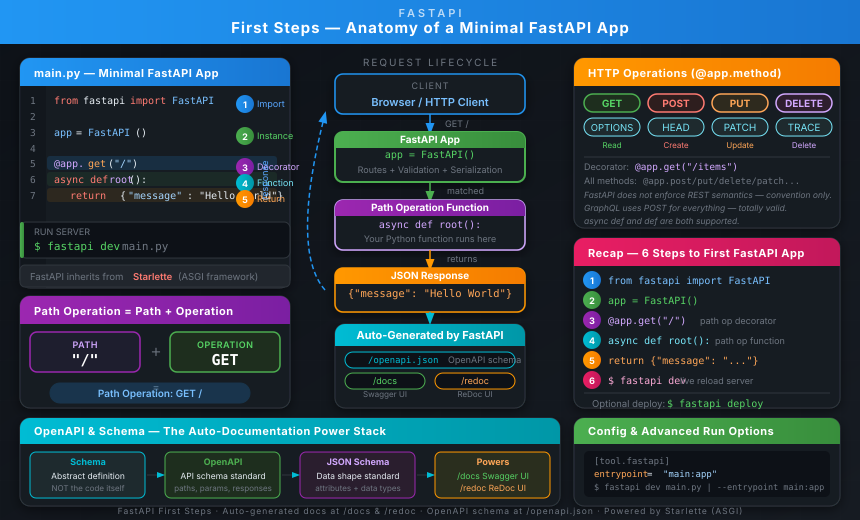
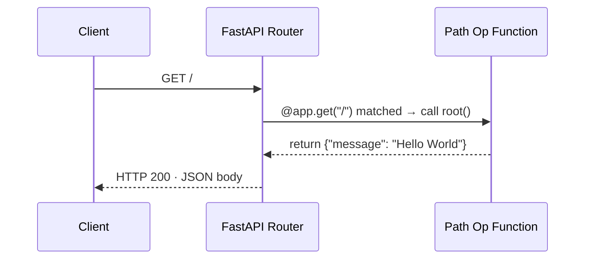

# 04 · First Steps 🚀

## 🎯 One Line
> Register a Python function as an HTTP handler with one decorator and FastAPI auto-handles routing, serialization, and interactive docs — all from five lines of code.

---

## 🖼️ The Picture



> 💡 **FastAPI bana lo apna pehla server:** Sochlo ek restaurant — `app` hai restaurant, `@app.get("/")` hai menu item, aur `async def root()` hai woh chef jo order ready karta hai. Banda aaya (request), waiter ne dekha (router), chef ne banaya (function), plate gayi (JSON response). Done. 🍽️

---

## 🧱 Anatomy of the Minimal App

```python
from fastapi import FastAPI        # (1) import

app = FastAPI()                    # (2) create instance

@app.get("/")                      # (3) path operation decorator
async def root():                  # (4) path operation function
    return {"message": "Hello World"}  # (5) return content
```

| Line | What It Is | What It Does |
|------|-----------|--------------|
| `from fastapi import FastAPI` | Import statement | Brings the `FastAPI` class into scope |
| `app = FastAPI()` | Instance creation | Creates your API object — all routes attach to this |
| `@app.get("/")` | Path operation decorator | Tells FastAPI: "the function below handles GET requests to `/`" |
| `async def root():` | Path operation function | Python function FastAPI calls when a matching request arrives |
| `return {"message": "Hello World"}` | Return value | Dict is auto-serialized to JSON by FastAPI |

**Technical detail:** `FastAPI` directly inherits from `Starlette` — every Starlette feature (middleware, routing, WebSockets, etc.) works in FastAPI too.

---

## ⚡ Path Operations — The Core Idea

A **path operation** = **PATH** + **OPERATION** (two things combined).

| Term | Definition | Example |
|------|-----------|---------|
| **Path** | Last part of the URL from the first `/` onwards. Also called *endpoint* or *route*. The main way to separate "concerns" and "resources" in an API. | `/items/foo` in `https://example.com/items/foo` |
| **Operation** | One of the HTTP methods (verbs). Tells the server *what to do* at a path. | `GET`, `POST`, `PUT`, `DELETE`, … |
| **Path operation** | The combination of both — "handle requests at THIS path using THIS HTTP method" | `GET /` — handle GET requests arriving at `/` |
| **Path operation decorator** | The `@app.get("/")` syntax — a Python decorator that *registers* the function below it as the handler | `@app.get("/")` |
| **Path operation function** | The Python function below the decorator — FastAPI calls this when a matching request arrives | `async def root():` |

**Python decorator refresher:** `@something` placed on top of a function is called a *decorator*. It "wraps" the function and does something with it. In our case, `@app.get("/")` registers `root` as the handler for `GET /`.

```
Request lifecycle:

  Client          FastAPI Router             Your Function           Response
    |                    |                         |                    |
    |--GET /------------>|                         |                    |
    |                    |--@app.get("/") match--->|                    |
    |                    |                         |--execute---------> |
    |                    |                         |  return dict       |
    |<---JSON response---|<------------------------|<-------------------|
```



---

## 🌐 HTTP Operations

| Operation | Convention | FastAPI Decorator | Notes |
|-----------|-----------|-------------------|-------|
| `GET` | Read data | `@app.get("/")` | Most common |
| `POST` | Create data | `@app.post("/")` | Send body |
| `PUT` | Update data (full replace) | `@app.put("/")` | Send full body |
| `DELETE` | Delete data | `@app.delete("/")` | |
| `PATCH` | Partial update | `@app.patch("/")` | Send only changed fields |
| `OPTIONS` | Exotic / less common | `@app.options("/")` | |
| `HEAD` | Exotic / less common | `@app.head("/")` | Like GET but no body |
| `TRACE` | Exotic / less common | `@app.trace("/")` | |

**All decorator variants:**
```python
@app.get("/")
@app.post("/")
@app.put("/")
@app.delete("/")
@app.options("/")
@app.head("/")
@app.patch("/")
@app.trace("/")
```

> 💡 **FastAPI is not a cop:** Yeh conventions hain, rules nahi. GraphQL pe log sirf `POST` use karte hain — sab kuch ke liye. FastAPI will not complain.

---

## 🖥️ Running the Server

```bash
# Basic — FastAPI finds your app automatically
$ fastapi dev

# Explicit file path
$ fastapi dev main.py

# Explicit entrypoint (module:variable)
$ fastapi dev --entrypoint main:app
```

**Or configure once in `pyproject.toml`:**
```toml
[tool.fastapi]
entrypoint = "main:app"
```

**What you see after running:**
```
INFO:     Will watch for changes in these directories: ['/your/project']
INFO:     Uvicorn running on http://127.0.0.1:8000 (Press CTRL+C to quit)
INFO:     Started reloader process ...
```

Then visit: `http://127.0.0.1:8000` → you get:
```json
{"message": "Hello World"}
```

---

## 📄 Auto-Generated Docs

FastAPI auto-generates an **OpenAPI schema** for your entire API. This single schema powers three auto-generated endpoints — zero config needed.

| Endpoint | What it is | What you see |
|----------|-----------|--------------|
| `/docs` | **Swagger UI** — interactive API docs | Try every endpoint live in the browser |
| `/redoc` | **ReDoc** — alternative reference docs | Cleaner read-only documentation |
| `/openapi.json` | Raw **OpenAPI JSON schema** | Machine-readable spec of your whole API |

### OpenAPI — What It Is and Why It Matters

| Term | Definition |
|------|-----------|
| **Schema** | An abstract description/definition of something — *not* the implementation code, just the description of its shape |
| **API schema** | A description of your API's paths, possible parameters, expected inputs/outputs, etc. |
| **Data schema** | A description of the *shape of data* — e.g., a JSON object's attributes and their types |
| **OpenAPI** | An open *specification/standard* that dictates how to define an API schema. FastAPI auto-generates one for you. |
| **JSON Schema** | The standard for describing the shape of JSON data. OpenAPI *uses* JSON Schema to describe the data sent/received by your API. |
| **openapi.json** | The raw machine-readable OpenAPI schema auto-generated by FastAPI. Available at `/openapi.json`. |

**Why OpenAPI matters:**
- Powers `/docs` (Swagger UI) and `/redoc` (ReDoc) automatically
- Dozens of alternative doc tools are all OpenAPI-compatible — drop in any of them
- Auto-generate client code (frontend, mobile, IoT) from the schema
- Industry-standard — any OpenAPI-aware tool can work with your API

---

## 🔬 Step-by-Step Code Breakdown

```python
from fastapi import FastAPI      # Step 1
app = FastAPI()                  # Step 2
@app.get("/")                    # Step 3 — decorator
async def root():                # Step 4 — function
    return {"message": "Hello World"}  # Step 5
```

### Step 1 — Import FastAPI
`FastAPI` is a Python *class* that provides all API functionality. It inherits from `Starlette` (an ASGI framework), so all Starlette capabilities are available.

### Step 2 — Create a FastAPI instance
`app = FastAPI()` — `app` is now your main API object. You attach all routes to it. The variable name `app` is conventional (not required).

### Step 3 — Create a path operation (the decorator)
`@app.get("/")` is a *path operation decorator*. It tells FastAPI:
- **Path:** `/` (the root URL)
- **Operation:** `GET`

The function *immediately below* becomes the handler for `GET /`.

### Step 4 — Define the path operation function
`async def root():` — this is the *path operation function*. FastAPI calls it whenever a `GET /` request arrives. Both `async def` and plain `def` work — check the Async docs for the difference.

### Step 5 — Return the content
`return {"message": "Hello World"}` — FastAPI automatically serializes this to JSON. You can return:
- `dict` → JSON object
- `list` → JSON array
- `str`, `int`, etc. → JSON scalar
- Pydantic models → JSON (with full validation)
- Many other objects — auto-converted

### Step 6 — Deploy (optional)
```bash
$ fastapi deploy
```
Deploys to FastAPI Cloud with a single command.

---

## 💡 "Aha!" Moments

> 💡 **`@app.get("/")` is just a function registration machine.** Decorator ne function ko "tag" kar diya — "yeh banda `/` ke GET requests ka maalik hai." FastAPI ne usse dictionary mein save kar liya. Request aayi? Dictionary check ki. Match mila? Function call kiya. That's it.

> 💡 **OpenAPI is the source of truth, not just docs.** `/openapi.json` → Swagger UI → ReDoc — teen cheezein, ek schema se. Aur wahi schema se tu client code bhi generate kar sakta hai. The docs ARE the API contract.

> 💡 **`async def` vs `def` — dono kaam karte hain.** FastAPI handles both. But mixing them incorrectly (using blocking code inside `async def`) creates bugs. When in doubt, check the Async docs.

---

## ⚠️ Gotchas

- **Decorator must be directly above the function** — no lines between `@app.get("/")` and `def root():`
- **`fastapi dev` not `uvicorn main:app`** — `fastapi dev` is the modern CLI; older tutorials use `uvicorn` directly (both work, `fastapi dev` is preferred for development)
- **`async def` + blocking I/O = bad** — if your function does blocking DB calls or file I/O, don't use `async def` unless using async libraries
- **Returning `None` silently** — if your function has no `return`, FastAPI returns a `null` JSON body, not an error
- **Path must start with `/`** — `@app.get("items")` will fail; must be `@app.get("/items")`
- **Variable name `app` is convention** — `my_api = FastAPI()` works too; just keep it consistent with how you run the server (`fastapi dev --entrypoint main:my_api`)
- **OpenAPI schema is auto-generated** — you never write `/openapi.json` by hand; it updates automatically as you add routes

---

## 🧪 Quick Check

<details>
<summary><strong>Q1: What is a "path operation" in FastAPI?</strong></summary>

A **path operation** is the combination of a **path** (the URL segment after the domain, e.g. `/items/foo`) and an **operation** (an HTTP method like GET, POST, PUT, DELETE). Together they define: "handle requests arriving at THIS path using THIS HTTP method."

</details>

<details>
<summary><strong>Q2: What does <code>@app.get("/")</code> actually do?</strong></summary>

It is a **path operation decorator** — a Python decorator that registers the function directly below it as the handler for `GET /` requests. When FastAPI receives a `GET` request at `/`, it calls the decorated function and returns its result as JSON.

</details>

<details>
<summary><strong>Q3: What are the three auto-generated URLs FastAPI creates, and what does each show?</strong></summary>

| URL | What it is |
|-----|-----------|
| `/docs` | Swagger UI — interactive docs; try endpoints live |
| `/redoc` | ReDoc — clean alternative reference docs |
| `/openapi.json` | Raw machine-readable OpenAPI schema |

All three are powered by the OpenAPI schema FastAPI auto-generates from your code.

</details>

<details>
<summary><strong>Q4: What is the difference between "schema", "API schema", "data schema", "OpenAPI", and "JSON Schema"?</strong></summary>

| Term | Meaning |
|------|---------|
| **Schema** | Abstract description of something (not the code, just the shape) |
| **API schema** | Description of your API's paths, operations, parameters |
| **Data schema** | Description of the shape of a JSON object (its fields + types) |
| **OpenAPI** | Open standard/specification for writing API schemas |
| **JSON Schema** | Standard for describing JSON data shapes; OpenAPI uses it internally |

FastAPI auto-generates an OpenAPI API schema that contains JSON Schema data schemas for every input/output.

</details>

---

> **Next →** [Path Parameters](05-path-parameters.md)
