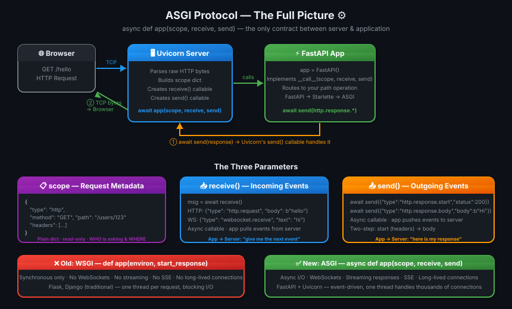
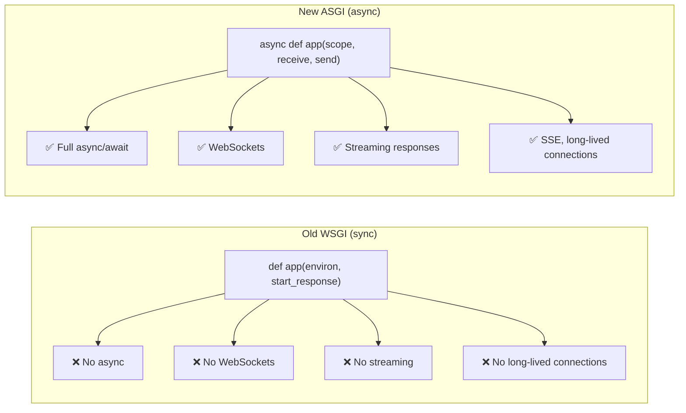
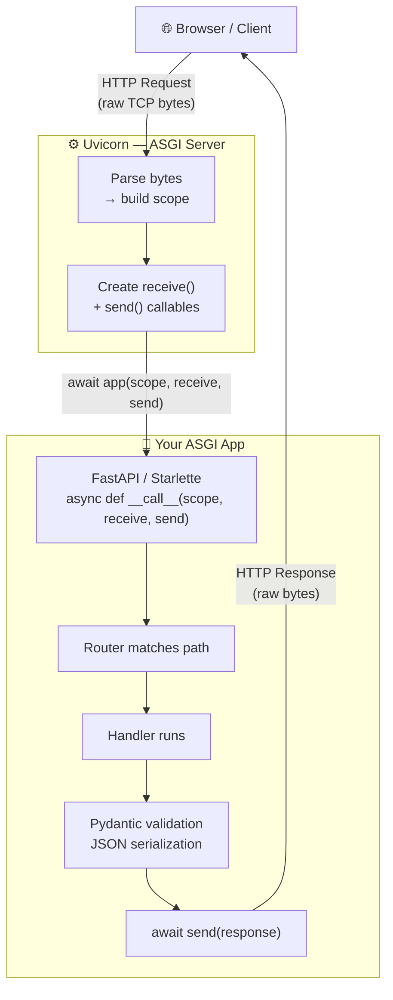
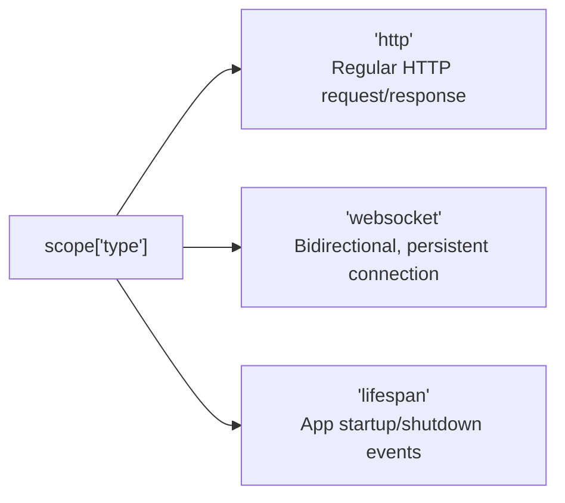

# 05 · ASGI Protocol — The Contract That Makes It All Work 🔌

---

## 🎯 One Line
> ASGI is a simple contract: "If you're an app, expose `async def __call__(scope, receive, send)`. If you're a server, call it." — that's the entire protocol.

---

## 🖼️ The Picture



> 💡 **Analogy:** ASGI ek power socket jaisa hai. Socket ka standard fixed hai — 3 holes, fixed shape. Koi bhi plug usme fit kar sakta hai — Uvicorn banega socket, FastAPI banega plug. Dono ko ek doosre ke baare mein kuch nahi pata, sirf standard contract pata hai. ⚡

---

## 🧱 Key Concepts

| Term | Kya hai | Remember |
|------|---------|---------|
| **ASGI** | Async Server Gateway Interface — a protocol/contract between server and app | Interface, not a library |
| **WSGI** | Older synchronous version — `def app(environ, start_response)` | No async, no WebSockets |
| **Uvicorn** | ASGI *server* — handles TCP, HTTP parsing, calls your app | The socket |
| **Gunicorn** | Process manager — can use Uvicorn as worker class for multi-core | Gunicorn manages, Uvicorn serves |
| **Starlette** | ASGI *framework/toolkit* — routing, middleware, WebSockets, responses | FastAPI is built on this |
| **FastAPI** | ASGI *application* built on Starlette — adds validation, docs, DI | Plug that fits the socket |
| **scope** | Dict of request metadata (type, method, path, headers) | "The envelope" |
| **receive** | Async callable — app reads incoming events from server | "Inbox" |
| **send** | Async callable — app sends outgoing events to server | "Outbox" |

---

## ⚡ WSGI vs ASGI — Why We Needed a New Protocol



| Feature | WSGI | ASGI |
|---------|------|------|
| Sync support | ✅ | ✅ |
| Async support | ❌ | ✅ |
| WebSockets | ❌ | ✅ |
| Server-Sent Events | ❌ | ✅ |
| Streaming responses | ❌ | ✅ |
| Examples | Flask, Django (classic) | FastAPI, Starlette, Django 4+ |

> 💡 **Why Flask can't do WebSockets natively:** Flask is WSGI — it's built on `environ`/`start_response` which is a synchronous, one-shot call. No concept of "keep the connection open and send events." ASGI's `receive`/`send` design makes this trivial.

---

## 🔬 The ASGI Contract — 3 Parameters

The entire ASGI application interface is one async callable:

```python
async def app(scope, receive, send):
    ...
```

### 1. `scope` — Request Metadata Dictionary

```python
# HTTP request scope
{
    "type": "http",          # "http" | "websocket" | "lifespan"
    "method": "GET",
    "path": "/users/123",
    "query_string": b"page=1",
    "headers": [
        (b"content-type", b"application/json"),
        (b"authorization", b"Bearer token123"),
    ],
    "server": ("127.0.0.1", 8000),
}
```

Think of `scope` as the **envelope** — it tells you everything about the incoming request before you've read the body.

### 2. `receive()` — Read Incoming Events

```python
# App calls this to read the request body
message = await receive()

# HTTP request body event:
{
    "type": "http.request",
    "body": b'{"name": "Ayush"}',
    "more_body": False       # True if more chunks coming
}

# WebSocket incoming message:
{
    "type": "websocket.receive",
    "text": "hello from client",
    "bytes": None
}
```

`receive` is **pull-based** — the app asks for events when it needs them. The server doesn't push.

### 3. `send()` — Write Outgoing Events

```python
# Step 1: Send response headers FIRST
await send({
    "type": "http.response.start",
    "status": 200,
    "headers": [
        (b"content-type", b"text/plain"),
        (b"content-length", b"10"),
    ]
})

# Step 2: Send response body
await send({
    "type": "http.response.body",
    "body": b"Hello ASGI",
    "more_body": False    # True if streaming more chunks
})
```

> ⚠️ **Order matters:** `http.response.start` MUST come before `http.response.body`. Think of it as: headers first, then content — same as real HTTP.

---

## 🍔 The Minimal ASGI App (Pure, No Framework)

```python
# main.py — zero dependencies, pure ASGI

async def app(scope, receive, send):

    # Ignore non-HTTP connections
    if scope["type"] != "http":
        return

    # Send headers
    await send({
        "type": "http.response.start",
        "status": 200,
        "headers": [
            (b"content-type", b"text/plain")
        ]
    })

    # Send body
    await send({
        "type": "http.response.body",
        "body": b"Hello ASGI"
    })
```

```bash
uvicorn main:app
# → http://localhost:8000 → "Hello ASGI"
```

This is the **entire foundation** FastAPI is built on. Every feature FastAPI adds is just more logic inside this same `(scope, receive, send)` pattern.

---

## 🏗️ What Uvicorn Actually Does

Uvicorn is the ASGI *server* — it handles the network side and calls your app. Conceptually:

```python
# What Uvicorn does internally (simplified)
class UvicornServer:

    async def handle_request(self, raw_request):

        # 1. Parse raw TCP bytes → build scope
        scope = {
            "type": "http",
            "method": "GET",
            "path": "/hello",
            "headers": [...],
        }

        # 2. Define receive — lets app read body
        async def receive():
            return {
                "type": "http.request",
                "body": b"",
            }

        # 3. Define send — receives app's response events
        async def send(message):
            if message["type"] == "http.response.start":
                self.write_status_and_headers(message)
            elif message["type"] == "http.response.body":
                self.write_body_to_socket(message["body"])

        # 4. Call your ASGI app — this is the ONLY thing it cares about
        await app(scope, receive, send)
```

**The key line:**
```python
await app(scope, receive, send)
```

That's it. Uvicorn doesn't know if `app` is FastAPI, Django, Starlette, or your own hand-rolled framework. It just needs that callable.

---

## 🔗 The Full Stack — How It All Connects



| Layer | Role | ASGI Side |
|-------|------|-----------|
| **Uvicorn** | Network + HTTP parsing | Server |
| **Starlette** | Routing, middleware, WebSockets | App (framework) |
| **FastAPI** | Validation, docs, DI | App (on top of Starlette) |

---

## 🔧 Uvicorn vs Gunicorn — When to Use What

```
Development:
  uvicorn main:app --reload
  └── Single process, hot reload, simple

Production (single server):
  uvicorn main:app --workers 4
  └── Multiple Uvicorn workers

Production (recommended):
  gunicorn main:app -w 4 -k uvicorn.workers.UvicornWorker
  └── Gunicorn manages processes
  └── Each worker IS a Uvicorn instance
  └── Gunicorn handles: signals, restarts, worker health
```

| Tool | Role | Use When |
|------|------|----------|
| **Uvicorn** | ASGI server, single process | Dev + simple deployments |
| **Gunicorn** | Process manager | Production (manages Uvicorn workers) |
| `uvicorn --workers N` | Built-in multi-worker | Simple production |
| `gunicorn -k UvicornWorker` | Gunicorn + Uvicorn together | Full production setup |

> 💡 **Gunicorn analogy:** Gunicorn is the HR manager, Uvicorn is the engineer. Manager handles hiring/firing/sick days (process lifecycle), engineer does the actual work (serving requests). Production mein HR zaroori hai! 👔

---

## 📡 ASGI Supports 3 Connection Types



```python
async def app(scope, receive, send):

    if scope["type"] == "http":
        # Handle HTTP request
        ...

    elif scope["type"] == "websocket":
        # Handle WebSocket connection
        # receive() gives: connect, receive, disconnect events
        # send() gives: accept, send, close events
        ...

    elif scope["type"] == "lifespan":
        # Handle startup/shutdown
        # receive() gives: startup, shutdown events
        ...
```

This is why **FastAPI can do WebSockets** while Flask (WSGI) cannot — the protocol itself supports bidirectional events through `receive` and `send`.

---

## 💡 "Aha!" Moments

**FastAPI's `app` object IS an ASGI application**
> `app = FastAPI()` creates an object with `async def __call__(self, scope, receive, send)`. So when Uvicorn does `await app(scope, receive, send)` it's calling `FastAPI.__call__()`. FastAPI is not magic — it's just a class that implements the ASGI interface.

**`receive` and `send` are what enable WebSockets**
> WSGI had `environ` (metadata) + `start_response` (one-shot write). No way to keep reading or writing after that. ASGI's `receive` lets you keep listening (`await receive()` in a loop), and `send` lets you keep writing — that's exactly what WebSockets and SSE need.

---

## ⚠️ Gotchas

- ❌ Always send `http.response.start` BEFORE `http.response.body` — wrong order = broken response
- ❌ Don't block inside `async def app()` with sync I/O — freezes the event loop
- ❌ `scope` is read-only metadata — you can't modify the request through scope
- ❌ Uvicorn `--reload` is for development only — never use in production
- ❌ `gunicorn` alone is NOT async-capable — you need `-k uvicorn.workers.UvicornWorker`

---

## 🧪 Quick Check

<details>
<summary>❓ What are the 3 parameters of the ASGI application interface and what does each do?</summary>

1. **`scope`** — a dict of request metadata (type, method, path, headers). Read-only. The "envelope."
2. **`receive`** — async callable the app calls to READ incoming events (request body, WebSocket messages). Pull-based.
3. **`send`** — async callable the app calls to WRITE outgoing events (response headers, body, WebSocket messages).
</details>

<details>
<summary>❓ Why can FastAPI handle WebSockets but Flask cannot?</summary>

Flask uses WSGI — a synchronous, one-shot protocol (`environ`, `start_response`). Once the response is sent, the connection closes. No concept of "keep reading events" or "keep sending events."

FastAPI uses ASGI — `receive()` lets the app keep reading (`websocket.receive` events in a loop) and `send()` lets it keep writing (`websocket.send` events). The protocol natively supports long-lived bidirectional connections.
</details>

<details>
<summary>❓ What does Uvicorn actually do? What's the one thing it cares about?</summary>

Uvicorn is the ASGI **server** — it handles raw TCP connections, parses HTTP bytes, builds the `scope` dict, creates `receive` and `send` callables, then calls:

```python
await app(scope, receive, send)
```

That's the ONE thing it cares about. Your app just has to accept those three arguments.
</details>

<details>
<summary>❓ What's the difference between Uvicorn and Gunicorn?</summary>

- **Uvicorn** = ASGI server (does actual request serving, async event loop)
- **Gunicorn** = process manager (starts/stops/restarts worker processes)

In production: `gunicorn -k uvicorn.workers.UvicornWorker` — Gunicorn manages multiple Uvicorn worker processes. Gunicorn = HR manager, Uvicorn = engineer.
</details>

---

> **Next →** [MiniAPI — Build Your Own Framework](06-miniapi-build-your-own.md)
