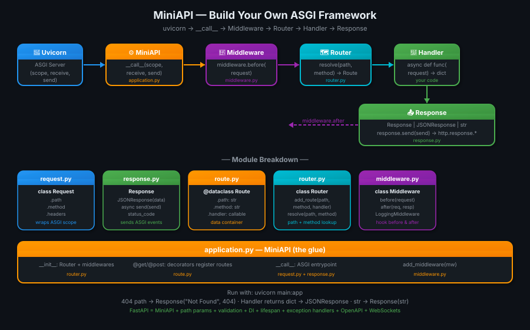
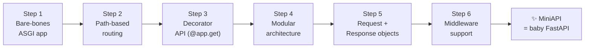
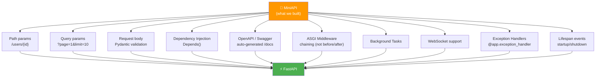

# 06 · MiniAPI — Build Your Own Framework 🔧

---

## 🎯 One Line
> Build a tiny ASGI framework from scratch — routing, requests, responses, middleware, JSON — until you realize you just built a baby FastAPI. Then FastAPI feels like magic you understand.

---

## 🖼️ The Picture



> 💡 **Analogy:** FastAPI seekhna seedha end product dekhne jaisa hai — impressive, magical. MiniAPI banana seedha assembly line dekhne jaisa hai — boring nahi, interesting! Jab tum khud screw lagate ho toh pata chalta hai screw kahan fit hota hai. 🔩

---

## 🧱 What We're Building — The Journey



Each step adds exactly one concept. By the end — you'll understand every layer of FastAPI.

---

## Step 1 — Bare-Bones ASGI App

The absolute minimum. One function, one response.

```python
# main.py

async def app(scope, receive, send):

    if scope["type"] != "http":
        return

    await send({
        "type": "http.response.start",
        "status": 200,
        "headers": [(b"content-type", b"text/plain")]
    })

    await send({
        "type": "http.response.body",
        "body": b"Hello ASGI"
    })
```

```bash
uvicorn main:app
# → http://localhost:8000 → "Hello ASGI"
```

**What this teaches:** The entire ASGI contract. Every framework — FastAPI, Starlette, Django — is this function, made smarter.

---

## Step 2 — Path-Based Routing

Read `scope["path"]` and return different responses.

```python
async def app(scope, receive, send):

    path = scope["path"]

    if path == "/":
        body = b"Home Page"
    elif path == "/users":
        body = b"Users Page"
    else:
        body = b"404 Not Found"

    await send({
        "type": "http.response.start",
        "status": 200,
        "headers": [(b"content-type", b"text/plain")]
    })
    await send({
        "type": "http.response.body",
        "body": body
    })
```

**What this teaches:** Routing is just an `if/elif` on `scope["path"]`. FastAPI's `@app.get("/users")` eventually does the same thing — just with a dict lookup instead.

---

## Step 3 — Decorator API (The FastAPI Feel)

Add `@app.get("/path")` decorator support. Now it *looks* like FastAPI.

```python
# single-file miniapi

class MiniAPI:

    def __init__(self):
        self.routes = {}          # (method, path) → handler

    def get(self, path):
        def decorator(func):
            self.routes[("GET", path)] = func
            return func
        return decorator

    async def __call__(self, scope, receive, send):

        method = scope["method"]
        path   = scope["path"]

        handler = self.routes.get((method, path))

        if handler:
            result = await handler()
            body = result.encode()
            status = 200
        else:
            body = b"Not Found"
            status = 404

        await send({
            "type": "http.response.start",
            "status": status,
            "headers": [(b"content-type", b"text/plain")]
        })
        await send({
            "type": "http.response.body",
            "body": body
        })


# Usage:
app = MiniAPI()

@app.get("/")
async def home():
    return "Hello Home"

@app.get("/users")
async def users():
    return "Users List"
```

```bash
uvicorn main:app
# GET /       → "Hello Home"
# GET /users  → "Users List"
# GET /other  → "Not Found"
```

**What this teaches:** Decorators are just functions that register handlers into a dict. `self.routes[("GET", path)] = func` is the core of every web framework's routing system.

---

## Step 4 — Modular Architecture

Split into files. This is how Starlette and FastAPI are actually organized.

```
miniapi/
├── __init__.py
├── application.py   ← MiniAPI class (ASGI __call__)
├── router.py        ← Route registry + lookup
├── route.py         ← Route dataclass
├── request.py       ← Wraps scope into friendly object
├── response.py      ← Response + JSONResponse
├── middleware.py    ← Base middleware class
└── exceptions.py   ← HTTPException
```

### route.py — One Route

```python
from dataclasses import dataclass
from typing import Callable

@dataclass
class Route:
    path: str
    method: str
    handler: Callable
```

A `Route` is just a value object — 3 fields. Nothing more.

### router.py — Route Registry

```python
from .route import Route

class Router:

    def __init__(self):
        self.routes = []

    def add_route(self, path, method, handler):
        self.routes.append(
            Route(path=path, method=method, handler=handler)
        )

    def resolve(self, path, method):
        for route in self.routes:
            if route.path == path and route.method == method:
                return route
        return None
```

**What this teaches:** A router is a list of routes + a `resolve()` method. FastAPI's router is the same idea, extended with path parameter patterns and regex matching.

### request.py — Wrap scope

```python
class Request:

    def __init__(self, scope):
        self._scope = scope

    @property
    def path(self):
        return self._scope["path"]

    @property
    def method(self):
        return self._scope["method"]

    @property
    def headers(self):
        return dict(self._scope.get("headers", []))
```

**What this teaches:** `Request` is just a friendly wrapper around `scope`. `scope["path"]` → `request.path`. FastAPI's `Request` object does the exact same thing — plus body parsing, query params, etc.

### response.py — Text + JSON

```python
import json

class Response:

    def __init__(self, body="", status_code=200, content_type="text/plain"):
        self.body        = body
        self.status_code = status_code
        self.content_type = content_type

    async def send(self, send):
        body = self.body.encode() if isinstance(self.body, str) else self.body

        await send({
            "type": "http.response.start",
            "status": self.status_code,
            "headers": [(b"content-type", self.content_type.encode())]
        })
        await send({
            "type": "http.response.body",
            "body": body
        })


class JSONResponse(Response):

    def __init__(self, data, status_code=200):
        super().__init__(
            body=json.dumps(data),
            status_code=status_code,
            content_type="application/json"
        )
```

**What this teaches:** FastAPI's `JSONResponse` is EXACTLY this — `json.dumps()` the data, set content-type to `application/json`, call `send()` twice. The "magic" is 8 lines of code.

### middleware.py — Base Class

```python
class Middleware:

    async def before(self, request):
        pass   # Override in subclasses

    async def after(self, request, response):
        pass   # Override in subclasses


class LoggingMiddleware(Middleware):

    async def before(self, request):
        print(f"→ {request.method} {request.path}")

    async def after(self, request, response):
        print(f"← {response.status_code}")
```

### application.py — The ASGI App (Glue Layer)

```python
from .router   import Router
from .request  import Request
from .response import Response, JSONResponse


class MiniAPI:

    def __init__(self):
        self.router      = Router()
        self.middlewares = []

    # ── Decorator API ─────────────────────────────
    def get(self, path):
        def wrapper(handler):
            self.router.add_route(path, "GET", handler)
            return handler
        return wrapper

    def post(self, path):
        def wrapper(handler):
            self.router.add_route(path, "POST", handler)
            return handler
        return wrapper

    def add_middleware(self, middleware):
        self.middlewares.append(middleware)

    # ── ASGI entry point ──────────────────────────
    async def __call__(self, scope, receive, send):

        if scope["type"] != "http":
            return

        request = Request(scope)

        # Run before-middleware
        for mw in self.middlewares:
            await mw.before(request)

        # Route lookup
        route = self.router.resolve(request.path, request.method)

        if route is None:
            response = Response("Not Found", status_code=404)
        else:
            result = await route.handler(request)

            # Auto-detect return type → correct Response
            if isinstance(result, Response):
                response = result
            elif isinstance(result, dict):
                response = JSONResponse(result)
            else:
                response = Response(str(result))

        # Run after-middleware
        for mw in self.middlewares:
            await mw.after(request, response)

        await response.send(send)
```

---

## Step 5 — Usage: Full MiniAPI App

```python
# main.py

from miniapi.application import MiniAPI
from miniapi.middleware  import LoggingMiddleware
from miniapi.response    import JSONResponse

app = MiniAPI()
app.add_middleware(LoggingMiddleware())


@app.get("/")
async def home(request):
    return {"message": "Hello from MiniAPI!"}


@app.get("/users")
async def list_users(request):
    return {
        "users": ["Ayush", "Priya", "Rahul"]
    }


@app.get("/health")
async def health(request):
    return JSONResponse({"status": "ok"}, status_code=200)
```

```bash
uvicorn main:app --reload

# GET /         → {"message": "Hello from MiniAPI!"}
# GET /users    → {"users": ["Ayush", "Priya", "Rahul"]}
# GET /health   → {"status": "ok"}
# GET /other    → "Not Found" (404)
# Console logs  → GET /users  ← 200
```

---

## 🗺️ MiniAPI → FastAPI: What's Missing

You built the core. FastAPI adds 10 more layers on top:



| Feature | MiniAPI | FastAPI |
|---------|---------|---------|
| Basic routing | ✅ | ✅ |
| JSON responses | ✅ | ✅ |
| Middleware hooks | ✅ (before/after) | ✅ (ASGI chain) |
| Path parameters | ❌ | ✅ `/users/{id}` |
| Query parameters | ❌ | ✅ auto-parsed |
| Request body | ❌ | ✅ Pydantic |
| Dependency injection | ❌ | ✅ `Depends()` |
| Auto docs `/docs` | ❌ | ✅ |
| WebSockets | ❌ | ✅ |
| Exception handlers | ❌ | ✅ |

**The point:** FastAPI is not magic. It's a MiniAPI with 10 more features, all built on the same `(scope, receive, send)` contract.

---

## 🔗 How FastAPI Is Actually Layered

```
Your Code
    ↓ @app.get("/users")
FastAPI
    ↓ type hints → Pydantic validation
    ↓ path params → regex matching
    ↓ Depends() → dependency graph
Starlette
    ↓ Routing, middleware chain, WebSocket helpers
    ↓ Request/Response objects
ASGI interface
    ↓ async def __call__(scope, receive, send)
Uvicorn
    ↓ TCP → HTTP parsing → calls app
Network
```

**Starlette** is the framework layer — routing, middleware, WebSockets. **FastAPI** sits on top of Starlette and adds the Pydantic validation, dependency injection, and OpenAPI generation. Your MiniAPI is a simplified Starlette.

---

## 💡 "Aha!" Moments

**`__call__` makes any object an ASGI app**
> Adding `async def __call__(self, scope, receive, send)` to ANY Python class makes it an ASGI application. Uvicorn just needs a callable with that signature — class instance, plain function, doesn't matter. FastAPI uses a class so it can store state (routes, middleware, etc.) between calls.

**Decorator = dict insert**
> `@app.get("/users")` is syntactic sugar for `app.routes[("GET", "/users")] = my_function`. The `@` symbol is just Python calling `app.get("/users")(my_function)`. Understanding this makes decorators demystify completely.

---

## ⚠️ Gotchas

- ❌ Our `Router.resolve()` uses exact string match — real frameworks use regex for `/users/{id}` path params
- ❌ Our `Middleware` runs as simple before/after hooks — Starlette uses ASGI middleware chaining (each middleware wraps the app, more powerful)
- ❌ We never call `receive()` — our app ignores request bodies. Real apps need `await receive()` to read POST body
- ❌ Our error handling is a 404 string — production apps need typed `HTTPException` with status codes + JSON error bodies
- ❌ No `content-length` header — real responses should include it for browser compatibility

---

## 🧪 Quick Check

<details>
<summary>❓ What does <code>async def __call__(self, scope, receive, send)</code> on a class do?</summary>

It makes the class instance **callable as an ASGI application**. When Uvicorn does `await app(scope, receive, send)`, Python calls `app.__call__(scope, receive, send)`. Any class with this method can be passed to Uvicorn as an ASGI app — that's exactly how `FastAPI()`, `Starlette()`, and our `MiniAPI()` all work.
</details>

<details>
<summary>❓ What does <code>@app.get("/users")</code> actually do at Python level?</summary>

It's a two-step call:
1. `app.get("/users")` is called — returns a `decorator` function
2. `decorator(my_handler)` is called — registers `("GET", "/users") → my_handler` in the routes dict and returns the original function unchanged

So `@app.get("/users")` before `async def users()` is identical to:
```python
async def users():
    ...
users = app.get("/users")(users)  # registers + returns unchanged
```
</details>

<details>
<summary>❓ What's missing in MiniAPI vs FastAPI? Name 5 things.</summary>

1. **Path parameters** — `/users/{id}` regex matching
2. **Query parameters** — auto-parse `?page=1` from `scope["query_string"]`
3. **Request body parsing** — `await receive()` + Pydantic validation
4. **Dependency injection** — `Depends()` graph resolution
5. **OpenAPI docs** — auto-generated `/docs` Swagger UI from type hints
</details>

<details>
<summary>❓ Why does our MiniAPI never call <code>receive()</code>?</summary>

Because our app only handles GET requests with no body. `receive()` is needed when you want to read the request body — for POST/PUT requests with JSON payload. A real app would do:

```python
message = await receive()
body = message["body"]  # raw bytes
data = json.loads(body)  # parse JSON
```

FastAPI calls `receive()` internally when a route has a body parameter (Pydantic model). We skipped this to keep it simple.
</details>

---

> **Next →** [Path Parameters](07-path-parameters.md)
