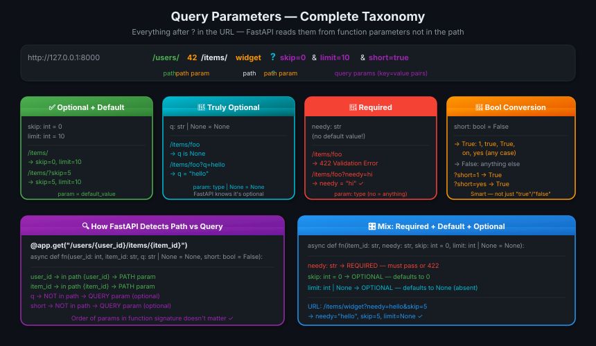
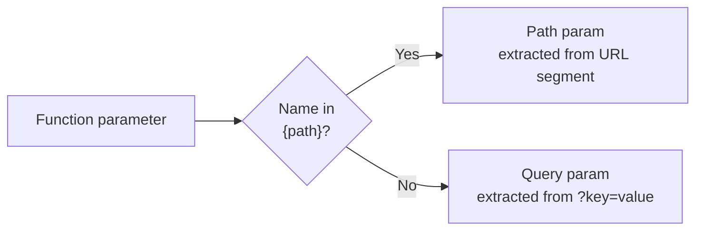

# 07 · Query Parameters 🔍

---

## 🎯 One Line
> Query params are everything after `?` in the URL — function params not in the path become query params automatically. FastAPI handles type conversion, defaults, optional, and required — all from the type hint.

---

## 🖼️ The Picture



> 💡 **Analogy:** Path params are the address on an envelope — they MUST be there to deliver. Query params are the sticky notes on top — optional filters, settings, preferences. `?skip=0&limit=10` = "give me items, but skip 0 and stop at 10." 📮

---

## 🧱 Key Concepts

| Concept | Kya hai | Example |
|---------|---------|---------|
| **Query param** | `key=value` after `?` in URL, separated by `&` | `?skip=0&limit=10` |
| **Auto-detection** | Params NOT in `{path}` are auto-treated as query params | `q` not in path → query |
| **Type conversion** | Declared type → auto-parsed from string | `skip: int` → `"5"` → `5` |
| **Default value** | `param = value` → optional, has fallback | `skip: int = 0` |
| **Optional (None)** | `param: T \| None = None` → absent = None | `q: str \| None = None` |
| **Required** | No default → must be in URL or 422 error | `needy: str` |
| **Bool conversion** | Smart: `1/true/True/on/yes` → `True` | `short: bool = False` |

---

## ⚡ How FastAPI Detects Path vs Query

FastAPI reads the path string and your function signature — if a param name appears in `{braces}` it's a path param, otherwise it's a query param. **Order doesn't matter.**

```python
@app.get("/users/{user_id}/items/{item_id}")
async def read_user_item(
    user_id: int,            # ← in path {user_id}  → PATH param
    item_id: str,            # ← in path {item_id}  → PATH param
    q: str | None = None,    # ← NOT in path         → QUERY param (optional)
    short: bool = False      # ← NOT in path         → QUERY param (optional)
):
    ...
```



---

## 📦 All 4 Flavours — With Code

### 1. Optional with Default

```python
fake_items_db = [{"item_name": "Foo"}, {"item_name": "Bar"}, {"item_name": "Baz"}]

@app.get("/items/")
async def read_item(skip: int = 0, limit: int = 10):
    return fake_items_db[skip : skip + limit]
```

| URL | skip | limit | Result |
|-----|------|-------|--------|
| `/items/` | 0 | 10 | items 0–9 |
| `/items/?skip=1` | 1 | 10 | items 1–9 |
| `/items/?skip=1&limit=2` | 1 | 2 | items 1–2 |

> Calling `/items/` is identical to `/items/?skip=0&limit=10` — defaults kick in automatically.

---

### 2. Truly Optional (None default)

```python
@app.get("/items/{item_id}")
async def read_item(item_id: str, q: str | None = None):
    if q:
        return {"item_id": item_id, "q": q}
    return {"item_id": item_id}
```

| URL | q | Response |
|-----|---|---------|
| `/items/foo` | `None` | `{"item_id": "foo"}` |
| `/items/foo?q=hello` | `"hello"` | `{"item_id": "foo", "q": "hello"}` |

> `q: str | None = None` — the `| None` tells FastAPI (and the editor) that `q` might not be there. Without it FastAPI would treat `q: str` as required.

---

### 3. Required (no default at all)

```python
@app.get("/items/{item_id}")
async def read_user_item(item_id: str, needy: str):
    return {"item_id": item_id, "needy": needy}
```

| URL | Result |
|-----|--------|
| `/items/foo` | ❌ `422 Unprocessable Entity` — `needy` missing |
| `/items/foo?needy=hello` | ✅ `{"item_id": "foo", "needy": "hello"}` |

> No `= something` → required. FastAPI returns a validation error automatically with a clear message if it's missing.

---

### 4. Bool Conversion — Smart Parsing

```python
@app.get("/items/{item_id}")
async def read_item(item_id: str, short: bool = False):
    item = {"item_id": item_id}
    if not short:
        item.update({"description": "This has a long description..."})
    return item
```

FastAPI accepts ALL of these as `True`:

```
?short=1       ?short=True     ?short=true
?short=on      ?short=yes      ?short=YES
?short=On      ?short=TRUE
```

Anything else → `False`.

> 💡 **Why smart bool?** HTTP query strings are always plain text. `bool("false")` in Python would be `True` (non-empty string!). FastAPI's conversion matches human intent — `?short=false` → `False`. No surprises. 🎯

---

## 🎛️ Mix Everything Together

```python
@app.get("/items/{item_id}")
async def read_user_item(
    item_id: str,             # PATH param — from URL segment
    needy: str,               # QUERY — required (no default)
    skip: int = 0,            # QUERY — optional, default 0
    limit: int | None = None  # QUERY — optional, default None
):
    item = {"item_id": item_id, "needy": needy, "skip": skip, "limit": limit}
    return item
```

| Param | Type | Required? | Default |
|-------|------|-----------|---------|
| `item_id` | `str` | ✅ (path) | — |
| `needy` | `str` | ✅ | — |
| `skip` | `int` | ❌ | `0` |
| `limit` | `int \| None` | ❌ | `None` |

Valid call: `/items/widget?needy=hello&skip=5`
→ `item_id="widget"`, `needy="hello"`, `skip=5`, `limit=None`

---

## 💡 "Aha!" Moments

**The same type hint does 5 things at once**
> `skip: int = 0` — (1) editor knows it's an int, (2) FastAPI auto-converts `"5"` → `5`, (3) validates (rejects `?skip=abc`), (4) makes it optional with default 0, (5) documents it in `/docs`. One annotation, five features. Ek line, paanch kaam. 🤯

**`| None` is the signal FastAPI uses**
> `q: str` = required query param. `q: str | None = None` = optional. The `| None` is what tells FastAPI "this can be absent." Don't forget the `= None` part — `q: str | None` without default is still required (just nullable).

---

## ⚠️ Gotchas

- ❌ `q: str | None` without `= None` — it's still **required** (just allows None as a value). Add `= None` to make it truly optional
- ❌ `bool("false")` in Python = `True` — never manually cast query bool params. Let FastAPI do it with `short: bool`
- ❌ Don't name a query param the same as a path param — FastAPI will read it as a path param and ignore it as a query param
- ❌ All query param values arrive as strings from HTTP — FastAPI converts them, but if you bypass FastAPI's parsing you'll get raw strings

---

## 🧪 Quick Check

<details>
<summary>❓ How does FastAPI know if a function param is a path param or a query param?</summary>

It compares the parameter name against the path string. If the name appears inside `{braces}` in the path — it's a path param. If it doesn't appear in the path at all — it's automatically treated as a query param. Order in the function signature doesn't matter.
</details>

<details>
<summary>❓ What's the difference between <code>q: str | None = None</code> and <code>q: str</code>?</summary>

- `q: str` → **required** query param. If absent from URL → 422 error.
- `q: str | None = None` → **optional** query param. If absent → `q` is `None` inside the function.

Both are string type when present. The `| None = None` is the signal to FastAPI that it's optional.
</details>

<details>
<summary>❓ What values does FastAPI accept for a <code>bool</code> query param to mean <code>True</code>?</summary>

Any of: `1`, `true`, `True`, `TRUE`, `on`, `On`, `ON`, `yes`, `Yes`, `YES` — case-insensitive variations of "truthy" strings. Everything else → `False`.

This is smarter than Python's native `bool("false")` which would incorrectly give `True`.
</details>

<details>
<summary>❓ How do you make a query param required with no default?</summary>

Simply declare it with a type and **no default value**:

```python
async def fn(needy: str):  # required — no = anything
```

If the URL doesn't include `?needy=...`, FastAPI returns a `422 Unprocessable Entity` with a clear error message automatically.
</details>

---

> **Next →** [Request Body](08-request-body.md)
