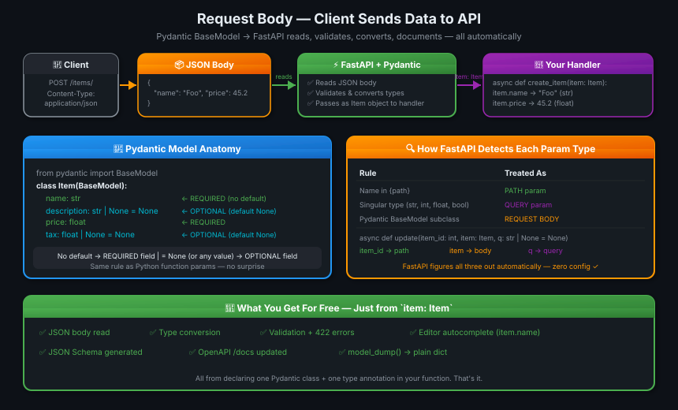
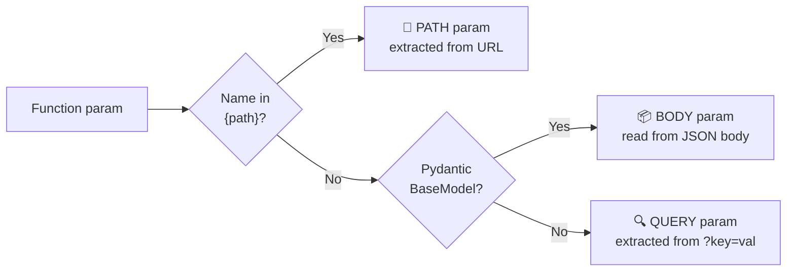

# 08 · Request Body 📦

---

## 🎯 One Line
> Request body = data the client sends TO your API. Declare a Pydantic `BaseModel`, type-hint your function param with it, and FastAPI handles reading, validating, converting, and documenting — automatically.

---

## 🖼️ The Picture



> 💡 **Analogy:** Query params are sticky notes on the envelope (visible in URL). Request body is the letter INSIDE the envelope — the actual payload, not visible in the URL, sent as JSON. Bade data ke liye body use karo, chote filter ke liye query params. 📮

---

## 🧱 Key Concepts

| Concept | Kya hai | Example |
|---------|---------|---------|
| **Request body** | Data sent FROM client TO API in HTTP message body | JSON `{"name": "Foo", "price": 45.2}` |
| **BaseModel** | Pydantic class — declares the shape and types of expected data | `class Item(BaseModel): name: str` |
| **Required field** | No default value → client MUST send it | `name: str` |
| **Optional field** | Has a default (usually `None`) → client can skip it | `tax: float \| None = None` |
| **`model_dump()`** | Convert Pydantic model instance → plain Python `dict` | `item.model_dump()` |
| **Auto-detection** | FastAPI sees Pydantic type → reads from body, not query/path | `item: Item` → body |

---

## 📦 The Pydantic Model

```python
from fastapi import FastAPI
from pydantic import BaseModel

class Item(BaseModel):
    name: str                      # REQUIRED — no default
    description: str | None = None # OPTIONAL — default None
    price: float                   # REQUIRED — no default
    tax: float | None = None       # OPTIONAL — default None

app = FastAPI()
```

| Field | Type | Required? | Why |
|-------|------|-----------|-----|
| `name` | `str` | ✅ | No default |
| `description` | `str \| None` | ❌ | Default = `None` |
| `price` | `float` | ✅ | No default |
| `tax` | `float \| None` | ❌ | Default = `None` |

**Valid JSON payloads — both work:**

```json
// Full payload
{ "name": "Foo", "description": "A desc", "price": 45.2, "tax": 3.5 }

// Minimal — only required fields
{ "name": "Foo", "price": 45.2 }
```

---

## ⚡ Declaring a Request Body

```python
@app.post("/items/")
async def create_item(item: Item):
    return item
```

That's it. FastAPI sees `item: Item` where `Item` is a `BaseModel` subclass → **reads JSON body, validates, converts, passes as `item`**.

### Using the model in your handler:

```python
@app.post("/items/")
async def create_item(item: Item):
    item_dict = item.model_dump()        # → plain dict
    if item.tax is not None:
        price_with_tax = item.price + item.tax
        item_dict.update({"price_with_tax": price_with_tax})
    return item_dict
```

Access fields directly: `item.name`, `item.price`, `item.tax`. Full editor autocomplete — the editor knows all fields and their types.

---

## 🔀 Combining Body + Path + Query

FastAPI auto-detects each param's source by these rules:



### Body + Path params:

```python
@app.put("/items/{item_id}")
async def update_item(item_id: int, item: Item):
    return {"item_id": item_id, **item.model_dump()}
```

- `item_id` → in path `{item_id}` → **path param**
- `item` → Pydantic model → **body param**

### Body + Path + Query params:

```python
@app.put("/items/{item_id}")
async def update_item(item_id: int, item: Item, q: str | None = None):
    result = {"item_id": item_id, **item.model_dump()}
    if q:
        result.update({"q": q})
    return result
```

| Param | Type | Source | Why |
|-------|------|--------|-----|
| `item_id` | `int` | Path | Name in `{item_id}` |
| `item` | `Item` (BaseModel) | Body | Pydantic model type |
| `q` | `str \| None` | Query | Not in path, not a model |

> 💡 **The key insight:** FastAPI figures all three out automatically from types alone. You never say "this is a body param" or "this is a query param" — the type IS the declaration. Type hint = `Item` → body. Simple type (`str`) → query. In path → path. Ek rule, teen sources. 🎯

---

## 🎁 What You Get For Free

Just by writing `item: Item` in your function:

```
✅ JSON body read automatically
✅ Type conversion (string "45.2" → float 45.2)
✅ Validation → 422 error with clear message if invalid
✅ Editor autocomplete: item.name, item.price, item.tax
✅ Error detection: item.pric (typo) → editor flags it
✅ JSON Schema generated
✅ Interactive /docs updated automatically
```

**What a 422 error looks like** if client sends `{}` (missing required fields):

```json
{
  "detail": [
    {
      "type": "missing",
      "loc": ["body", "name"],
      "msg": "Field required"
    },
    {
      "type": "missing",
      "loc": ["body", "price"],
      "msg": "Field required"
    }
  ]
}
```

FastAPI generates this automatically — you write zero error-handling code.

---

## 🔬 `model_dump()` — Model to Dict

```python
item = Item(name="Foo", price=45.2)

item.model_dump()
# → {"name": "Foo", "description": None, "price": 45.2, "tax": None}

# Spread into a dict with **
result = {"item_id": 1, **item.model_dump()}
# → {"item_id": 1, "name": "Foo", "description": None, "price": 45.2, "tax": None}
```

Use `model_dump()` when you need a plain dict — for DB inserts, merging with other data, returning modified versions.

---

## 💡 "Aha!" Moments

**POST vs PUT vs PATCH — all support bodies**
> POST (create), PUT (full replace), PATCH (partial update), DELETE (rare) — all accept a request body. GET technically can but it's undefined behavior in the HTTP spec and rarely used. Use POST for creation, PUT/PATCH for updates.

**`| None = None` — you need BOTH parts**
> `description: str | None` alone means "can be a string or None but IS required." `description: str | None = None` means "optional, defaults to None." Both the type union AND the default are needed. Same rule as query params.

---

## ⚠️ Gotchas

- ❌ Using `@app.get()` for a request body — GET + body is undefined per HTTP spec. Use POST/PUT/PATCH
- ❌ `description: str | None` without `= None` — it's still **required** (just accepts None as value)
- ❌ Don't access model fields via dict notation — `item["name"]` fails. Use dot notation: `item.name`
- ❌ Sending plain query params instead of JSON body — FastAPI will return 422 because body is missing
- ❌ Forgetting `Content-Type: application/json` header in manual requests — without it, FastAPI can't parse the body

---

## 🧪 Quick Check

<details>
<summary>❓ How does FastAPI know a function param should come from the request body?</summary>

If the param's type is a Pydantic `BaseModel` subclass, FastAPI reads it from the JSON request body. Singular types (`str`, `int`, `float`, `bool`) that aren't in the path → query params. Names in `{path}` → path params.
</details>

<details>
<summary>❓ What happens if a client sends a request body missing a required field?</summary>

FastAPI returns a `422 Unprocessable Entity` response automatically with a detailed JSON error listing every missing/invalid field — name, location (`["body", "field_name"]`), and error message. You write zero error-handling code.
</details>

<details>
<summary>❓ What is <code>model_dump()</code> and when do you use it?</summary>

`model_dump()` converts a Pydantic model instance into a plain Python `dict`. Use it when you need a dict — for database inserts, merging with other data with `**`, or returning a modified version of the model data.

```python
item.model_dump()  # → {"name": "Foo", "price": 45.2, "description": None, "tax": None}
```
</details>

<details>
<summary>❓ Write a route that takes a path param <code>item_id: int</code>, a Pydantic body <code>item: Item</code>, and an optional query param <code>q: str</code>.</summary>

```python
@app.put("/items/{item_id}")
async def update_item(
    item_id: int,              # from path
    item: Item,                # from JSON body
    q: str | None = None       # from query string
):
    result = {"item_id": item_id, **item.model_dump()}
    if q:
        result.update({"q": q})
    return result
```

FastAPI detects all three sources automatically from types alone.
</details>

---

> **Next →** [Query Parameters and String Validations](09-query-params-str-validations.md)
