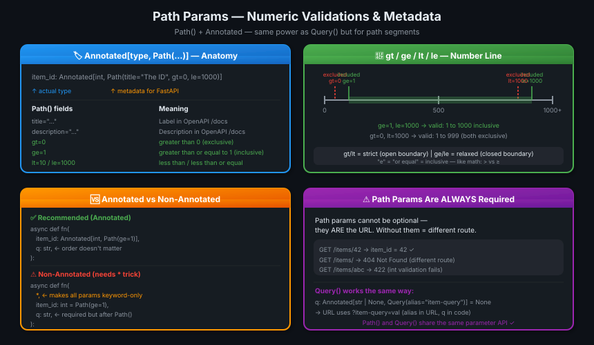
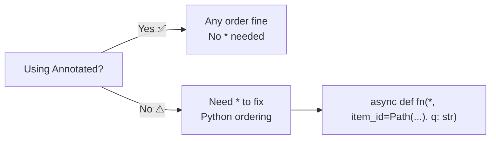

# 09 · Path Parameters — Numeric Validations 🔢

---

## 🎯 One Line
> `Path()` inside `Annotated[...]` lets you add metadata (title, description) and numeric constraints (gt, ge, lt, le) to path parameters — same API as `Query()`, just for the URL segment.

---

## 🖼️ The Picture



> 💡 **Analogy:** Query params mein already `Query(max_length=50)` jaisa restriction lagaya. Path params ke liye? Same cheez, `Path(ge=1, le=1000)`. Ek hi tool, do jagah kaam. Librarian ne ek hi shelf system se dono counters manage kiye. 📚

---

## 🧱 Key Concepts

| Concept | Kya hai | Example |
|---------|---------|---------|
| `Path()` | Adds metadata + validation to path params | `Path(title="Item ID", ge=1)` |
| `Query()` | Same but for query params | `Query(alias="item-query")` |
| `Annotated[type, Path(...)]` | Recommended syntax — type + metadata together | `Annotated[int, Path(ge=0, le=1000)]` |
| `gt` | Greater than (exclusive — the value itself NOT allowed) | `gt=0` → valid: 1, 2, 3... |
| `ge` | Greater than or equal (inclusive) | `ge=1` → valid: 1, 2, 3... |
| `lt` | Less than (exclusive) | `lt=10` → valid: ...7, 8, 9 |
| `le` | Less than or equal (inclusive) | `le=1000` → valid: ...999, 1000 |
| `title` | Label shown in OpenAPI `/docs` | `title="The ID of the item"` |
| `description` | Description shown in OpenAPI `/docs` | `description="Must be positive"` |
| `alias` | Different name in URL vs Python code | `alias="item-query"` → URL: `?item-query=` |

---

## 📦 Imports

```python
from typing import Annotated
from fastapi import FastAPI, Path, Query
```

`Path` and `Query` are imported from `fastapi`. `Annotated` comes from `typing`.

---

## ⚡ Basic Usage — Adding Metadata

```python
@app.get("/items/{item_id}")
async def read_items(
    item_id: Annotated[int, Path(title="The ID of the item to get")],
    q: Annotated[str | None, Query(alias="item-query")] = None,
):
    results = {"item_id": item_id}
    if q:
        results.update({"q": q})
    return results
```

- `Path(title=...)` → adds a label to `item_id` in Swagger `/docs`
- `Query(alias="item-query")` → URL uses `?item-query=hello`, but code uses `q`

---

## 📏 Numeric Validations — gt / ge / lt / le

```python
@app.get("/items/{item_id}")
async def read_items(
    item_id: Annotated[int, Path(title="The ID of the item to get", gt=0, le=1000)],
    q: str,
):
    results = {"item_id": item_id}
    if q:
        results.update({"q": q})
    return results
```

| Constraint | Meaning | Boundary |
|-----------|---------|----------|
| `gt=0` | value > 0 | 🚫 0 excluded, ✅ 1+ valid |
| `ge=1` | value ≥ 1 | ✅ 1 included, ✅ 1+ valid |
| `lt=10` | value < 10 | 🚫 10 excluded, ✅ ...9 valid |
| `le=1000` | value ≤ 1000 | ✅ 1000 included, 🚫 1001+ |

**Memory trick:** `e` = "or Equal" = inclusive boundary. `gt`/`lt` = strict = exclusive.

```
gt=0, le=1000  →  valid range: [1, 2, ..., 999, 1000]  (0 excluded, 1000 included)
ge=1, lt=1000  →  valid range: [1, 2, ..., 998, 999]   (1 included, 1000 excluded)
```

### Float validations — works on Query too:

```python
@app.get("/items/{item_id}")
async def read_items(
    item_id: Annotated[int, Path(ge=0, le=1000)],
    q: str,
    size: Annotated[float, Query(gt=0, lt=10.5)],
):
    results = {"item_id": item_id}
    if q:
        results.update({"q": q})
    return results
```

`gt` and `lt` work on `float` too — `size` must be between 0 (exclusive) and 10.5 (exclusive).

---

## 🔀 Annotated vs Non-Annotated Syntax

### ✅ Recommended — Annotated (order-flexible)

```python
@app.get("/items/{item_id}")
async def read_items(
    item_id: Annotated[int, Path(title="The ID of the item to get", ge=1)],
    q: str,   # required query param — can come BEFORE or AFTER, doesn't matter
):
    results = {"item_id": item_id}
    if q:
        results.update({"q": q})
    return results
```

With `Annotated`, param order in the function signature doesn't matter — FastAPI reads from the type, not the position.

### ⚠️ Non-Annotated — needs the `*` trick

```python
@app.get("/items/{item_id}")
async def read_items(
    *,   # ← makes ALL following params keyword-only
    item_id: int = Path(title="The ID of the item to get", ge=1),
    q: str,
):
    ...
```

**Why `*`?** Without `Annotated`, `item_id` has a default (`Path(...)`), so Python normally requires params-without-defaults to come first. `q: str` has no default but comes after `item_id = Path(...)` — Python would complain. The bare `*` makes all following params keyword-only, removing the ordering restriction.



---

## ⚠️ Path Params Are ALWAYS Required

Path params cannot be optional — the path segment IS the identifier:

```
GET /items/42    → item_id = 42       ✅
GET /items/      → 404 Not Found       (different route entirely)
GET /items/abc   → 422 Validation Error (int conversion fails)
GET /items/-1    → 422 Validation Error (ge=1 fails)
```

Even if you write `item_id: int = Path(default=None)`, the route still needs something in that slot — it's just that the *validation* is optional, not the URL segment itself.

---

## 💡 "Aha!" Moments

**`Path()` and `Query()` share the same API**
> Both accept `title`, `description`, `gt`, `ge`, `lt`, `le`, `alias`, `min_length`, `max_length`, `pattern` — the exact same keyword arguments. Learning one = knowing both. Ek tool, do functions, same interface. 🎯

**`Annotated` decouples type from constraints**
> Without `Annotated`: `item_id: int = Path(ge=1)` — the `int` and the constraint live in different places. With `Annotated[int, Path(ge=1)]` — the constraint is attached TO the type, not the default. Cleaner, and order-independent.

---

## ⚠️ Gotchas

- ❌ `gt=0` does NOT allow 0 — use `ge=0` if 0 should be valid
- ❌ Forgetting `*` with non-Annotated syntax causes `SyntaxError` when a required param follows a defaulted one
- ❌ Path params are always required — you can't make them truly optional like query params
- ❌ `alias` changes the URL key, not the Python variable name — code still uses the original name

---

## 🧪 Quick Check

<details>
<summary>❓ What is the difference between <code>gt=0</code> and <code>ge=0</code>?</summary>

- `gt=0` → "greater than 0" — **excludes** 0. Valid values: 1, 2, 3...
- `ge=0` → "greater than or equal to 0" — **includes** 0. Valid values: 0, 1, 2, 3...

Memory trick: the `e` in `ge`/`le` = "or Equal" = inclusive boundary.
</details>

<details>
<summary>❓ Why do you need <code>*</code> in the function signature when NOT using Annotated?</summary>

Without `Annotated`, `item_id: int = Path(...)` has a "default" (the `Path()` object), but Python requires params without defaults to come before params with defaults. If `q: str` (no default) comes after `item_id = Path(...)` (has default), Python raises a `SyntaxError`.

The bare `*` makes all subsequent params **keyword-only**, removing the ordering requirement entirely. With `Annotated`, this isn't needed because the constraint is in the type, not the default.
</details>

<details>
<summary>❓ Can a path parameter be optional?</summary>

No. A path parameter is part of the URL structure — without it, the URL matches a *different* route (or 404). You can add `None` as a type option and provide a default, but the URL segment still must be present. Use query params for truly optional values.
</details>

<details>
<summary>❓ Does Path() work for float validations too?</summary>

Yes — `gt`, `ge`, `lt`, `le` work on any numeric type (`int` or `float`). And `Query()` also supports numeric constraints with the same keywords:

```python
size: Annotated[float, Query(gt=0, lt=10.5)]
```

This validates that `size` is strictly between 0 and 10.5.
</details>

---

> **Next →** [Query Parameters — String Validations](10-query-params-str-validations.md)
