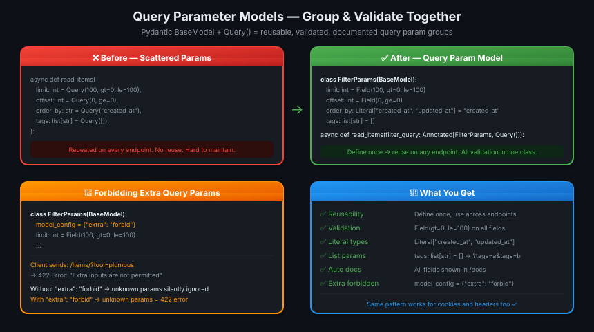

# 10 · Query Parameter Models 🗂️

---

## 🎯 One Line
> Group related query params into a Pydantic `BaseModel`, annotate with `Query()` — reusable, validated, documented, and optionally strict (forbid unknown params).

---

## 🖼️ The Picture



> 💡 **Analogy:** Har endpoint pe alag-alag `limit`, `offset`, `order_by` likhna = har dukaan mein alg menu print karna. `FilterParams` banana = ek menu banao, sab jagah lagao. Ek jagah change karo, sab update. 📋

---

## 🧱 Key Concepts

| Concept | Kya hai | Example |
|---------|---------|---------|
| **Query param model** | Pydantic `BaseModel` whose fields become query params | `class FilterParams(BaseModel)` |
| **`Annotated[Model, Query()]`** | Signals FastAPI: read this model's fields from query string | `filter_query: Annotated[FilterParams, Query()]` |
| **`Field()`** | Pydantic's per-field validator (like `Query()` but inside a model) | `Field(100, gt=0, le=100)` |
| **`Literal["a", "b"]`** | Restricts value to exact set of strings | `Literal["created_at", "updated_at"]` |
| **`"extra": "forbid"`** | Reject any query param not declared in the model | `model_config = {"extra": "forbid"}` |

---

## 📦 The Pattern

```python
from typing import Annotated, Literal
from fastapi import FastAPI, Query
from pydantic import BaseModel, Field

app = FastAPI()

class FilterParams(BaseModel):
    limit: int = Field(100, gt=0, le=100)     # 1–100, default 100
    offset: int = Field(0, ge=0)              # ≥0, default 0
    order_by: Literal["created_at", "updated_at"] = "created_at"
    tags: list[str] = []                      # repeatable: ?tags=a&tags=b

@app.get("/items/")
async def read_items(filter_query: Annotated[FilterParams, Query()]):
    return filter_query
```

**What the URL looks like:**
```
/items/?limit=20&offset=10&order_by=updated_at&tags=python&tags=fastapi
```

FastAPI reads each field from the query string, validates against the model, and passes a `FilterParams` instance to your function.

---

## 🚫 Forbidding Extra Query Params

By default, unknown query params are silently ignored. To reject them:

```python
class FilterParams(BaseModel):
    model_config = {"extra": "forbid"}   # ← add this line

    limit: int = Field(100, gt=0, le=100)
    offset: int = Field(0, ge=0)
    order_by: Literal["created_at", "updated_at"] = "created_at"
    tags: list[str] = []

@app.get("/items/")
async def read_items(filter_query: Annotated[FilterParams, Query()]):
    return filter_query
```

If client sends `/items/?tool=plumbus` (unknown param):

```json
{
    "detail": [
        {
            "type": "extra_forbidden",
            "loc": ["query", "tool"],
            "msg": "Extra inputs are not permitted",
            "input": "plumbus"
        }
    ]
}
```

| Behaviour | Config |
|-----------|--------|
| Silently ignore unknown params (default) | No `model_config` needed |
| Reject unknown params with 422 | `model_config = {"extra": "forbid"}` |

---

## ♻️ Reusability — The Whole Point

```python
# Define once
class FilterParams(BaseModel):
    model_config = {"extra": "forbid"}
    limit: int = Field(100, gt=0, le=100)
    offset: int = Field(0, ge=0)
    order_by: Literal["created_at", "updated_at"] = "created_at"
    tags: list[str] = []

# Use on multiple endpoints
@app.get("/items/")
async def read_items(f: Annotated[FilterParams, Query()]):
    return f

@app.get("/products/")
async def read_products(f: Annotated[FilterParams, Query()]):
    return f
```

Change validation in `FilterParams` once → both endpoints updated. No duplication.

---

## 💡 "Aha!" Moments

**`Field()` inside the model = `Query()` outside it**
> `limit: int = Field(100, gt=0, le=100)` inside a BaseModel is equivalent to `limit: int = Query(100, gt=0, le=100)` as a standalone param. Same validation, same docs — just grouped inside a class.

**`list[str] = []` → multi-value query param**
> `tags: list[str] = []` accepts repeated query params: `?tags=python&tags=fastapi` → `tags = ["python", "fastapi"]`. Works the same as `tags: list[str] = Query([])` standalone.

---

## ⚠️ Gotchas

- ❌ Don't confuse with request body models — `Annotated[FilterParams, Query()]` reads from query string, not JSON body. Same Pydantic class, different source.
- ❌ `Literal["a", "b"]` only works for exact string matches — case-sensitive
- ❌ Without `"extra": "forbid"`, typos in query params (`?limot=5`) are silently ignored — your default kicks in

---

## 🧪 Quick Check

<details>
<summary>❓ How does FastAPI know <code>FilterParams</code> should be read from the query string and not the body?</summary>

The `Annotated[FilterParams, Query()]` annotation. Without `Query()`, a Pydantic model type would be read from the request body. With `Query()`, FastAPI reads each field from the URL query string instead.
</details>

<details>
<summary>❓ What does <code>model_config = {"extra": "forbid"}</code> do?</summary>

It tells Pydantic to reject any input key that isn't declared as a field in the model. For query params, this means any unknown query param triggers a 422 error. Without it, unknown params are silently ignored.
</details>

<details>
<summary>❓ How do you pass multiple values for a list field like <code>tags: list[str]</code>?</summary>

Repeat the key in the URL: `?tags=python&tags=fastapi&tags=web` → `tags = ["python", "fastapi", "web"]`. This is standard URL query string syntax for repeated keys.
</details>

---

> **Next →** [Body — Multiple Parameters](11-body-multiple-params.md)
