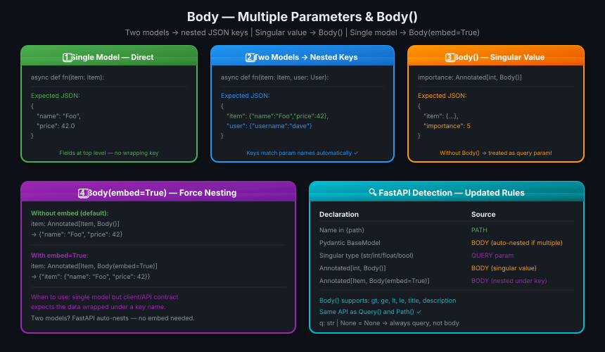
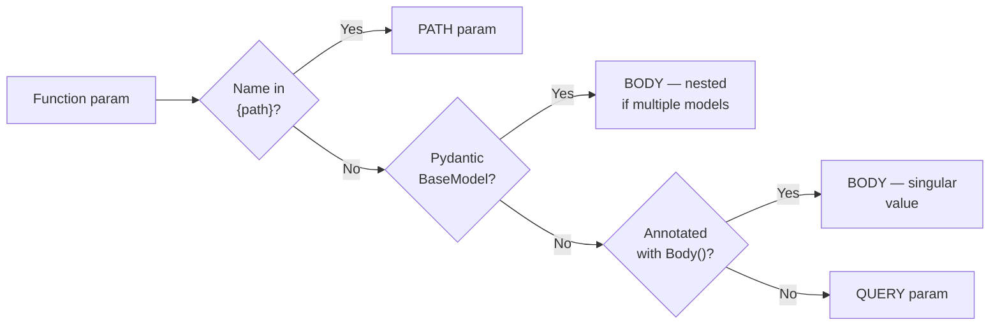

# 11 · Body — Multiple Parameters 📦📦

---

## 🎯 One Line
> Two Pydantic models → FastAPI auto-nests them under their param names. Singular value in body → wrap with `Body()`. Single model but want nesting → use `Body(embed=True)`.

---

## 🖼️ The Picture



> 💡 **Analogy:** Ek model = ek parcel, seedha open karo. Do model = do parcel, har ek apne box mein. Singular value = chhoti item bhi apne box mein chahiye toh `Body()` lagao. Warna wo query param ki line mein chali jaati hai. 📦

---

## 🧱 Key Concepts

| Concept | Kya hai | Example |
|---------|---------|---------|
| **Single model** | One Pydantic param → fields at top level of JSON | `{"name": "Foo", "price": 42}` |
| **Multiple models** | Two+ Pydantic params → each nested under its param name | `{"item": {...}, "user": {...}}` |
| **`Body()`** | Forces a singular value (`int`, `str`) into the body instead of query | `importance: Annotated[int, Body()]` |
| **`Body(embed=True)`** | Forces a single model to be nested under its key name | `item: Annotated[Item, Body(embed=True)]` |

---

## 1️⃣ Mix Path + Query + Body

All three can coexist freely:

```python
from fastapi import FastAPI, Path
from pydantic import BaseModel
from typing import Annotated

app = FastAPI()

class Item(BaseModel):
    name: str
    description: str | None = None
    price: float
    tax: float | None = None

@app.put("/items/{item_id}")
async def update_item(
    item_id: int,              # ← PATH param
    item: Item,                # ← BODY param
    q: str | None = None       # ← QUERY param
):
    result = {"item_id": item_id, **item.model_dump()}
    if q:
        result.update({"q": q})
    return result
```

Body can also be optional:
```python
item: Item | None = None   # optional body
```

---

## 2️⃣ Multiple Body Parameters → Auto-Nested

Two Pydantic models in the same function → FastAPI expects a nested JSON structure, keyed by the parameter names:

```python
class Item(BaseModel):
    name: str
    description: str | None = None
    price: float
    tax: float | None = None

class User(BaseModel):
    username: str
    full_name: str | None = None

@app.put("/items/{item_id}")
async def update_item(item_id: int, item: Item, user: User):
    results = {"item_id": item_id, "item": item, "user": user}
    return results
```

**Expected JSON body:**

```json
{
    "item": {
        "name": "Foo",
        "description": "The pretender",
        "price": 42.0,
        "tax": 3.2
    },
    "user": {
        "username": "dave",
        "full_name": "Dave Grohl"
    }
}
```

FastAPI auto-creates the nesting. Param names (`item`, `user`) become the JSON keys. Zero configuration.

---

## 3️⃣ Body() — Singular Value in the Body

By default, a singular type like `int` or `str` → query param. To put it in the body instead, wrap with `Body()`:

```python
from fastapi import Body
from typing import Annotated

@app.put("/items/{item_id}")
async def update_item(
    item_id: int,
    item: Item,
    user: User,
    importance: Annotated[int, Body()]   # ← Body() forces it into the JSON body
):
    results = {"item_id": item_id, "importance": importance, "item": item, "user": user}
    return results
```

**Expected JSON body:**

```json
{
    "item": {
        "name": "Foo",
        "price": 42.0
    },
    "user": {
        "username": "dave"
    },
    "importance": 5
}
```

> ⚠️ Without `Body()`: `importance: int` → FastAPI reads it from the query string (`?importance=5`). With `Body()` → reads from JSON body.

`Body()` also accepts all the same validators:

```python
importance: Annotated[int, Body(gt=0)]   # must be positive
```

---

## 4️⃣ Body(embed=True) — Force Single Model to Nest

With a single Pydantic model, FastAPI expects the fields **directly** (no wrapping key). To wrap under its param name:

```python
# Default — no wrapping
@app.put("/items/{item_id}")
async def update_item(item_id: int, item: Item):
    ...
# Expects: {"name": "Foo", "price": 42}

# With embed=True — nested under "item" key
@app.put("/items/{item_id}")
async def update_item(
    item_id: int,
    item: Annotated[Item, Body(embed=True)]
):
    ...
# Expects: {"item": {"name": "Foo", "price": 42}}
```

| Scenario | Expected JSON |
|----------|--------------|
| One model, no embed | `{"name": "Foo", "price": 42}` |
| One model, `embed=True` | `{"item": {"name": "Foo", "price": 42}}` |
| Two models, no embed needed | `{"item": {...}, "user": {...}}` — auto-nested |

---

## 🔍 Updated Detection Rules — Full Picture



| Declaration | Where FastAPI reads from |
|-------------|--------------------------|
| Name in `{path}` | URL path segment |
| `item: Item` (BaseModel) | JSON body — direct or nested |
| `importance: Annotated[int, Body()]` | JSON body — as a key |
| `q: str \| None = None` | URL query string |

---

## 💡 "Aha!" Moments

**`Body()` exists because singular types default to query**
> FastAPI's rule: `int`, `str`, `float`, `bool` → query params. If you need an integer IN the body (not in the URL), you must explicitly say `Body()`. Without it, `importance: int` → FastAPI looks for `?importance=5` in the URL, not the JSON.

**Two models auto-nest, one model doesn't (unless embed=True)**
> FastAPI is smart: two models need separate keys to avoid field name collisions, so it wraps them automatically. One model has no collision risk, so it puts fields at the top level. `embed=True` opts into nesting for the single-model case when your API contract requires it.

---

## ⚠️ Gotchas

- ❌ Forgetting `Body()` on a singular param — it becomes a query param silently
- ❌ Using `embed=True` when you have two models — redundant, auto-nesting already happens
- ❌ Sending flat JSON `{"name": "Foo"}` when two models are declared — FastAPI expects `{"item": {...}, "user": {...}}`

---

## 🧪 Quick Check

<details>
<summary>❓ You have <code>importance: int</code> in a route with two Pydantic body models. Where does FastAPI look for it?</summary>

In the **query string** (`?importance=5`) — because `int` is a singular type and FastAPI's rule is: singular types → query params. To put it in the JSON body alongside the models, you must write `importance: Annotated[int, Body()]`.
</details>

<details>
<summary>❓ When do you need <code>Body(embed=True)</code>?</summary>

When you have exactly **one** Pydantic model as a body param but want the JSON to be nested under the param's key name. Example: `item: Annotated[Item, Body(embed=True)]` expects `{"item": {"name": "Foo"}}` instead of `{"name": "Foo"}`. Not needed with two models — auto-nesting happens automatically.
</details>

<details>
<summary>❓ What JSON structure does FastAPI expect when you declare <code>item: Item</code> and <code>user: User</code>?</summary>

Nested under their parameter names:
```json
{
    "item": {"name": "Foo", "price": 42},
    "user": {"username": "dave"}
}
```
FastAPI uses the Python parameter name as the JSON key. No configuration needed.
</details>

<details>
<summary>❓ Can you mix body params, query params, and path params in one route?</summary>

Yes — all freely. FastAPI detects source from type:
- Name in `{path}` → path param
- Pydantic model → body
- `Annotated[int, Body()]` → body singular
- Singular type without `Body()` → query
- `q: str | None = None` → query (always)
</details>

---

> **Next →** [Body — Fields](12-body-fields.md)
