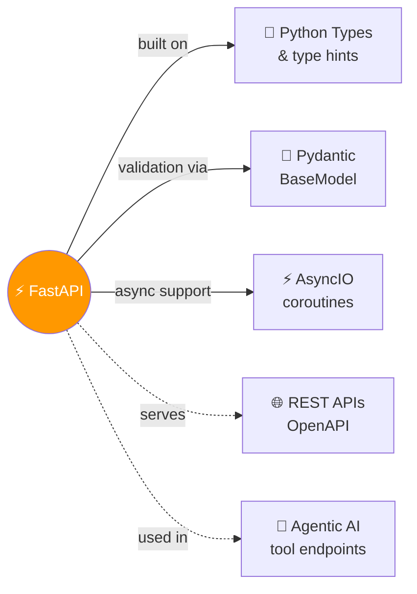

# ⚡ FastAPI

> Modern, fast Python web framework — declare once with types, get validation + docs + editor support for free.

---

## 🧠 Brain — How This Connects

## 📊 Progress
| # | Lesson | Confidence | Revised |
|---|--------|-----------|---------|
| 01 | [Python Types Intro](01-python-types-intro.md) | 🔴 | — |
| 02 | [Concurrency &amp; Async/Await](02-concurrency-async-await.md) | 🔴 | — |
| 03 | [Environment Variables](03-environment-variables.md) | 🔴 | — |
| 04 | [First Steps](04-first-steps.md) | 🔴 | — |

## 🧩 Memory Fragments
> - FastAPI is ALL based on Python type hints — types aren't optional, they ARE the framework
> - Pydantic handles validation; Starlette handles the HTTP layer; FastAPI is the glue
> - `Annotated[str, Query(...)]` is how FastAPI gets rich metadata from type hints

---

## 🎬 Teach Mode — Lesson Flow

> Open these in order = you can teach anyone FastAPI

| # | Lesson | One-liner | Time |
|---|--------|-----------|------|
| 01 | [Python Types Intro](01-python-types-intro.md) | Type hints — the foundation everything else builds on | 8 min |
| 02 | [Concurrency &amp; Async/Await](02-concurrency-async-await.md) | async def vs def — burger shop analogy, when to use what | 8 min |
| 03 | [Environment Variables](03-environment-variables.md) | OS env vars, .env files, python-dotenv, Pydantic Settings | 8 min |
| 04 | [First Steps](04-first-steps.md) | Minimal app anatomy, path operations, uvicorn, /docs | 10 min |

---

## 📚 Sources
> - 🌐 Docs: [FastAPI Official Documentation](https://fastapi.tiangolo.com/)

## 🔗 Connected Topics
> → [python/asyncio](../python/asyncio/) · [python/](../python/) · [agentic-ai](../agentic-ai/)

## 30-Second Recall 🧠
> FastAPI uses Python type hints to do everything: validate request data, convert types, generate error messages, and produce OpenAPI docs — all from a single annotation like `name: str`. Pydantic models are the data validation layer. `Annotated[type, metadata]` is how extra rules (like max length) get attached without extra code. Type hints themselves are passive — Python ignores them; FastAPI/Pydantic are the ones that act on them.
