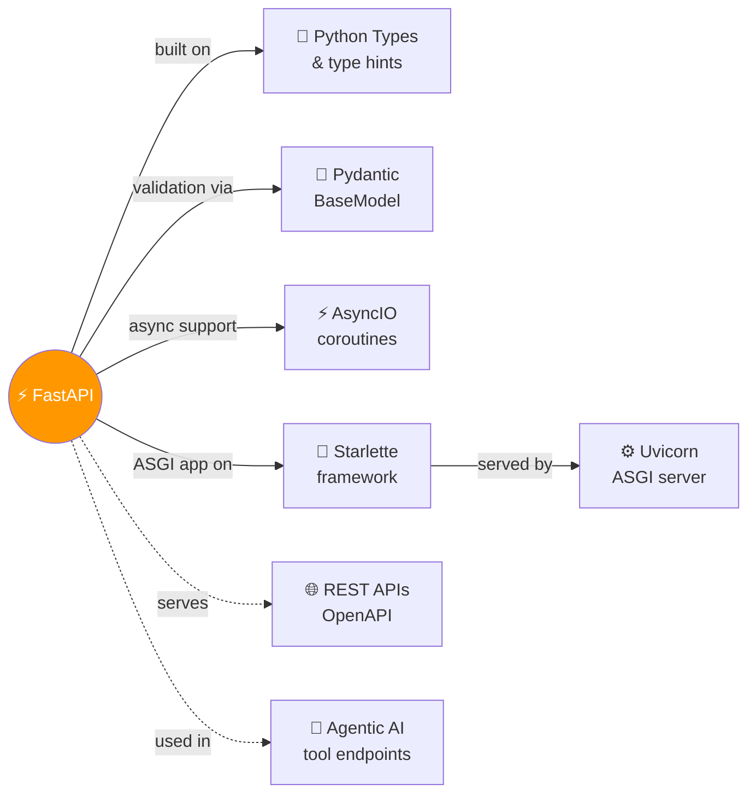

# ⚡ FastAPI

> Modern, fast Python web framework — declare once with types, get validation + docs + editor support for free.

---

## 🧠 Brain — How This Connects

## 📊 Progress
| # | Lesson | Confidence | Revised |
|---|--------|-----------|---------|
| 01 | [Python Types Intro](01-python-types-intro.md) | 🔴 | — |
| 02 | [Concurrency &amp; Async/Await](02-concurrency-async-await.md) | 🔴 | — |
| 03 | [Environment Variables](03-environment-variables.md) | 🔴 | — |
| 04 | [First Steps](04-first-steps.md) | 🔴 | — |
| 05 | [ASGI Protocol](05-asgi-protocol.md) | 🔴 | — |
| 06 | [MiniAPI — Build Your Own](06-miniapi-build-your-own.md) | 🔴 | — |
| 07 | [Query Parameters](07-query-params.md) | 🔴 | — |
| 08 | [Request Body](08-request-body.md) | 🔴 | — |
| 09 | [Path Params — Numeric Validations](09-path-params-numeric-validations.md) | 🔴 | — |
| 10 | [Query Parameter Models](10-query-param-models.md) | 🔴 | — |
| 11 | [Body — Multiple Parameters](11-body-multiple-params.md) | 🔴 | — |

## 🧩 Memory Fragments
> - FastAPI is ALL based on Python type hints — types aren't optional, they ARE the framework
> - Pydantic handles validation; Starlette handles the HTTP layer; FastAPI is the glue
> - `Annotated[str, Query(...)]` is how FastAPI gets rich metadata from type hints
> - ASGI contract = `async def __call__(scope, receive, send)` — Uvicorn calls it, your app implements it
> - `@app.get("/path")` is just a decorator that inserts a handler into a routes dict

---

## 🎬 Teach Mode — Lesson Flow

> Open these in order = you can teach anyone FastAPI

| # | Lesson | One-liner | Time |
|---|--------|-----------|------|
| 01 | [Python Types Intro](01-python-types-intro.md) | Type hints — the foundation everything else builds on | 8 min |
| 02 | [Concurrency &amp; Async/Await](02-concurrency-async-await.md) | async def vs def — burger shop analogy, when to use what | 8 min |
| 03 | [Environment Variables](03-environment-variables.md) | OS env vars, .env files, python-dotenv, Pydantic Settings | 8 min |
| 04 | [First Steps](04-first-steps.md) | Minimal app anatomy, path operations, uvicorn, /docs | 10 min |
| 05 | [ASGI Protocol](05-asgi-protocol.md) | scope/receive/send contract, Uvicorn internals, WSGI vs ASGI | 12 min |
| 06 | [MiniAPI — Build Your Own](06-miniapi-build-your-own.md) | Build a baby FastAPI from scratch — routing, Request, Response, Middleware | 15 min |
| 07 | [Query Parameters](07-query-params.md) | optional/required/default/bool — everything after ? in the URL | 8 min |
| 08 | [Request Body](08-request-body.md) | Pydantic BaseModel, required/optional fields, body+path+query combo | 10 min |
| 09 | [Path Params — Numeric Validations](09-path-params-numeric-validations.md) | Path(), gt/ge/lt/le, Annotated, title/description metadata | 8 min |
| 10 | [Query Parameter Models](10-query-param-models.md) | Group query params into a BaseModel, Field(), Literal, extra=forbid | 8 min |
| 11 | [Body — Multiple Parameters](11-body-multiple-params.md) | Two models auto-nest, Body() for singular, embed=True | 10 min |

---

## 📚 Sources
> - 🌐 Docs: [FastAPI Official Documentation](https://fastapi.tiangolo.com/)

## 🔗 Connected Topics
> → [python/asyncio](../python/asyncio/) · [python/](../python/) · [agentic-ai](../agentic-ai/)

## 30-Second Recall 🧠
> FastAPI uses Python type hints to do everything: validate request data, convert types, generate error messages, and produce OpenAPI docs — all from a single annotation like `name: str`. Pydantic models are the data validation layer. `Annotated[type, metadata]` is how extra rules (like max length) get attached without extra code. Type hints themselves are passive — Python ignores them; FastAPI/Pydantic are the ones that act on them.
