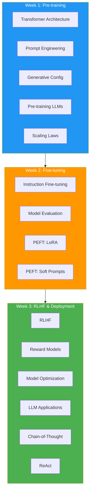

# 🧠 Generative AI with Large Language Models

> From transformers to RLHF — the complete LLM lifecycle! 🚀

---

## 🎯 Course Overview

| | |
|---|---|
| **Platform** | DeepLearning.AI + Coursera |
| **Partner** | AWS |
| **Level** | Intermediate |
| **Duration** | ~10 hours |
| **Instructors** | Antje Barth, Chris Fregly, Shelbee Eigenbrode, Mike Chambers |

---

## 🧠 Brain — Course Map

---

## 📚 Week Structure

### Week 1: Generative AI Use Cases, Project Lifecycle & Pre-training

| # | Lesson | Status |
|---|--------|--------|
| 01 | [Course Introduction](week-1-pretraining/01-course-introduction.md) | 🔴 |
| 02 | [Generative AI & LLMs](week-1-pretraining/02-generative-ai-llms.md) | 🔴 |
| 03 | [LLM Use Cases & Tasks](week-1-pretraining/03-llm-use-cases.md) | 🔴 |
| 04 | [Text Generation Before Transformers](week-1-pretraining/04-before-transformers.md) | 🔴 |
| 05 | [Transformers Architecture](week-1-pretraining/05-transformers-architecture.md) | 🔴 |
| 06 | [Generating Text with Transformers](week-1-pretraining/06-generating-text.md) | 🔴 |
| 07 | [Prompting & Prompt Engineering](week-1-pretraining/07-prompting.md) | 🔴 |
| 08 | [Generative Configuration](week-1-pretraining/08-generative-config.md) | 🔴 |
| 09 | [GenAI Project Lifecycle](week-1-pretraining/09-project-lifecycle.md) | 🔴 |
| 10 | [Pre-training LLMs](week-1-pretraining/10-pretraining-llms.md) | 🔴 |
| 11 | [Computational Challenges](week-1-pretraining/11-computational-challenges.md) | 🔴 |
| 12 | [Multi-GPU Strategies](week-1-pretraining/12-multi-gpu.md) | 🔴 |
| 13 | [Scaling Laws](week-1-pretraining/13-scaling-laws.md) | 🔴 |
| 14 | [Domain Adaptation](week-1-pretraining/14-domain-adaptation.md) | 🔴 |

### Week 2: Fine-tuning & Evaluating LLMs

| # | Lesson | Status |
|---|--------|--------|
| 01 | [Introduction - Week 2](week-2-finetuning/01-introduction.md) | 🔴 |
| 02 | [Instruction Fine-tuning](week-2-finetuning/02-instruction-finetuning.md) | 🔴 |
| 03 | [Single Task Fine-tuning](week-2-finetuning/03-single-task.md) | 🔴 |
| 04 | [Multi-task Instruction Fine-tuning](week-2-finetuning/04-multi-task.md) | 🔴 |
| 05 | [Model Evaluation](week-2-finetuning/05-model-evaluation.md) | 🔴 |
| 06 | [Benchmarks](week-2-finetuning/06-benchmarks.md) | 🔴 |
| 07 | [Parameter Efficient Fine-tuning (PEFT)](week-2-finetuning/07-peft-intro.md) | 🔴 |
| 08 | [PEFT: LoRA](week-2-finetuning/08-lora.md) | 🔴 |
| 09 | [PEFT: Soft Prompts](week-2-finetuning/09-soft-prompts.md) | 🔴 |

### Week 3: RLHF & LLM-Powered Applications

| # | Lesson | Status |
|---|--------|--------|
| 01 | [Introduction - Week 3](week-3-rlhf-deployment/01-introduction.md) | 🔴 |
| 02 | [Aligning Models with Human Values](week-3-rlhf-deployment/02-alignment.md) | 🔴 |
| 03 | [RLHF Overview](week-3-rlhf-deployment/03-rlhf-overview.md) | 🔴 |
| 04 | [RLHF: Human Feedback](week-3-rlhf-deployment/04-human-feedback.md) | 🔴 |
| 05 | [RLHF: Reward Model](week-3-rlhf-deployment/05-reward-model.md) | 🔴 |
| 06 | [RLHF: Fine-tuning with RL](week-3-rlhf-deployment/06-finetuning-rl.md) | 🔴 |
| 07 | [Proximal Policy Optimization](week-3-rlhf-deployment/07-ppo.md) | 🔴 |
| 08 | [Reward Hacking](week-3-rlhf-deployment/08-reward-hacking.md) | 🔴 |
| 09 | [Scaling Human Feedback](week-3-rlhf-deployment/09-scaling-feedback.md) | 🔴 |
| 10 | [Model Optimization for Deployment](week-3-rlhf-deployment/10-model-optimization.md) | 🔴 |
| 11 | [Using LLMs in Applications](week-3-rlhf-deployment/11-llm-applications.md) | 🔴 |
| 12 | [External Applications](week-3-rlhf-deployment/12-external-apps.md) | 🔴 |
| 13 | [Chain-of-Thought Prompting](week-3-rlhf-deployment/13-chain-of-thought.md) | 🔴 |
| 14 | [PAL: Program-aided Language Models](week-3-rlhf-deployment/14-pal.md) | 🔴 |
| 15 | [ReAct: Reasoning & Action](week-3-rlhf-deployment/15-react.md) | 🔴 |
| 16 | [LLM Application Architectures](week-3-rlhf-deployment/16-architectures.md) | 🔴 |
| 17 | [Responsible AI](week-3-rlhf-deployment/17-responsible-ai.md) | 🔴 |

---

## 🧩 Memory Fragments

> *Fragments will be added as lessons are completed*

---

## 💻 Labs

| Lab | Week | Focus |
|-----|------|-------|
| Lab 1 | Week 1 | Summarize Dialogue |
| Lab 2 | Week 2 | Fine-tune for Dialogue Summarization |
| Lab 3 | Week 3 | RLHF for Positive Summaries |

---

## 🔗 Connected Topics

> [RAG Course](../rag/) · [Agentic AI](../agentic-ai/) · [Agent Memory](../agent-memory/)

---

## 📚 Source

> 🎓 [Generative AI with LLMs](https://learn.deeplearning.ai/courses/generative-ai-with-llms) — DeepLearning.AI + AWS
