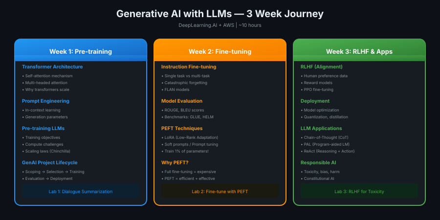
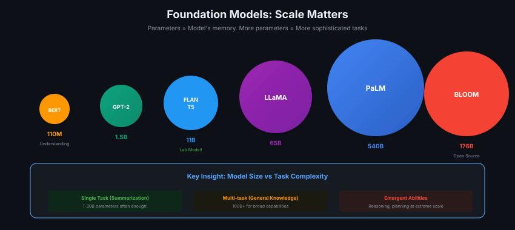

# 00 · Course Introduction

> **TL;DR:** 3-week deep dive into LLMs — from transformers to RLHF to production apps. Hands-on labs with FLAN-T5.

---

## Course Overview



| Week | Focus | Lab |
|------|-------|-----|
| **1** | Transformers, prompting, pre-training | Dialogue summarization |
| **2** | Instruction fine-tuning, PEFT, LoRA | Fine-tune with PEFT |
| **3** | RLHF, deployment, LLM apps | RLHF for toxicity |

---

## Why This Course?

**LLMs are a general-purpose technology** — like deep learning or electricity.

- Many apps that took **months** → now take **days or weeks**
- Companies scrambling to hire people who can build with LLMs
- Technical deep dive, not just surface-level

---

## Foundation Models



**Parameters = Model's memory**

| Size | Parameters | Best For |
|------|------------|----------|
| Small | 1-10B | Single task (summarization, chatbot) |
| Medium | 10-100B | Multi-task, domain-specific |
| Large | 100B+ | General knowledge, emergent abilities |

**Surprise:** Small models (1-30B) can be fantastic for specific applications!

---

## What You'll Learn

### Week 1: Pre-training
- **Transformer architecture** — self-attention, multi-headed attention
- **Prompt engineering** — in-context learning, generation parameters
- **Pre-training** — compute challenges, scaling laws
- **GenAI Project Lifecycle** — scoping to deployment

### Week 2: Fine-tuning
- **Instruction fine-tuning** — adapting to specific tasks
- **Model evaluation** — ROUGE, BLEU, benchmarks
- **PEFT** — LoRA, soft prompts (train 1% of parameters!)

### Week 3: RLHF & Applications
- **RLHF** — aligning with human values
- **Deployment** — quantization, distillation
- **LLM Apps** — Chain-of-Thought, ReAct, PAL

---

## Prerequisites

- Python programming
- Basic ML concepts (supervised/unsupervised, loss functions)
- PyTorch or TensorFlow experience helpful

---

## Lab Model: FLAN-T5

Throughout the labs, you'll use **FLAN-T5** — an open-source instruction-tuned model from Google.

```
FLAN-T5: ~11B parameters
- Instruction fine-tuned
- Good balance of capability vs. compute
- Perfect for learning!
```

---

## Instructors

| Name | Role |
|------|------|
| **Andrew Ng** | Course Lead |
| **Antje Barth** | Principal Dev Advocate, AWS |
| **Mike Chambers** | Dev Advocate, AWS |
| **Shelbee Eigenbrode** | Principal Solutions Architect, AWS |
| **Chris Fregly** | Principal Solutions Architect, AWS |

---

## Key Takeaways

1. **LLMs = general-purpose technology** — many applications possible
2. **Scale matters** but smaller models work for specific tasks
3. **3 phases:** Pre-train → Fine-tune → Align (RLHF)
4. **Hands-on labs** with real models and code
