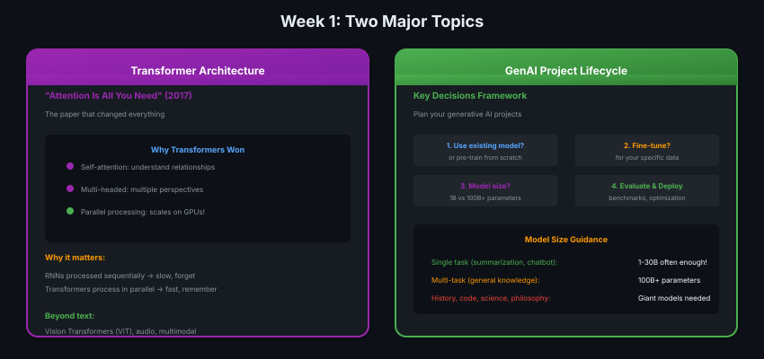

# 01 · Introduction - Week 1

> **TL;DR:** Week 1 covers two major topics: transformer architecture (why LLMs work) and GenAI project lifecycle (how to plan your projects).

---

## Week 1 Preview



---

## Topic 1: Transformer Architecture

**"Attention Is All You Need" (2017)** — the paper that changed everything.

### Why Transformers?

Before transformers, we had **RNNs** (Recurrent Neural Networks):
- Processed text **sequentially** (word by word)
- Slow and hard to parallelize
- Forgot earlier words in long sequences

**Transformers changed the game:**

| RNNs | Transformers |
|------|-------------|
| Sequential processing | Parallel processing |
| Forget long context | Attention sees all |
| Slow on GPUs | Scales massively |

### What You'll Learn

- **Self-attention:** How each word relates to every other word
- **Multi-headed attention:** Multiple perspectives on relationships
- **Why it scales:** GPU parallelization made it practical

### Beyond Text

Transformers aren't just for language:
- **Vision Transformers (ViT)** — images
- **Audio Transformers** — speech, music
- **Multimodal** — text + images together

---

## Topic 2: GenAI Project Lifecycle

When building with LLMs, you face key decisions:

```
1. Use existing model or pre-train from scratch?
   └── Most: use existing foundation model

2. Fine-tune for your data?
   └── Often yes, for specific tasks

3. What model size?
   └── Depends on task complexity

4. Evaluate and deploy
   └── Benchmarks, optimization, production
```

### Model Size Guidance

| Task Type | Recommended Size | Example |
|-----------|------------------|---------|
| Single task | 1-30B | Summarization, customer chatbot |
| Multi-task | 10-100B | Domain-specific assistant |
| General knowledge | 100B+ | History, code, science, philosophy |

**Surprise:** Small models can be fantastic for specific use cases!

---

## Week 1 Coverage

| Lesson | Topic |
|--------|-------|
| 02-03 | Generative AI & LLM Use Cases |
| 04-06 | Transformer Architecture Deep Dive |
| 07-08 | Prompting & Generative Config |
| 09 | GenAI Project Lifecycle |
| 10-14 | Pre-training & Scaling Laws |

---

## Why Transformers Took Off

Attention mechanisms existed before 2017, but the transformer architecture made attention work in a **massively parallel** way — enabling training on modern GPUs at massive scale. That's the real breakthrough: not just attention, but attention + parallelism.

> 💡 *Transformer = attention + GPU parallelism. Ek ke bina doosra kuch kaam ka nahi tha.*

---

## Key Takeaways

1. **Transformers** = self-attention + parallelization = scale
2. **GenAI Lifecycle** = key decisions framework for building LLM apps
3. **Model size** = match to task (small models beat giants for single tasks)
4. **Transformers beyond text** = ViT, audio, multimodal — same architecture
